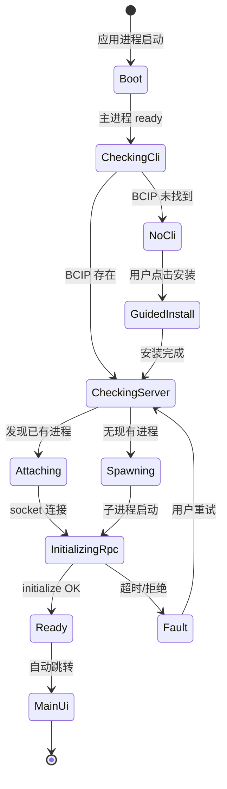
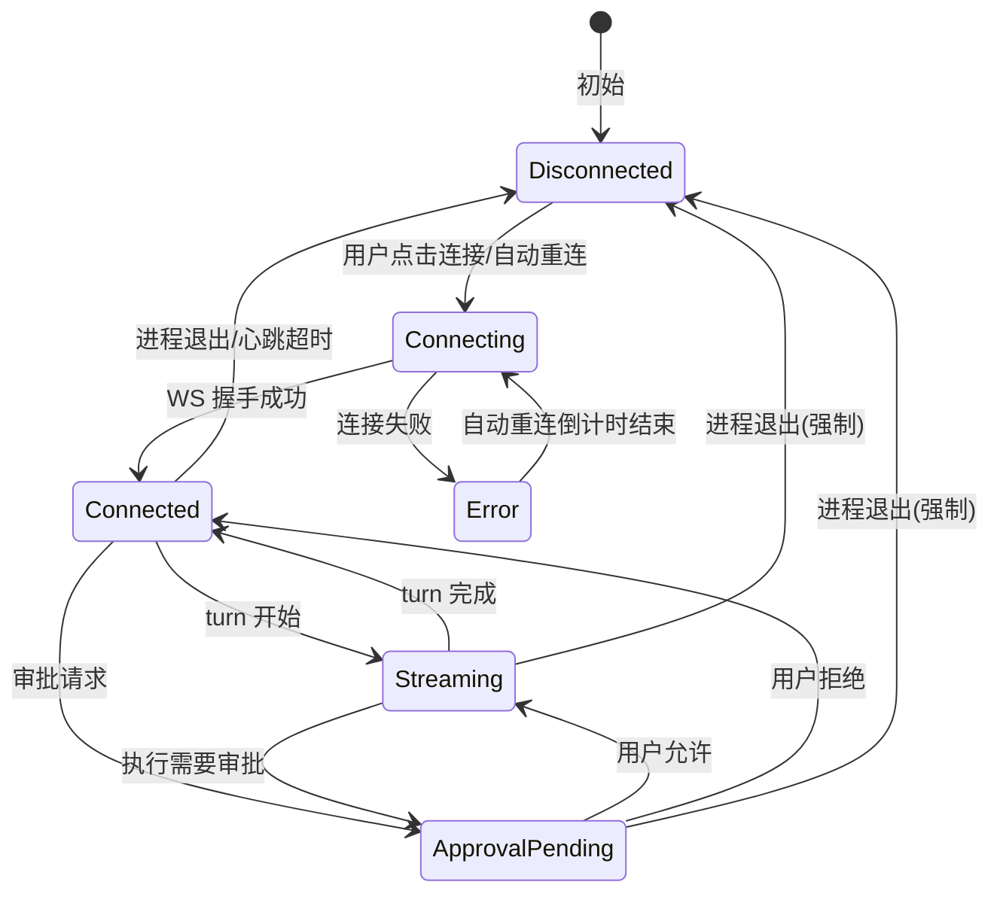
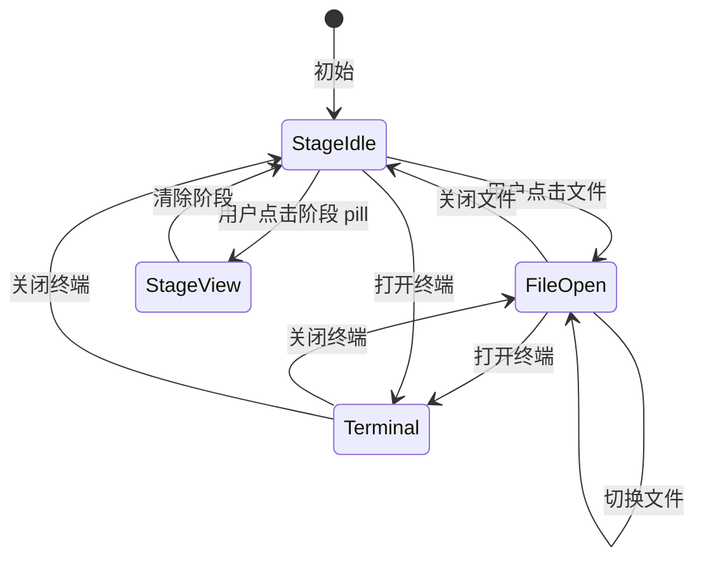
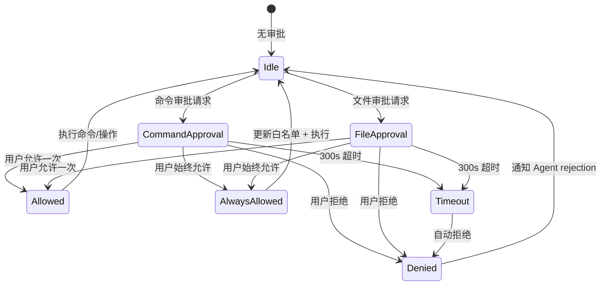

# BCIP 桌面端像素级复刻 Codex 视觉设计规范

> **文档版本**: v2.0  
> **日期**: 2026-05-30  
> **状态**: 设计交付稿  
> **作者**: BCIP 设计团队  
> **依赖**: codex-rs 开源生态、OpenAI Codex Desktop App  
> **设计基准分辨率**: 1400 x 900（最小 900 x 650）  
> **平台覆盖**: macOS（主平台） + Windows（P2 变体）  
> **关联文档**:  
> - `2026-05-30-desktop-design-spec.md`（Figma 设计稿规范）  
> - `2026-05-30-desktop-codex-parity-strategy.md`（架构策略）  

---


## 目录

- [第0章 前言](#第0章-前言)
  - [0.1 文档目标](#01-文档目标)
  - [0.2 适用范围](#02-适用范围)
  - [0.3 读者对象](#03-读者对象)
  - [0.4 使用方法](#04-使用方法)
  - [0.5 术语定义](#05-术语定义)
  - [0.6 与上游文档的关系](#06-与上游文档的关系)
- [第1章 设计系统概述](#第1章-设计系统概述)
  - [1.1 设计目标与原则](#11-设计目标与原则)
  - [1.2 与 Codex 的复刻关系说明](#12-与-codex-的复刻关系说明)
  - [1.3 BCIP 品牌差异化点](#13-BCIP-品牌差异化点)
  - [1.4 平台覆盖范围](#14-平台覆盖范围)
- [第2章 色彩体系](#第2章-色彩体系)
  - [2.1 基础色板](#21-基础色板)
  - [2.2 语义色 Token](#22-语义色-token)
  - [2.3 状态色](#23-状态色)
  - [2.4 特殊语义 Token](#24-特殊语义-token)
- [第3章 字体排版](#第3章-字体排版)
  - [3.1 字体栈](#31-字体栈)
  - [3.2 字号阶梯](#32-字号阶梯)
  - [3.3 字重规范](#33-字重规范)
  - [3.4 行高规范](#34-行高规范)
  - [3.5 字距规范](#35-字距规范)
  - [3.6 文本样式组合](#36-文本样式组合)
- [第4章 间距系统](#第4章-间距系统)
  - [4.1 基础单位](#41-基础单位)
  - [4.2 间距阶梯](#42-间距阶梯)
  - [4.3 组件内边距标准](#43-组件内边距标准)
  - [4.4 布局间距](#44-布局间距)
  - [4.5 尺寸规范](#45-尺寸规范)
- [第5章 圆角与阴影](#第5章-圆角与阴影)
  - [5.1 圆角阶梯](#51-圆角阶梯)
  - [5.2 阴影规范](#52-阴影规范)
  - [5.3 边框规范](#53-边框规范)
- [第6章 动画与动效](#第6章-动画与动效)
  - [6.1 时长阶梯](#61-时长阶梯)
  - [6.2 缓动函数](#62-缓动函数)
  - [6.3 各组件动画规范](#63-各组件动画规范)
  - [6.4 性能规范](#64-性能规范)
- [设计 Token 速查表](#设计-token-速查表)
- [第7章 主壳层（App Shell）](#第7章-主壳层app-shell)
  - [7.1 TitleBar](#71-titlebar)
  - [7.2 LeftSidebar](#72-leftsidebar)
  - [7.3 PanelResizeHandle](#73-panelresizehandle)
  - [7.4 StatusBar](#74-statusbar)
  - [7.5 ToastRegion](#75-toastregion)
- [第8章 中心工作区（Center Workspace）](#第8章-中心工作区center-workspace)
  - [8.1 WorkspaceToolbar](#81-workspacetoolbar)
  - [8.2 FilePreviewRouter](#82-filepreviewrouter)
  - [8.3 TodoDock](#83-tododock)
- [第9章 Agent 面板（右侧）](#第9章-agent-面板右侧)
  - [9.1 AgentHeader](#91-agentheader)
  - [9.2 ThreadListDrawer](#92-threadlistdrawer)
  - [9.3 MessageTimeline](#93-messagetimeline)
  - [9.4 Composer](#94-composer)
  - [9.5 AgentFooter](#95-agentfooter)
- [第10章 设置页（Settings）](#第10章-设置页settings)
  - [10.1 SettingsLayout](#101-settingslayout)
  - [10.2 GeneralSettings](#102-generalsettings)
  - [10.3 ModelSettings](#103-modelsettings)
  - [10.4 ApprovalSandboxSettings](#104-approvalsandboxsettings)
  - [10.5 McpServersSettings](#105-mcpserverssettings)
  - [10.6 SkillsSettings](#106-skillssettings)
  - [10.7 PluginsSettings](#107-pluginssettings)
  - [10.8 AppearanceSettings](#108-appearancesettings)
  - [10.9 ShortcutsSettings](#109-shortcutssettings)
  - [10.10 AboutDiagnostics](#1010-aboutdiagnostics)
- [第11章 首次引导页（Onboarding / Boot）](#第11章-首次引导页onboarding--boot)
  - [11.1 BootSplash](#111-bootsplash)
  - [11.2 BootNoCli](#112-bootnocli)
  - [11.3 BootConnecting](#113-bootconnecting)
  - [11.4 BootFault](#114-bootfault)
- [第12章 浮层与弹窗（Overlays）](#第12章-浮层与弹窗overlays)
  - [12.1 ApprovalDialog](#121-approvaldialog)
  - [12.2 McpElicitationModal](#122-mcpelicitationmodal)
  - [12.3 OAuthWaitingSheet](#123-oauthwaitingsheet)
  - [12.4 CommandPalette](#124-commandpalette)
- [第13章 Windows 平台适配总则](#第13章-windows-平台适配总则)
  - [13.1 设计策略](#131-设计策略)
  - [13.2 平台检测与条件渲染](#132-平台检测与条件渲染)
- [第14章 标题栏（Windows 专用）](#第14章-标题栏windows-专用)
  - [14.1 窗口控制按钮](#141-窗口控制按钮)
  - [14.2 标题栏高度与背景](#142-标题栏高度与背景)
  - [14.3 标题文字](#143-标题文字)
  - [14.4 右侧操作按钮](#144-右侧操作按钮)
  - [14.5 标题栏 Inactive 状态](#145-标题栏-inactive-状态)
  - [14.6 TitleBar 组件完整实现参考](#146-titlebar-组件完整实现参考)
- [第15章 字体与排版（Windows 调整）](#第15章-字体与排版windows-调整)
  - [15.1 字体栈](#151-字体栈)
  - [15.2 字号调整表](#152-字号调整表)
  - [15.3 字重补偿](#153-字重补偿)
  - [15.4 等宽字体](#154-等宽字体)
  - [15.5 字体渲染优化](#155-字体渲染优化)
- [第16章 圆角与阴影（Windows 调整）](#第16章-圆角与阴影windows-调整)
  - [16.1 圆角对照表](#161-圆角对照表)
  - [16.2 阴影系统](#162-阴影系统)
  - [16.3 边框规范](#163-边框规范)
- [第17章 滚动条（Windows 定制）](#第17章-滚动条windows-定制)
  - [17.1 Windows 滚动条问题](#171-windows-滚动条问题)
  - [17.2 自定义滚动条样式](#172-自定义滚动条样式)
- [第18章 布局适配（Windows）](#第18章-布局适配windows)
  - [18.1 三栏布局宽度调整](#181-三栏布局宽度调整)
  - [18.2 菜单适配](#182-菜单适配)
  - [18.3 窗口 Padding 与缩放](#183-窗口-padding-与缩放)
- [第19章 交互差异](#第19章-交互差异)
  - [19.1 快捷键映射](#191-快捷键映射)
  - [19.2 触摸板/鼠标差异](#192-触摸板鼠标差异)
  - [19.3 窗口行为](#193-窗口行为)
- [第20章 Windows 各屏幕变体规范](#第20章-windows-各屏幕变体规范)
  - [20.1 TitleBar（Windows 变体）](#201-titlebarwindows-变体)
  - [20.2 LeftSidebar（Windows 变体）](#202-leftsidebarwindows-变体)
  - [20.3 CenterWorkspace（Windows 变体）](#203-centerworkspacewindows-变体)
  - [20.4 AgentPanel（Windows 变体）](#204-agentpanelwindows-变体)
  - [20.5 StatusBar（Windows 变体）](#205-statusbarwindows-变体)
  - [20.6 Settings（Windows 变体）](#206-settingswindows-变体)
  - [20.7 首次引导（Onboarding）（Windows 变体）](#207-首次引导onboardingwindows-变体)
  - [20.8 浮层弹窗（Overlays）（Windows 变体）](#208-浮层弹窗overlayswindows-变体)
- [第21章 全局交互规范](#第21章-全局交互规范)
  - [21.1 鼠标交互](#211-鼠标交互)
  - [21.2 键盘交互](#212-键盘交互)
  - [21.3 触摸板/手势](#213-触摸板手势)
- [第22章 面板交互](#第22章-面板交互)
  - [22.1 侧栏展开/收起](#221-侧栏展开收起)
  - [22.2 面板拖拽调整](#222-面板拖拽调整)
  - [22.3 面板覆盖层（移动端适配）](#223-面板覆盖层移动端适配)
- [第23章 消息交互](#第23章-消息交互)
  - [23.1 流式消息渲染](#231-流式消息渲染)
  - [23.2 消息操作](#232-消息操作)
  - [23.3 工具卡片交互](#233-工具卡片交互)
  - [23.4 Reasoning 块交互](#234-reasoning-块交互)
- [第24章 输入交互](#第24章-输入交互)
  - [24.1 Composer](#241-composer)
  - [24.2 Slash Command Palette](#242-slash-command-palette)
  - [24.3 @ 提及](#243--提及)
- [第25章 审批交互](#第25章-审批交互)
  - [25.1 ApprovalDialog 出现](#251-approvaldialog-出现)
  - [25.2 审批操作](#252-审批操作)
- [第26章 设置页交互](#第26章-设置页交互)
  - [26.1 导航切换](#261-导航切换)
  - [26.2 表单控件](#262-表单控件)
- [第27章 状态过渡动画](#第27章-状态过渡动画)
  - [27.1 应用启动](#271-应用启动)
  - [27.2 连接状态](#272-连接状态)
  - [27.3 加载状态](#273-加载状态)
- [第28章 Codex 像素级走查表](#第28章-codex-像素级走查表)
  - [28.1 Codex 对标项](#281-codex-对标项)
  - [28.2 BCIP 专利差异化项](#282-BCIP-专利差异化项)
  - [28.3 动画参数走查表](#283-动画参数走查表)
  - [28.4 尺寸参数走查表](#284-尺寸参数走查表)
- [第29章 无障碍规范](#第29章-无障碍规范)
  - [29.1 键盘可访问性](#291-键盘可访问性)
  - [29.2 屏幕阅读器（ARIA）](#292-屏幕阅读器aria)
  - [29.3 色彩对比度](#293-色彩对比度)
- [附录 A：设计 Token 汇总表](#附录-a设计-token-汇总表)
- [附录 B：Figma Variables 创建指南](#附录-bfigma-variables-创建指南)
- [附录 C：版本历史](#附录-c版本历史)

---


## 第0章 前言

### 0.1 文档目标

本文档是 BCIP Agent（云熙智能体）桌面端视觉设计的**唯一权威规范**，为设计和开发团队提供像素级复刻 OpenAI Codex 官方桌面版的设计依据。文档涵盖从设计系统基础到具体平台实现的全链路规范，确保 BCIP 桌面端在会话体验、组件视觉和交互行为上与 Codex 保持 >= 90% 的组件级可对照度，同时在外层体现 BCIP 专利三栏工作区的品牌差异化。

### 0.2 适用范围

本文档覆盖 **macOS + Windows 双平台**：

- **macOS**（主平台）：透明标题栏 + 系统交通灯按钮、SF Pro 系统字体回退、8px 覆盖式滚动条
- **Windows**（P2 变体）：系统标题栏 + caption 按钮、Segoe UI Variable 系统字体回退、10px 自定义滚动条

所有 Token 值、组件参数、动画时长均适用于双平台，平台差异在各章节中明确标注。

### 0.3 读者对象

| 角色 | 阅读建议 |
|------|----------|
| **设计师** | 必读第 0-6 章（设计系统基础），再查阅具体组件章节 |
| **前端开发** | 必读第 1-6 章（Token 和变量定义），再按平台查阅第 7-20 章，最后参考第 21-29 章（交互规范） |
| **产品经理** | 重点阅读第 0 章、第 1 章、第 28 章（走查表） |
| **测试/QAE** | 重点阅读第 28 章（走查表）和第 29 章（无障碍规范） |

### 0.4 使用方法

1. **先阅读设计系统基础**（第 1-6 章）：理解色彩 Token、字体排版、间距系统、圆角阴影和动画规范。所有后续章节均引用此处的 Token 定义。
2. **再查阅具体平台规范**：macOS 开发者阅读第 7-12 章，Windows 开发者阅读第 13-20 章。
3. **最后参考交互规范**（第 21-29 章）：实现交互行为、动画参数和无障碍支持。
4. **使用走查表**（第 28 章）进行验收：逐项核对 Codex 对标项和 BCIP 差异化项。

### 0.5 术语定义

| 术语 | 定义 |
|------|------|
| **Codex Parity** | BCIP 桌面端与 OpenAI Codex 官方桌面版在视觉、交互、动画上的对标程度目标（>= 90% 组件级可对照） |
| **BCIP 差异化** | 在 Codex 基础上为 BCIP 品牌和工作流进行的定制修改，如品牌绿替换、专利工作区、阶段指示器等 |
| **P0 / P1 / P2** | 优先级分级：P0 = 阻碍发布（必须实现），P1 = 重要（影响体验），P2 = 优化（提升体验） |
| **Token** | 设计系统中命名的设计值（如 `bg/base`、`text/primary`），供 Figma 变量和 CSS 变量共同引用 |
| **CSS Variable** | 前端实现中使用的 CSS 自定义属性（如 `--bg-base`、`--text-primary`），映射自设计 Token |
| **TrafficLights** | macOS 窗口左上角的三个圆形控制按钮（关闭/最小化/全屏） |
| **Caption Buttons** | Windows 窗口右上角的三个方形控制按钮（最小化/最大化/关闭） |

### 0.6 与上游文档的关系

本文档依赖以下上游设计决策：

- **`2026-05-30-desktop-design-spec.md`**（Figma 设计稿规范）：定义了 BCIP 桌面端的整体信息架构、三栏布局和功能范围。本文档是该规范在视觉和交互层面的细化。
- **`2026-05-30-desktop-codex-parity-strategy.md`**（架构策略）：定义了 Codex 复刻范围、差异化策略和优先级矩阵。本文档是该策略在设计规范层面的落地。

> **注意**：上游文档发生变更时，本文档应同步更新。如有冲突，以上游文档为准。

---


## 第一部分：设计系统基础

> 本部分（第 1-6 章）定义 BCIP 桌面端的完整设计系统，包括色彩、字体、间距、圆角阴影和动画规范。所有 Token 和参数适用于 macOS 和 Windows 双平台，是后续逐屏规范和交互规范的基础。

> **交叉引用提示**:
> - 第 7-12 章（macOS 逐屏规范）将具体应用本部分的 Token 到各屏幕组件
> - 第 13-20 章（Windows 变体）将描述平台适配下的 Token 调整
> - 第 21-27 章（交互规范）将引用本部分的动画时长和缓动函数定义
> - 第 28 章（走查表）提供了基于本规范的逐项验收清单

## 第1章 设计系统概述

### 1.1 设计目标与原则

BCIP Agent（云熙智能体）桌面端的设计目标是：**在 Codex 官方桌面版的会话与配置体验上做到组件级可对照（>= 90%），外层保留 BCIP 专利三栏工作区的品牌差异化表达**。

五项核心设计原则：

| 序号 | 原则 | 说明 |
|------|------|------|
| P1 | **Codex 像素级复刻** | Agent 面板（消息气泡、工具卡片、输入区、设置页）严格对标 Codex 官方桌面版的视觉参数 |
| P2 | **品牌绿差异化** | 将 Codex 的蓝色强调色（#0066FF）全局替换为 BCIP 专利品牌绿（#4A7C6F），流式光标、链接使用青绿变体（#3A8B8C） |
| P3 | **专利工作区显性化** | 中心面板保留阶段指示器（检索->对比->审查->起草）、TodoDock、PDF 标注等 BCIP 独有功能 |
| P4 | **跨平台一致** | macOS 与 Windows 共享同一套设计 Token，仅在标题栏（交通灯/caption）上有平台差异 |
| P5 | **Light/Dark 双主题** | 所有语义 Token 必须提供 Light 和 Dark 两套值，由 CSS Variable 驱动切换 |

### 1.2 与 Codex 的复刻关系说明

```
BCIP Desktop UI = Codex Shell (复刻) + BCIP Workspace (差异化) + BCIP Brand Green (换肤)
```

**复刻范围**（像素级对齐）：
- 右侧 Agent 面板的整体骨架（Thread -> Message Timeline -> Composer -> Footer）
- 消息气泡的视觉参数（圆角不对称、max-width 85%、左边框 2px 流式指示器）
- 工具调用卡片（ToolCallCard / McpToolCallCard）的展开/收起交互与样式
- 设置页的全屏布局（左侧 200px 固定导航 + 右侧内容区）
- 命令审批弹层（ApprovalDialog）的三按钮层级
- 输入区（Composer）的 slash palette、附件、发送按钮布局
- 状态栏（ConnectionChip / ModelBadge / UsageStrip）的位置与样式

**差异化范围**（BCIP-only）：
- 标题栏：显示"云熙"品牌名 + 阶段指示器（Pill 形态）
- 中心面板：专利工作区（StageIndicator、TodoDock、PdfAnnotation、ProjectTree）
- 左侧边栏：项目/文件双 Tab + .BCIP 项目树结构
- 强调色：Codex #0066FF -> BCIP #4A7C6F（专利绿）

### 1.3 BCIP 品牌差异化点

**品牌主色**: `#4A7C6F` —— "专利绿"，象征知识产权的生命周期（从创造到保护）

| 品牌元素 | 色值 | 应用场景 |
|----------|------|----------|
| 主品牌绿 | `#4A7C6F` | 强调色、成功态、已连接指示、当前阶段 Pill |
| 青绿变体 | `#3A8B8C` | 流式光标闪烁、链接、交互高亮 |
| 暖色背景 | `#F5F2EE` | Light 模式主背景（区别于 Codex 的冷灰 #F5F5F7） |
| 深色暖调 | `#1C1A18` | Dark 模式主背景（暖调深色，区别于 Codex 的冷灰 #1A1A1A） |

### 1.4 平台覆盖范围

**主平台：macOS**
- 透明标题栏 + 系统交通灯按钮（`titleBarStyle: 'hidden'`）
- 字体栈：Inter 为主，SF Pro 作为系统 fallback
- 窗口控制：TrafficLights 位于左上角，`trafficLightPosition: { x: 10, y: 10 }`
- 滚动条：macOS 覆盖式滚动条（8px 宽度）

**P2 平台：Windows**
- 系统标题栏（保留 caption 按钮），UI 标题栏区域仅作为内容区
- 字体栈：Inter 为主，Segoe UI 作为系统 fallback
- 窗口控制：右上角系统最小化/最大化/关闭按钮
- 滚动条：Windows 传统滚动条样式

---

## 第2章 色彩体系

### 2.1 基础色板

#### 2.1.1 BCIP 品牌色

| 角色 | 色值 | Token | 用途 |
|------|------|-------|------|
| 品牌主绿 | `#4A7C6F` | `--BCIP-brand-green` | 全局强调色：按钮、选中态、成功指示、阶段 Pill |
| 品牌青绿 | `#3A8B8C` | `--BCIP-brand-cyan` | 流式光标、链接文字、交互高亮 |
| 品牌浅绿 | `#5A9A8C` | `--BCIP-brand-green-light` | Hover 状态、渐变终点 |
| 品牌深绿 | `#3A6B5F` | `--BCIP-brand-green-dark` | Active/Pressed 状态、渐变起点 |

#### 2.1.2 中性色阶（Light 模式）

| 级别 | 色值 | Token | 用途 |
|------|------|-------|------|
| Neutral-50 | `#FAF8F5` | `--neutral-50` | 最浅背景、卡片底色 |
| Neutral-100 | `#F5F2EE` | `--neutral-100` | Light 模式主背景 |
| Neutral-200 | `#E8E4DF` | `--neutral-200` | 边框、分隔线 |
| Neutral-300 | `#D4CFC9` | `--neutral-300` | 禁用边框 |
| Neutral-400 | `#A39E98` | `--neutral-400` | 占位文字、Tertiary 文字 |
| Neutral-500 | `#6B6560` | `--neutral-500` | 次要文字、说明文字 |
| Neutral-600 | `#4A4540` | `--neutral-600` | 深灰文字 |
| Neutral-700 | `#2D2A26` | `--neutral-700` | 标题文字辅助 |
| Neutral-800 | `#1A1814` | `--neutral-800` | 主文字色 |
| Neutral-900 | `#0D0B09` | `--neutral-900` | 最深文字 |

#### 2.1.3 中性色阶（Dark 模式）

| 级别 | 色值 | Token | 用途 |
|------|------|-------|------|
| Neutral-dark-50 | `#2D2A26` | `--neutral-dark-50` | Dark 模式 elevated 卡片 |
| Neutral-dark-100 | `#252320` | `--neutral-dark-100` | Dark 模式卡片/输入框 |
| Neutral-dark-200 | `#1C1A18` | `--neutral-dark-200` | Dark 模式主背景 |
| Neutral-dark-300 | `#1A1816` | `--neutral-dark-300` | Dark 模式侧边栏 |
| Neutral-dark-400 | `#8A8580` | `--neutral-dark-400` | Dark 模式次要文字 |
| Neutral-dark-500 | `#6B6560` | `--neutral-dark-500` | Dark 模式禁用 |
| Neutral-dark-600 | `#A39E98` | `--neutral-dark-600` | Dark 模式占位文字 |
| Neutral-dark-700 | `#C4BFBA` | `--neutral-dark-700` | Dark 模式说明文字 |
| Neutral-dark-800 | `#F0EDE8` | `--neutral-dark-800` | Dark 模式主文字 |
| Neutral-dark-900 | `#FAF8F5` | `--neutral-dark-900` | Dark 模式最强文字 |

#### 2.1.4 透明度阶梯

| 透明度 | Token | 用途 |
|--------|-------|------|
| `rgba(0,0,0,0.04)` | `--opacity-hover-light` | Light 模式 hover 背景 |
| `rgba(0,0,0,0.08)` | `--opacity-border-light` | Light 模式边框 |
| `rgba(0,0,0,0.12)` | `--opacity-disabled-light` | Light 模式禁用态遮罩 |
| `rgba(0,0,0,0.48)` | `--opacity-overlay-light` | Light 模式浮层遮罩 |
| `rgba(255,255,255,0.06)` | `--opacity-hover-dark` | Dark 模式 hover 背景 |
| `rgba(255,255,255,0.08)` | `--opacity-border-dark` | Dark 模式边框 |
| `rgba(255,255,255,0.12)` | `--opacity-disabled-dark` | Dark 模式禁用态遮罩 |
| `rgba(255,255,255,0.48)` | `--opacity-overlay-dark` | Dark 模式浮层遮罩 |

### 2.2 语义色 Token（完整变量表）

语义色是设计系统的核心，所有组件开发 **必须** 引用语义 Token，禁止使用裸色值。

#### 2.2.1 背景色（Background）

| Token | Light | Dark | CSS Variable | 用途 |
|-------|-------|------|--------------|------|
| `bg/base` | `#F5F2EE` | `#1C1A18` | `--bg-base` | 应用主背景色（Light: 暖米灰 / Dark: 暖深灰） |
| `bg/surface` | `#FAF8F5` | `#1A1816` | `--bg-surface` | 面板底色、侧边栏底色（Light: 暖白 / Dark: 略深于 base） |
| `bg/elevated` | `#FFFFFF` | `#252320` | `--bg-elevated` | 卡片、输入框、弹出层（Light: 纯白 / Dark:  elevated 表面） |
| `bg/sidebar` | `rgba(245,242,238,0.72)` | `rgba(26,24,22,0.85)` | `--bg-sidebar` | 侧边栏玻璃效果背景（毛玻璃底层色） |
| `bg/sidebar-solid` | `#F0EDE8` | `#1A1816` | `--bg-sidebar-solid` | 侧边栏非玻璃态备用（Windows/低性能模式） |
| `bg/titlebar` | `#F5F2EE` | `#1C1A18` | `--bg-titlebar` | 标题栏背景（与 bg/base 一致） |
| `bg/composer` | `#FFFFFF` | `#252320` | `--bg-composer` | 输入区背景（与 bg/elevated 一致） |
| `bg/hover` | `rgba(0,0,0,0.04)` | `rgba(255,255,255,0.06)` | `--bg-hover` | 列表项、按钮 hover 背景 |
| `bg/active` | `rgba(74,124,111,0.08)` | `rgba(74,124,111,0.12)` | `--bg-active` | 选中项背景（带品牌绿 tint） |
| `bg/overlay` | `rgba(0,0,0,0.48)` | `rgba(0,0,0,0.64)` | `--bg-overlay` | 模态框 backdrop 遮罩 |

#### 2.2.2 文字色（Text）

| Token | Light | Dark | CSS Variable | 用途 |
|-------|-------|------|--------------|------|
| `text/primary` | `#1A1814` | `#F0EDE8` | `--text-primary` | 主正文（Light: 深暖黑 / Dark: 90% 白暖调） |
| `text/secondary` | `#6B6560` | `#8A8580` | `--text-secondary` | 说明文字、副标题 |
| `text/tertiary` | `#A39E98` | `#6B6560` | `--text-tertiary` | 占位符、时间戳、禁用文字 |
| `text/inverse` | `#FFFFFF` | `#1A1814` | `--text-inverse` | 深色背景上的反白文字（按钮内文字） |
| `text/accent` | `#4A7C6F` | `#5A9A8C` | `--text-accent` | 强调文字、链接、品牌引用（Dark 使用较亮变体保证对比度） |
| `text/link` | `#3A8B8C` | `#4AAFB0` | `--text-link` | 可点击链接文字（Dark 使用较亮青绿） |

#### 2.2.3 边框色（Border）

| Token | Light | Dark | CSS Variable | 用途 |
|-------|-------|------|--------------|------|
| `border/default` | `rgba(0,0,0,0.08)` | `rgba(255,255,255,0.08)` | `--border-default` | 默认分隔线、卡片边框 |
| `border/hover` | `rgba(0,0,0,0.12)` | `rgba(255,255,255,0.12)` | `--border-hover` | Hover 状态边框加粗 |
| `border/focus` | `#4A7C6F` | `#5A9A8C` | `--border-focus` | 聚焦状态边框（品牌绿） |
| `border/error` | `#B85C50` | `#D47268` | `--border-error` | 错误状态边框 |
| `border/dashed` | `rgba(0,0,0,0.12)` | `rgba(255,255,255,0.12)` | `--border-dashed` | 拖拽区域虚线边框 |

#### 2.2.4 强调色（Accent）

| Token | Light | Dark | CSS Variable | 用途 |
|-------|-------|------|--------------|------|
| `accent/primary` | `#4A7C6F` | `#5A9A8C` | `--accent-primary` | 主按钮背景、选中态、阶段当前 Pill（Dark 使用较亮变体 #5A9A8C） |
| `accent/primary-hover` | `#5A9A8C` | `#6AB0A0` | `--accent-primary-hover` | 主按钮 Hover 态 |
| `accent/primary-active` | `#3A6B5F` | `#4A8A7E` | `--accent-primary-active` | 主按钮 Active/Pressed 态 |
| `accent/cyan` | `#3A8B8C` | `#4AAFB0` | `--accent-cyan` | 流式光标闪烁、链接 Hover |
| `accent/cyan-glow` | `rgba(58,139,140,0.3)` | `rgba(74,175,176,0.4)` | `--accent-cyan-glow` | 流式光标发光效果、Agent 块左边框（流式中） |

### 2.3 状态色（Status Colors）

#### 2.3.1 通用状态色

| 状态 | Light | Dark | CSS Variable | 用途 |
|------|-------|------|--------------|------|
| `status/success` | `#4A7C6F` | `#5A9A8C` | `--status-success` | 成功、已连接、通过 |
| `status/success-bg` | `rgba(74,124,111,0.08)` | `rgba(90,154,140,0.12)` | `--status-success-bg` | 成功态背景（toast、badge 底色） |
| `status/warning` | `#B8923A` | `#D4A84A` | `--status-warning` | 警告、连接中、需注意 |
| `status/warning-bg` | `rgba(184,146,58,0.08)` | `rgba(212,168,74,0.12)` | `--status-warning-bg` | 警告态背景 |
| `status/error` | `#B85C50` | `#D47268` | `--status-error` | 错误、失败、危险操作 |
| `status/error-bg` | `rgba(184,92,80,0.08)` | `rgba(212,114,104,0.12)` | `--status-error-bg` | 错误态背景 |
| `status/info` | `#5A7A9A` | `#7A9ABA` | `--status-info` | 提示信息（区别于强调色，用于中性提示） |
| `status/info-bg` | `rgba(90,122,154,0.08)` | `rgba(122,154,186,0.12)` | `--status-info-bg` | 提示态背景 |

#### 2.3.2 连接状态色（Connection Status）

| 状态 | 色值引用 | CSS Variable | 场景 |
|------|----------|--------------|------|
| 已连接 | `status/success` #4A7C6F | `--connection-connected` | WebSocket 正常、Agent 就绪 |
| 连接中 | `status/warning` #B8923A | `--connection-connecting` | WebSocket 握手、BCIP 进程启动中 |
| 已断开 | `status/error` #B85C50 | `--connection-disconnected` | WebSocket 断开、进程退出 |
| 等待审批 | `accent/cyan` #3A8B8C | `--connection-pending` | 命令/文件操作等待用户审批 |

#### 2.3.3 MCP 服务器状态色

| 状态 | 颜色 | 图标 | CSS Variable | 说明 |
|------|------|------|--------------|------|
| `starting` | `status/warning` #B8923A | Spinner 旋转 | `--mcp-starting` | MCP 服务正在启动 |
| `ready` | `status/success` #4A7C6F | 实心圆点 | `--mcp-ready` | MCP 服务就绪，工具可用 |
| `failed` | `status/error` #B85C50 | 感叹号三角 | `--mcp-failed` | MCP 服务启动失败，可展开查看错误 |
| `cancelled` | `text/tertiary` #A39E98 | 空心圆 | `--mcp-cancelled` | MCP 服务被用户取消 |

### 2.4 特殊语义 Token

| Token | Light | Dark | CSS Variable | 用途 |
|-------|-------|------|--------------|------|
| `shadow/color` | `rgba(0,0,0,0.08)` | `rgba(0,0,0,0.24)` | `--shadow-color` | 阴影基础色（Dark 模式阴影更深） |
| `glass/blur` | `blur(20px) saturate(180%)` | `blur(20px) saturate(180%)` | `--glass-blur` | 毛玻璃 backdrop-filter |
| `selection/bg` | `rgba(74,124,111,0.25)` | `rgba(90,154,140,0.30)` | `--selection-bg` | 文字选中高亮背景 |
| `focus/ring` | `0 0 0 2px rgba(74,124,111,0.3)` | `0 0 0 2px rgba(90,154,140,0.4)` | `--focus-ring` | 焦点环（focus visible 状态） |
| `scrollbar/track` | `transparent` | `transparent` | `--scrollbar-track` | 滚动条轨道 |
| `scrollbar/thumb` | `rgba(0,0,0,0.20)` | `rgba(255,255,255,0.20)` | `--scrollbar-thumb` | 滚动条滑块默认 |
| `scrollbar/thumb-hover` | `rgba(0,0,0,0.30)` | `rgba(255,255,255,0.30)` | `--scrollbar-thumb-hover` | 滚动条滑块 Hover |

---

## 第3章 字体排版

### 3.1 字体栈（Font Stack）

#### 3.1.1 UI 字体

| 平台 | 字体栈 | Token | 说明 |
|------|--------|-------|------|
| macOS | `Inter, -apple-system, BlinkMacSystemFont, "SF Pro Display", "Segoe UI", sans-serif` | `--font-ui` | Inter 为主，SF Pro 为系统 fallback |
| Windows | `Inter, "Segoe UI Variable", "Segoe UI", -apple-system, sans-serif` | `--font-ui-win` | Inter 为主，Segoe UI Variable 为系统 fallback |
| 通用 fallback | `Inter, system-ui, -apple-system, "Segoe UI", Roboto, sans-serif` | `--font-ui-fallback` | 跨平台通用字体栈 |

> **设计决策说明**: Codex 官方在 macOS 上使用 SF Pro / Windows 上使用 Segoe UI。BCIP 统一使用 Inter 作为主 UI 字体，确保跨平台视觉一致性，系统字体仅作为 fallback。标题栏仍使用 Inter Semibold 以保持一致。

#### 3.1.2 代码字体

| 字体 | 字体栈 | Token | 说明 |
|------|--------|-------|------|
| JetBrains Mono | `"JetBrains Mono", "Fira Code", "Consolas", "Monaco", monospace` | `--font-mono` | 代码块、文件路径、命令行、JSON 展示 |

#### 3.1.3 等宽字体应用场景

| 场景 | 字体 | 说明 |
|------|------|------|
| 代码块 | JetBrains Mono | 消息中的代码片段 |
| 文件路径 | JetBrains Mono | breadcrumb、文件树节点 |
| 命令行 | JetBrains Mono | Composer 中 `/` 命令、终端输出 |
| JSON/TOML | JetBrains Mono | 配置展示（config.toml 预览） |
| Token 计数 | JetBrains Mono | 用量条数字显示 |

### 3.2 字号阶梯（Type Scale）

BCIP 桌面端采用以 12px 为基线的字号系统，共 11 个级别：

| 级别 | Token | 字号 (px) | 字重 | 行高 | 字距 (px) | 应用场景 |
|------|-------|-----------|------|------|-----------|----------|
| H1 | `--type-h1` | 20 | 600 (Semibold) | 1.3 | -0.01em | 设置页标题、模态框标题 |
| H2 | `--type-h2` | 16 | 600 (Semibold) | 1.35 | -0.005em | 面板标题、设置分组标题 |
| H3 | `--type-h3` | 14 | 600 (Semibold) | 1.4 | 0 | 卡片标题、小节标题 |
| Body | `--type-body` | 14 | 400 (Regular) | 1.6 | 0 | 正文段落、消息气泡内容 |
| UI | `--type-ui` | 13 | 400 (Regular) | 1.5 | 0 | 侧边栏导航项、按钮文字 |
| Small | `--type-small` | 12 | 400 (Regular) | 1.5 | 0.005em | 列表项、标签、时间戳 |
| Caption | `--type-caption` | 11 | 400 (Regular) | 1.4 | 0.01em | 辅助说明、元数据、分组标题（全大写） |
| Code | `--type-code` | 12 | 400 (Regular) | 1.4 | 0 | 内联代码、代码块 |
| Code Small | `--type-code-sm` | 11 | 400 (Regular) | 1.4 | 0 | 文件路径、命令预览 |
| Titlebar | `--type-titlebar` | 13 | 600 (Semibold) | 1.0 | 0 | 标题栏应用名/项目名 |
| Display | `--type-display` | 24 | 700 (Bold) | 1.2 | -0.02em | 启动页 Logo 文字、空态标题（极少使用） |

### 3.3 字重规范（Font Weight）

| 字重 | 数值 | Token | 使用场景 |
|------|------|-------|----------|
| Regular | 400 | `--weight-regular` | 正文、列表项、说明文字、Placeholder |
| Medium | 500 | `--weight-medium` | 次要按钮文字、选中态导航项、强调内联文本 |
| Semibold | 600 | `--weight-semibold` | 标题栏标题、面板标题、卡片标题、当前阶段 Pill、用户气泡发送者名 |
| Bold | 700 | `--weight-bold` | 启动页标题、空态强调、模态框主标题 |

### 3.4 行高规范（Line Height）

| 场景 | 行高倍数 | Token | 说明 |
|------|----------|-------|------|
| UI 控件（按钮、标签、导航项） | 1.0 - 1.2 | `--leading-tight` | 单行文字，紧凑行高 |
| 列表项、表格行 | 1.4 | `--leading-snug` | 多行列表项，舒适阅读 |
| 正文段落 | 1.6 | `--leading-normal` | 消息气泡正文、长文本 |
| 代码块 | 1.4 | `--leading-code` | 代码显示（JetBrains Mono 自带较大字高，行高不宜过大） |
| 标题 | 1.2 - 1.35 | `--leading-head` | H1-H3 标题行高 |

### 3.5 字距规范（Letter Spacing）

| 场景 | 字距 | Token | 说明 |
|------|------|-------|------|
| 大号标题 (H1, Display) | -0.01em ~ -0.02em | `--tracking-tight` | 大字号收紧字距，避免视觉松散 |
| 正文、UI 文字 | 0 | `--tracking-normal` | 默认字距 |
| 小字号 (Caption, 11px) | +0.01em | `--tracking-wide` | 小字号略微放宽，提升可读性 |
| 全大写标签 | +0.05em | `--tracking-uppercase` | 分组标题（如 "THREADS"、"GENERAL"） |

### 3.6 文本样式组合（Text Style Presets）

以下为常用文本样式组合，供 Figma Text Style 和 CSS Class 直接使用：

| 样式名 | 字号 | 字重 | 行高 | 字距 | 颜色 Token | 应用场景 |
|--------|------|------|------|------|------------|----------|
| `text/settings-title` | 20px | 600 | 1.3 | -0.01em | `text/primary` | 设置页大标题 |
| `text/settings-group` | 12px | 500 | 1.4 | 0.05em | `text/secondary` | 设置分组标题（全大写） |
| `text/agent-name` | 13px | 600 | 1.0 | 0 | `text/primary` | Agent 消息发送者名 |
| `text/message-user` | 14px | 400 | 1.6 | 0 | `text/primary` | 用户消息内容 |
| `text/message-agent` | 14px | 400 | 1.6 | 0 | `text/primary` | Agent 消息内容 |
| `text/system-line` | 11px | 400 | 1.4 | 0.01em | `text/tertiary` | 系统提示行（居中、italic） |
| `text/thread-title` | 12px | 500 | 1.4 | 0 | `text/primary` | 线程列表标题（选中态 600） |
| `text/thread-preview` | 12px | 400 | 1.4 | 0 | `text/tertiary` | 线程列表预览 |
| `text/tool-name` | 12px | 600 | 1.4 | 0 | `text/primary` | 工具卡片标题 |
| `text/code-block` | 12px | 400 | 1.4 | 0 | `text/primary` | 代码块内容 |
| `text/path` | 11px | 400 | 1.4 | 0 | `accent/cyan` | 文件路径（JetBrains Mono） |
| `text/usage-strip` | 11px | 400 | 1.0 | 0.01em | `text/secondary` | 用量条数字 |
| `text/status-bar` | 11px | 400 | 1.0 | 0 | `text/secondary` | 状态栏信息 |
| `text/composer-placeholder` | 14px | 400 | 1.6 | 0 | `text/tertiary` | 输入框占位文字 |
| `text/stage-pill` | 12px | 600 | 1.0 | 0.02em | `text/inverse` / `text/secondary` | 阶段 Pill 文字 |
| `text/button-primary` | 13px | 500 | 1.0 | 0 | `text/inverse` | 主按钮文字 |
| `text/button-secondary` | 13px | 400 | 1.0 | 0 | `text/primary` | 次要按钮文字 |


---

## 第4章 间距系统

### 4.1 基础单位

BCIP 桌面端采用 **4px 栅格系统**（4px grid）。所有间距、内边距、尺寸必须是 4px 的整数倍。

| 基础单位 | 值 | Token |
|----------|------|-------|
| 栅格单元 | 4px | `--grid-unit: 4px` |

### 4.2 间距阶梯（Spacing Scale）

提供 10 个级别的间距 Token，覆盖从微观到宏观的所有场景：

| Token | 值 (px) | 换算 (rem) | 应用场景 |
|---------|---------|------------|----------|
| `--space-0` | 0 | 0 | 无间距 |
| `--space-1` | 4 | 0.25rem | 图标内边距、紧凑间距 |
| `--space-2` | 8 | 0.5rem | 按钮内部水平 padding、列表项紧凑间距 |
| `--space-3` | 12 | 0.75rem | 输入框内部 padding、卡片内部小间距 |
| `--space-4` | 16 | 1rem | 卡片内部 padding、面板内边距（标准） |
| `--space-5` | 20 | 1.25rem | 模态框内部 padding、表单组间距 |
| `--space-6` | 24 | 1.5rem | 面板间间距、设置页内容区 padding |
| `--space-8` | 32 | 2rem | 大卡片内边距、面板标题区 padding |
| `--space-10` | 40 | 2.5rem | 模态框整体 margin、页面级 padding |
| `--space-12` | 48 | 3rem | 大模块间距、空态内边距 |
| `--space-16` | 64 | 4rem | 页面级模块间距、启动页内边距 |

### 4.3 组件内边距标准

#### 4.3.1 按钮（Button）

| 按钮类型 | 高度 | 水平 Padding | 垂直 Padding | 圆角 | 说明 |
|----------|------|-------------|-------------|------|------|
| 主按钮 (Primary) | 32px | 16px (--space-4) | 0 | 8px | 文字垂直居中，内联 padding |
| 次按钮 (Secondary) | 32px | 16px | 0 | 8px | 与主按钮同高，背景不同 |
| 小型按钮 (Small) | 24px | 12px (--space-3) | 0 | 6px | 工具栏内操作按钮 |
| 图标按钮 (Icon) | 28px | 0 | 0 | 6px | 正方形，图标居中（热区 28x28） |
| 危险按钮 (Danger) | 32px | 16px | 0 | 8px | 红色背景，用于删除等危险操作 |

#### 4.3.2 输入框（Input / Composer）

| 组件 | 高度 | Padding | 圆角 | 说明 |
|------|------|---------|------|------|
| 单行输入框 | 36px | 0 12px | 8px | 设置表单、搜索框 |
| Composer 输入区 | auto (min 56px, max 200px) | 16px | 12px | Agent 面板底部输入区（Codex 对标） |
| 搜索框 | 32px | 0 12px 0 36px | 8px | 左侧预留 36px 给搜索图标 |
| Textarea | auto (min 80px) | 12px | 8px | 多行文本输入 |

#### 4.3.3 卡片（Card）

| 卡片类型 | Padding | 圆角 | 说明 |
|----------|---------|------|------|
| 工具卡片 (ToolCallCard) | 12px (--space-3) | 8px | 标题行 + 可展开内容区 |
| 消息气泡 - 用户 (UserBubble) | 12px 16px | 12px (左上 4px) | 右对齐，max-width 85%，不对称圆角 |
| 消息气泡 - Agent (AgentBlock) | 12px 16px | 12px (右上 4px) | 左对齐，左边框 2px，不对称圆角 |
| 设置卡片 (SettingsCard) | 24px (--space-6) | 12px | 设置页内容卡片 |
| 空态卡片 (EmptyState) | 48px (--space-12) | 12px | 大内边距，居中内容 |
| 审批弹窗 (ApprovalDialog) | 24px | 12px | 模态框内容区 padding |

> **消息气泡圆角细节（Codex 对标）**:
> - UserBubble: `border-radius: 12px 12px 4px 12px`（右下锐角指向输入区）
> - AgentBlock: `border-radius: 12px 12px 12px 4px`（左下锐角）
> - 流式状态 AgentBlock: 左边框 `border-left: 2px solid var(--accent-cyan-glow)`

#### 4.3.4 列表项（List Item）

| 列表类型 | 高度 | Padding | 说明 |
|----------|------|---------|------|
| 侧边栏导航项 | 36px | 8px 16px | 主导航（New Thread / Automations / Skills） |
| 线程列表项 | 32px | 6px 16px 6px 28px | 左侧缩进 28px 显示层级 |
| 设置导航项 | 32px | 8px 12px | 设置左侧导航 |
| 文件树节点 | 28px | 4px 8px | 紧凑行高 |
| MCP 服务器行 | 48px | 12px 16px | 较高行，容纳状态 + 操作 |
| 下拉菜单项 | 32px | 8px 12px | 下拉选择项 |

### 4.4 布局间距（Layout Spacing）

#### 4.4.1 三栏骨架间距

| 区域 | 宽度 | Token | 说明 |
|------|------|-------|------|
| 标题栏 (TitleBar) | 100% (h: 38px) | `--layout-titlebar-height: 38px` | 全宽，固定高度 |
| 左侧边栏 (LeftSidebar) | 260px (展开) / 48px (收起) | `--layout-sidebar-width: 260px` | 最小 48px，最大 400px |
| 右侧面板 (AgentPanel) | 380px (默认) | `--layout-agent-width: 380px` | 最小 320px，最大 520px |
| 中心内容区 (CenterWorkspace) | flex: 1 | `--layout-center-flex: 1` | 自适应，最小 400px |
| 底部状态栏 (StatusBar) | 100% (h: 32px) | `--layout-statusbar-height: 32px` | 全宽，固定高度 |
| TodoDock 高度 | 120px ~ 160px (可折叠) | `--layout-todo-height: 140px` | 折叠后 0px |

#### 4.4.2 面板间距

| 场景 | 间距值 | Token |
|------|--------|-------|
| 面板间 gap | 0px | 无 gap，面板间用 1px border 分隔 |
| 面板内部 padding | 16px | `--panel-padding: 16px` |
| 面板标题区 padding | 12px 16px | `--panel-header-padding: 12px 16px` |
| 内容区 padding | 16px | `--content-padding: 16px` |
| 设置页左侧导航宽度 | 200px | `--settings-nav-width: 200px` |
| 设置页内容区 padding | 24px 32px | `--settings-content-padding: 24px 32px` |

#### 4.4.3 响应式断点

| 断点 | 窗口宽度 | 行为 |
|------|----------|------|
| Desktop XL | >= 1400px | 三栏全显，左侧 260px，右侧 380px |
| Desktop | 1200-1399px | 三栏全显，右侧 360px |
| Tablet | 900-1199px | 隐藏线程列表抽屉，右侧 320px |
| Compact | < 900px | 右侧 Agent 面板变为覆盖层，左栏图标轨 48px |
| Minimum | 900 x 650 | 应用最小尺寸，低于此值不再允许缩小 |

### 4.5 尺寸规范（Sizing）

#### 4.5.1 图标尺寸

| 场景 | 尺寸 (px) | Token |
|------|-----------|-------|
| 工具栏图标 | 16 x 16 | `--icon-sm: 16px` |
| 侧边栏导航图标 | 16 x 16 | `--icon-sm: 16px` |
| 按钮内图标 | 14 x 14 | `--icon-xs: 14px` |
| 状态指示图标 | 16 x 16 | `--icon-sm: 16px` |
| 空态/大图标 | 48 x 48 | `--icon-lg: 48px` |
| 交通灯按钮 | 12 x 12 (直径) | `--traffic-light-size: 12px` |

#### 4.5.2 其他固定尺寸

| 元素 | 尺寸 | 说明 |
|------|------|------|
| Resize Handle 热区 | 4px | 面板间拖拽手柄宽度 |
| Resize Handle 悬停线 | 2px | 悬停时显示的强调色线 |
| 滚动条宽度 | 8px | macOS 覆盖式 / Windows 传统式 |
| 滚动条滑块最小高度 | 40px | 短内容时滑块最小高度 |
| 焦点环宽度 | 2px | focus-visible 外环 |
| 焦点环偏移 | 2px | 外环与元素间距 |
| 分隔线厚度 | 1px | 所有 border/divider 统一 1px |

---

## 第5章 圆角与阴影

### 5.1 圆角阶梯（Border Radius Scale）

采用 9 级圆角系统，从锐角到全圆：

| Token | 值 | 应用场景 |
|-------|------|----------|
| `--radius-0` | 0px | 无圆角（表格单元格、全宽分隔线） |
| `--radius-sm` | 2px | 微小圆角（标签 badge、小图标背景） |
| `--radius-base` | 4px | 基础圆角（下拉项、分段控件） |
| `--radius-md` | 6px | 控件默认圆角（按钮、输入框、导航项） |
| `--radius-lg` | 8px | 卡片圆角（工具卡片、按钮、设置卡片） |
| `--radius-xl` | 10px | 大卡片（消息气泡基础圆角） |
| `--radius-2xl` | 12px | 面板级圆角（Composer、弹出面板、设置卡片） |
| `--radius-3xl` | 16px | 弹窗/模态框圆角 |
| `--radius-full` | 50% | 完全圆形（交通灯按钮、头像、状态圆点） |

#### 5.1.1 组件圆角映射表

| 组件 | 圆角 Token | 值 | 说明 |
|------|-----------|------|------|
| 主按钮 | `--radius-md` | 8px | Codex 对标 |
| 次按钮 | `--radius-md` | 8px | 与主按钮一致 |
| 图标按钮 | `--radius-md` | 6px | 小圆角 |
| 输入框 | `--radius-md` | 8px | 单行输入 |
| Composer | `--radius-2xl` | 12px | 输入区大圆角（Codex 对标） |
| 工具卡片 | `--radius-lg` | 8px | 标题行和内容区统一 |
| 消息气泡 (User) | 不对称 | 12px 12px 4px 12px | 锐角指向输入方向 |
| 消息气泡 (Agent) | 不对称 | 12px 12px 12px 4px | 锐角在左下 |
| 阶段 Pill (未激活) | `--radius-full` | 50% | 胶囊形状 |
| 阶段 Pill (当前) | `--radius-full` | 50% | 胶囊形状，实心绿底 |
| 弹出面板 | `--radius-2xl` | 12px | Dropdown、Menu |
| 模态框 / 弹窗 | `--radius-3xl` | 16px | 审批弹窗、OAuth 等待 |
| 设置卡片 | `--radius-2xl` | 12px | 设置页内容区卡片 |
| Toast | `--radius-lg` | 8px | 通知 Toast |
| 交通灯按钮 | `--radius-full` | 50% | 圆形，直径 12px |
| 头像 | `--radius-full` | 50% | 圆形 |
| 状态圆点 | `--radius-full` | 50% | 圆形，直径 6-8px |
| 复选框 | `--radius-sm` | 4px | 轻微圆角 |

### 5.2 阴影规范（Shadow / Elevation）

BCIP 采用 4 级 Elevation 系统，对应不同的 z-index 层级和视觉重量：

#### 5.2.1 Elevation 阶梯

| 级别 | Token | 阴影值 (Light) | 阴影值 (Dark) | Z-Index | 应用场景 |
|------|-------|----------------|---------------|---------|----------|
| Elevation-0 | `--shadow-none` | `none` | `none` | 0 | 静态元素、普通卡片 |
| Elevation-1 | `--shadow-card` | `0 1px 3px rgba(0,0,0,0.08), 0 1px 2px rgba(0,0,0,0.04)` | `0 1px 3px rgba(0,0,0,0.24), 0 1px 2px rgba(0,0,0,0.12)` | 10 | 静态卡片（工具卡片、设置卡片） |
| Elevation-2 | `--shadow-floating` | `0 4px 12px rgba(0,0,0,0.08), 0 2px 4px rgba(0,0,0,0.04)` | `0 4px 12px rgba(0,0,0,0.24), 0 2px 4px rgba(0,0,0,0.12)` | 20 | 浮动面板（Dropdown、Menu、Tooltip）、Composer 聚焦态 |
| Elevation-3 | `--shadow-modal` | `0 12px 40px rgba(0,0,0,0.12), 0 4px 12px rgba(0,0,0,0.08)` | `0 12px 40px rgba(0,0,0,0.32), 0 4px 12px rgba(0,0,0,0.16)` | 30 | 模态框、弹窗、审批对话框 |
| Elevation-4 | `--shadow-drag` | `0 16px 48px rgba(0,0,0,0.16), 0 8px 24px rgba(0,0,0,0.08)` | `0 16px 48px rgba(0,0,0,0.40), 0 8px 24px rgba(0,0,0,0.20)` | 40 | 拖拽中元素（文件拖拽、面板拖拽） |

#### 5.2.2 特殊阴影

| 场景 | 阴影值 | Token | 说明 |
|------|--------|-------|------|
| Composer 聚焦 | `0 4px 12px rgba(0,0,0,0.08)` | `--shadow-composer-focus` | 输入区聚焦时轻微上浮 |
| 选中 Glow | `0 0 0 2px rgba(74,124,111,0.2)` | `--shadow-glow-green` | 选中项外部绿色辉光 |
| 错误 Glow | `0 0 0 2px rgba(184,92,80,0.2)` | `--shadow-glow-error` | 错误项外部红色辉光 |
| 侧边栏玻璃 | `1px 0 0 rgba(0,0,0,0.08)` | `--shadow-sidebar` | 侧边栏右侧边框阴影（Light） |
| 状态栏顶部线 | `0 -1px 0 rgba(0,0,0,0.06)` | `--shadow-statusbar` | 状态栏上边框阴影 |

### 5.3 边框规范（Border）

#### 5.3.1 边框宽度

| 场景 | 宽度 | Token |
|------|------|-------|
| 默认分隔线 | 1px | `--border-width-default: 1px` |
| 聚焦环 | 2px | `--border-width-focus: 2px` |
| 流式状态指示器 | 2px | `--border-width-streaming: 2px` |
| 选中态左边框 | 3px | `--border-width-selected: 3px`（线程列表选中态，对标 Codex 蓝色竖条） |

#### 5.3.2 边框样式

| 场景 | 样式 | Token |
|------|------|-------|
| 默认边框 | `solid` | `--border-style-default: solid` |
| 拖拽区域 | `dashed` | `--border-style-dashed: dashed` |
| 焦点环 | `solid` | `--border-style-focus: solid` |

#### 5.3.3 分隔线使用场景

| 位置 | 颜色 Token | 方向 | 说明 |
|------|-----------|------|------|
| 标题栏底部 | `border/default` | 水平 | 标题栏与内容区分隔 |
| 侧边栏右侧 | `border/default` | 垂直 | 侧边栏与中心区分隔 |
| 面板间 | `border/default` | 垂直/水平 | 面板 resize 手柄位置 |
| 列表项间 | `border/default` | 水平 | 细线分隔（极淡） |
| 状态栏顶部 | `border/default` | 水平 | 状态栏与内容区分隔 |
| Composer 顶部 | `border/default` | 水平 | 输入区与消息区分隔 |
| 模态框 backdrop | `bg/overlay` | 全屏 | 半透明遮罩层 |

---

## 第6章 动画与动效

### 6.1 时长阶梯（Duration Scale）

| 级别 | Token | 时长 | 使用场景 |
|------|-------|------|----------|
| Instant | `--duration-0` | 0ms | 状态切换（无动画，即时响应） |
| Fast | `--duration-fast` | 100ms | 下拉菜单出现、Tooltip 显示、小元素状态切换 |
| Normal | `--duration-normal` | 150ms | 按钮 Hover、列表项 Hover、导航切换、颜色过渡 |
| Slow | `--duration-slow` | 250ms | 面板展开/收起、侧边栏切换、Tab 切换、弹窗出现 |
| Slower | `--duration-slower` | 350ms | 模态框出现/消失、页面过渡、Toast 滑入 |
| Streaming | `--duration-stream` | 1000ms | 流式光标闪烁（1s step） |

### 6.2 缓动函数（Easing Functions）

| 名称 | CSS 值 | Token | 使用场景 |
|------|--------|-------|----------|
| Ease Out | `ease-out` | `--ease-out` | 元素出现（从屏幕外进入）、hover 响应 |
| Ease In | `ease-in` | `--ease-in` | 元素消失（离开屏幕），较少使用 |
| Ease In-Out | `ease-in-out` | `--ease-in-out` | 面板展开/收起、模态框、开关切换 |
| Spring (标准) | `cubic-bezier(0.4, 0, 0.2, 1)` | `--ease-spring` | 弹窗、面板、设置页切换（Codex 对标，Material 标准） |
| Spring (弹性) | `cubic-bezier(0.34, 1.56, 0.64, 1)` | `--ease-bounce` | Toast 滑入、通知出现（轻微回弹） |
| Spring (减速) | `cubic-bezier(0, 0, 0.2, 1)` | `--ease-decelerate` | 大幅面板展开（侧边栏从收起态展开） |
| Linear | `linear` | `--ease-linear` | 旋转动画（Spinner）、进度条、光标闪烁 |
| Step | `steps(2)` | `--ease-step` | 流式光标闪烁（1s step-end） |

### 6.3 各组件动画规范

#### 6.3.1 Hover 过渡

| 元素 | 属性 | 时长 | 缓动 | 说明 |
|------|------|------|------|------|
| 按钮背景色 | `background-color` | 150ms | `ease-out` | 主按钮: brand green -> lighter green |
| 按钮文字色 | `color` | 150ms | `ease-out` | 次按钮: primary -> accent |
| 列表项背景 | `background-color` | 150ms | `ease-out` | 透明 -> `--bg-hover` |
| 图标颜色 | `color` | 150ms | `ease-out` | `--text-secondary` -> `--text-primary` |
| 链接下划线 | `text-decoration-color` | 150ms | `ease-out` | 透明 -> opaque |
| 卡片阴影 | `box-shadow` | 150ms | `ease-out` | Elevation-0 -> Elevation-1 |
| 边框颜色 | `border-color` | 150ms | `ease-out` | `--border-default` -> `--border-hover` |

#### 6.3.2 面板展开 / 收起

| 面板 | 动画属性 | 时长 | 缓动 | 说明 |
|------|----------|------|------|------|
| 左侧边栏展开 | `width` | 250ms | `--ease-decelerate` | 从 48px 展开到 260px |
| 左侧边栏收起 | `width` | 250ms | `--ease-spring` | 从 260px 收起到 48px |
| 右侧面板展开 | `width` | 250ms | `--ease-decelerate` | 从 0 展开到 380px |
| TodoDock 展开 | `height` | 300ms | `--ease-spring` | 从 0 展开到 140px |
| TodoDock 收起 | `height` | 250ms | `--ease-spring` | 从 140px 收起到 0 |
| 线程列表抽屉 | `transform: translateX()` | 250ms | `--ease-spring` | 从屏幕外滑入 |
| 设置页切换 | `opacity` + `transform` | 200ms | `--ease-spring` | 内容区淡入 + 轻微上移 (8px) |

#### 6.3.3 弹窗出现 / 消失

| 弹窗类型 | 动画 | 时长 | 缓动 | 说明 |
|----------|------|------|------|------|
| 审批弹窗 (ApprovalDialog) 出现 | `opacity` 0->1 + `transform: scale(0.96)->scale(1)` | 200ms | `--ease-spring` | 轻微缩放 + 淡入 |
| 审批弹窗 消失 | `opacity` 1->0 + `transform: scale(1)->scale(0.96)` | 150ms | `--ease-in` | 反向动画 |
| OAuth 等待弹窗 | `opacity` + `transform: translateY(20px)->0` | 250ms | `--ease-bounce` | 从下方滑入 + 回弹 |
| MCP Elicitation 弹窗 | 同审批弹窗 | 200ms | `--ease-spring` | 统一模态框动画 |
| Backdrop 遮罩 | `opacity` 0->1 | 150ms | `ease-out` | 半透明遮罩淡入 |

#### 6.3.4 消息流入动画

| 元素 | 动画 | 时长 | 缓动 | 说明 |
|------|------|------|------|------|
| 用户消息气泡 | `transform: translateY(8px)->0` + `opacity` 0->1 | 200ms | `--ease-spring` | 从下方滑入 |
| Agent 消息块 | `transform: translateY(8px)->0` + `opacity` 0->1 | 200ms | `--ease-spring` | 从下方滑入 |
| 系统提示行 | `opacity` 0->1 | 150ms | `ease-out` | 纯淡入，无位移 |
| 工具卡片 | `transform: translateY(4px)->0` + `opacity` 0->1 | 200ms | `--ease-spring` | 从下方轻微滑入 |
| Turn 分隔线 | `opacity` 0->1 + `width` 0->100% | 250ms | `--ease-out` | 从中心向两侧展开 |

#### 6.3.5 工具卡片展开 / 收起

| 状态 | 动画属性 | 时长 | 缓动 | 说明 |
|------|----------|------|------|------|
| 展开 | `height` auto + `opacity` 0->1 | 250ms | `--ease-spring` | 内容区高度展开 + 淡入 |
| 收起 | `height` auto->0 + `opacity` 1->0 | 200ms | `--ease-in` | 内容区收起 + 淡出 |
| 展开图标旋转 | `transform: rotate(0->180deg)` | 200ms | `--ease-spring` | Chevron 图标旋转 |

#### 6.3.6 流式光标闪烁（Streaming Cursor）

| 属性 | 值 | 说明 |
|------|------|------|
| 光标颜色 | `#3A8B8C` (`--accent-cyan`) | 青绿色光标 |
| 光标宽度 | 2px | 竖线光标 |
| 光标高度 | 1.2em | 与当前行高一致 |
| 动画 | `opacity` 1->0->1 | 闪烁效果 |
| 时长 | 1000ms (`--duration-stream`) | 每秒闪烁一次 |
| 缓动 | `steps(2)` (`--ease-step`) | 步进式闪烁（非渐变） |
| CSS | `animation: cursor-blink 1s steps(2) infinite` | 无限循环 |
| 停止条件 | 流式结束时移除 animation class | JS 控制停止 |

```css
@keyframes cursor-blink {
  0%, 100% { opacity: 1; }
  50% { opacity: 0; }
}

.streaming-cursor {
  display: inline-block;
  width: 2px;
  height: 1.2em;
  background-color: var(--accent-cyan);
  margin-left: 2px;
  vertical-align: text-bottom;
  animation: cursor-blink 1s steps(2) infinite;
}
```

#### 6.3.7 Agent 块流式左边框

| 属性 | 值 | 说明 |
|------|------|------|
| 左边框颜色（流式中） | `rgba(58,139,140,0.3)` (`--accent-cyan-glow`) | 半透明青绿 |
| 左边框颜色（流式结束） | `transparent` | 流式结束后渐变消失 |
| 左边框宽度 | 2px | 与光标宽度一致 |
| 过渡 | `border-left-color` 300ms `ease-out` | 流式结束后的渐隐 |

#### 6.3.8 其他微动效

| 场景 | 动画 | 时长 | 说明 |
|------|------|------|------|
| Toast 滑入 | `transform: translateY(-100%)` -> 0 + `opacity` | 300ms | 从顶部滑入 + 回弹 |
| Toast 自动消失 | `opacity` 1->0 + `transform: translateX(100%)` | 200ms | 向右滑出 |
| Spinner 旋转 | `transform: rotate(0->360deg)` | 1000ms linear infinite | 连接中旋转指示 |
| 阶段 Pill 切换 | `background-color` + `color` | 200ms | 当前阶段切换过渡 |
| 搜索框展开 | `width` | 200ms | 聚焦时宽度微调 |
| 复制成功反馈 | `transform: scale(1->1.1->1)` | 200ms | 点击复制按钮的缩放反馈 |
| 滚动条出现 | `opacity` 0->1 | 100ms | 滚动时淡入 |
| 拖拽文件进入 | `border-color` + `background-color` | 150ms | 虚线边框 + 淡绿背景反馈 |

### 6.4 性能规范

#### 6.4.1 GPU 加速

| 场景 | 属性 | 说明 |
|------|------|------|
| 面板展开/收起 | `will-change: transform, width` | 在动画开始前添加 |
| 弹窗动画 | `will-change: transform, opacity` | 动画结束后移除 |
| 消息流入 | `will-change: transform, opacity` | 批量消息时仅对最近 3 条添加 |
| 拖拽中 | `will-change: transform` | 拖拽开始添加，结束移除 |
| 阴影过渡 | `will-change: box-shadow` | 较少使用，阴影动画较少 |

#### 6.4.2 动画性能最佳实践

```css
/* 推荐的动画属性（GPU 合成层） */
.animated-panel {
  /* 仅使用这些属性做动画，避免触发 Layout/Paint */
  transform: translateX(0);      /* 位移 -> GPU 合成 */
  transform: translateY(0);      /* 位移 -> GPU 合成 */
  transform: scale(1);            /* 缩放 -> GPU 合成 */
  opacity: 1;                     /* 透明度 -> GPU 合成 */
}

/* 避免动画的属性（触发重排/重绘） */
.avoid-animating {
  /* width/height: 动画时可能导致布局抖动 */
  /* 如需动画，尽量用 transform: scale() 替代 */
}
```

#### 6.4.3 Reduced Motion 支持

```css
@media (prefers-reduced-motion: reduce) {
  *,
  *::before,
  *::after {
    animation-duration: 0.01ms !important;
    animation-iteration-count: 1 !important;
    transition-duration: 0.01ms !important;
  }
}
```

所有动画组件必须支持 `prefers-reduced-motion` 媒体查询，在减少动效模式下禁用过渡动画，实现即时状态切换。

#### 6.4.4 60fps 动画检查清单

- [ ] 仅对 `transform` 和 `opacity` 属性做动画
- [ ] 使用 `will-change` 提前声明（动画结束后移除）
- [ ] 避免在动画中改变 `width`、`height`、`top`、`left` 等布局属性
- [ ] 避免在动画中改变 `box-shadow`（如需使用伪元素 + opacity 模拟）
- [ ] 使用 `requestAnimationFrame` 做 JS 驱动的动画
- [ ] 批量 DOM 更新时使用 `DocumentFragment` 或虚拟滚动
- [ ] 消息列表长度超过 50 条时启用虚拟滚动（`react-window` / `@tanstack/react-virtual`）

---

## 附录 A：设计 Token 汇总表（Figma Variable 创建参考）

以下为全部设计 Token 的汇总，供 Figma Variables 创建和前端 CSS Variables 定义时参考。

### A.1 语义色 Token（Light + Dark 双模式）

| Token Path | Light | Dark | Category |
|------------|-------|------|----------|
| `bg/base` | `#F5F2EE` | `#1C1A18` | Background |
| `bg/surface` | `#FAF8F5` | `#1A1816` | Background |
| `bg/elevated` | `#FFFFFF` | `#252320` | Background |
| `bg/sidebar` | `rgba(245,242,238,0.72)` | `rgba(26,24,22,0.85)` | Background |
| `bg/sidebar-solid` | `#F0EDE8` | `#1A1816` | Background |
| `bg/titlebar` | `#F5F2EE` | `#1C1A18` | Background |
| `bg/composer` | `#FFFFFF` | `#252320` | Background |
| `bg/hover` | `rgba(0,0,0,0.04)` | `rgba(255,255,255,0.06)` | Background |
| `bg/active` | `rgba(74,124,111,0.08)` | `rgba(74,124,111,0.12)` | Background |
| `bg/overlay` | `rgba(0,0,0,0.48)` | `rgba(0,0,0,0.64)` | Background |
| `text/primary` | `#1A1814` | `#F0EDE8` | Text |
| `text/secondary` | `#6B6560` | `#8A8580` | Text |
| `text/tertiary` | `#A39E98` | `#6B6560` | Text |
| `text/inverse` | `#FFFFFF` | `#1A1814` | Text |
| `text/accent` | `#4A7C6F` | `#5A9A8C` | Text |
| `text/link` | `#3A8B8C` | `#4AAFB0` | Text |
| `border/default` | `rgba(0,0,0,0.08)` | `rgba(255,255,255,0.08)` | Border |
| `border/hover` | `rgba(0,0,0,0.12)` | `rgba(255,255,255,0.12)` | Border |
| `border/focus` | `#4A7C6F` | `#5A9A8C` | Border |
| `border/error` | `#B85C50` | `#D47268` | Border |
| `accent/primary` | `#4A7C6F` | `#5A9A8C` | Accent |
| `accent/primary-hover` | `#5A9A8C` | `#6AB0A0` | Accent |
| `accent/primary-active` | `#3A6B5F` | `#4A8A7E` | Accent |
| `accent/cyan` | `#3A8B8C` | `#4AAFB0` | Accent |
| `accent/cyan-glow` | `rgba(58,139,140,0.3)` | `rgba(74,175,176,0.4)` | Accent |
| `status/success` | `#4A7C6F` | `#5A9A8C` | Status |
| `status/success-bg` | `rgba(74,124,111,0.08)` | `rgba(90,154,140,0.12)` | Status |
| `status/warning` | `#B8923A` | `#D4A84A` | Status |
| `status/warning-bg` | `rgba(184,146,58,0.08)` | `rgba(212,168,74,0.12)` | Status |
| `status/error` | `#B85C50` | `#D47268` | Status |
| `status/error-bg` | `rgba(184,92,80,0.08)` | `rgba(212,114,104,0.12)` | Status |
| `status/info` | `#5A7A9A` | `#7A9ABA` | Status |
| `status/info-bg` | `rgba(90,122,154,0.08)` | `rgba(122,154,186,0.12)` | Status |

### A.2 特殊 Token

| Token Path | Value | Category |
|------------|-------|----------|
| `shadow/color` | `rgba(0,0,0,0.08)` (Light) / `rgba(0,0,0,0.24)` (Dark) | Effect |
| `glass/blur` | `blur(20px) saturate(180%)` | Effect |
| `selection/bg` | `rgba(74,124,111,0.25)` (L) / `rgba(90,154,140,0.30)` (D) | Effect |
| `focus/ring` | `0 0 0 2px rgba(74,124,111,0.3)` (L) / `0 0 0 2px rgba(90,154,140,0.4)` (D) | Effect |
| `scrollbar/thumb` | `rgba(0,0,0,0.20)` (L) / `rgba(255,255,255,0.20)` (D) | Scrollbar |
| `scrollbar/thumb-hover` | `rgba(0,0,0,0.30)` (L) / `rgba(255,255,255,0.30)` (D) | Scrollbar |

### A.3 排版 Token

| Token Path | Value |
|------------|-------|
| `font/ui` | `Inter, -apple-system, BlinkMacSystemFont, "SF Pro Display", "Segoe UI", sans-serif` |
| `font/mono` | `"JetBrains Mono", "Fira Code", "Consolas", "Monaco", monospace` |
| `type/h1` | 20px / 600 / 1.3 / -0.01em |
| `type/h2` | 16px / 600 / 1.35 / -0.005em |
| `type/h3` | 14px / 600 / 1.4 / 0 |
| `type/body` | 14px / 400 / 1.6 / 0 |
| `type/ui` | 13px / 400 / 1.5 / 0 |
| `type/small` | 12px / 400 / 1.5 / 0.005em |
| `type/caption` | 11px / 400 / 1.4 / 0.01em |
| `type/code` | 12px / 400 / 1.4 / 0 |
| `type/code-sm` | 11px / 400 / 1.4 / 0 |
| `type/titlebar` | 13px / 600 / 1.0 / 0 |
| `type/display` | 24px / 700 / 1.2 / -0.02em |
| `weight/regular` | 400 |
| `weight/medium` | 500 |
| `weight/semibold` | 600 |
| `weight/bold` | 700 |
| `leading/tight` | 1.0 - 1.2 |
| `leading/snug` | 1.4 |
| `leading/normal` | 1.6 |
| `leading/code` | 1.4 |
| `leading/head` | 1.2 - 1.35 |
| `tracking/tight` | -0.01em |
| `tracking/normal` | 0 |
| `tracking/wide` | +0.01em |
| `tracking/uppercase` | +0.05em |

### A.4 间距 Token

| Token Path | Value |
|------------|-------|
| `space/0` | 0px |
| `space/1` | 4px |
| `space/2` | 8px |
| `space/3` | 12px |
| `space/4` | 16px |
| `space/5` | 20px |
| `space/6` | 24px |
| `space/8` | 32px |
| `space/10` | 40px |
| `space/12` | 48px |
| `space/16` | 64px |
| `grid/unit` | 4px |

### A.5 圆角 Token

| Token Path | Value |
|------------|-------|
| `radius/0` | 0px |
| `radius/sm` | 2px |
| `radius/base` | 4px |
| `radius/md` | 6px |
| `radius/lg` | 8px |
| `radius/xl` | 10px |
| `radius/2xl` | 12px |
| `radius/3xl` | 16px |
| `radius/full` | 50% |

### A.6 阴影 Token

| Token Path | Light | Dark |
|------------|-------|------|
| `shadow/none` | `none` | `none` |
| `shadow/card` | `0 1px 3px rgba(0,0,0,0.08), 0 1px 2px rgba(0,0,0,0.04)` | `0 1px 3px rgba(0,0,0,0.24), 0 1px 2px rgba(0,0,0,0.12)` |
| `shadow/floating` | `0 4px 12px rgba(0,0,0,0.08), 0 2px 4px rgba(0,0,0,0.04)` | `0 4px 12px rgba(0,0,0,0.24), 0 2px 4px rgba(0,0,0,0.12)` |
| `shadow/modal` | `0 12px 40px rgba(0,0,0,0.12), 0 4px 12px rgba(0,0,0,0.08)` | `0 12px 40px rgba(0,0,0,0.32), 0 4px 12px rgba(0,0,0,0.16)` |
| `shadow/drag` | `0 16px 48px rgba(0,0,0,0.16), 0 8px 24px rgba(0,0,0,0.08)` | `0 16px 48px rgba(0,0,0,0.40), 0 8px 24px rgba(0,0,0,0.20)` |

### A.7 动画 Token

| Token Path | Value |
|------------|-------|
| `duration/0` | 0ms |
| `duration/fast` | 100ms |
| `duration/normal` | 150ms |
| `duration/slow` | 250ms |
| `duration/slower` | 350ms |
| `duration/stream` | 1000ms |
| `ease/out` | `ease-out` |
| `ease/in` | `ease-in` |
| `ease/in-out` | `ease-in-out` |
| `ease/spring` | `cubic-bezier(0.4, 0, 0.2, 1)` |
| `ease/bounce` | `cubic-bezier(0.34, 1.56, 0.64, 1)` |
| `ease/decelerate` | `cubic-bezier(0, 0, 0.2, 1)` |
| `ease/linear` | `linear` |
| `ease/step` | `steps(2)` |

### A.8 布局 Token

| Token Path | Value |
|------------|-------|
| `layout/titlebar-height` | 38px |
| `layout/statusbar-height` | 32px |
| `layout/sidebar-width` | 260px |
| `layout/sidebar-collapsed` | 48px |
| `layout/agent-width` | 380px |
| `layout/todo-height` | 140px |
| `layout/settings-nav-width` | 200px |
| `icon/sm` | 16px |
| `icon/xs` | 14px |
| `icon/lg` | 48px |
| `traffic-light/size` | 12px |
| `border-width/default` | 1px |
| `border-width/focus` | 2px |
| `border-width/selected` | 3px |

### A.9 MCP 状态 Token

| Token Path | 引用 |
|------------|------|
| `mcp/starting` | `status/warning` |
| `mcp/ready` | `status/success` |
| `mcp/failed` | `status/error` |
| `mcp/cancelled` | `text/tertiary` |

### A.10 连接状态 Token

| Token Path | 引用 |
|------------|------|
| `connection/connected` | `status/success` |
| `connection/connecting` | `status/warning` |
| `connection/disconnected` | `status/error` |
| `connection/pending` | `accent/cyan` |

---

## 附录 B：Figma Variables 创建指南

### B.1 Collection 结构

建议在 Figma 中创建以下 Variable Collection：

1. **Primitive Colors** —— 基础色板（品牌色、中性色阶），不区分 Light/Dark
2. **Semantic Colors** —— 语义色，包含 `Light` / `Dark` 两个模式（Mode）
3. **Spacing** —— 间距 Token，数值型
4. **Typography** —— 字号、字重、行高、字距，数值型
5. **Radius** —— 圆角 Token，数值型
6. **Shadow** —— 阴影 Token，String 类型（CSS shadow value）
7. **Animation** —— 时长、缓动函数，数值/String

### B.2 Mode 配置

**Semantic Colors Collection** 必须配置两个 Mode：

| Mode 名称 | 说明 |
|-----------|------|
| `Light` | Light 主题下所有语义 Token 的值 |
| `Dark` | Dark 主题下所有语义 Token 的值 |

### B.3 命名规范

- Token 名称使用 `/` 分隔层级，如 `bg/base`、`text/primary`
- 全小写，使用 kebab-case
- 避免使用空格和特殊字符（除 `/` 外）

---


---


## 第二部分：macOS 逐屏设计规范

> 本部分（第 7-12 章）描述 macOS 版本每个屏幕的详细设计规范。Windows 平台的对应变体请参阅第三部分（第 13-20 章）。所有颜色、尺寸和组件参数均引用第一部分定义的设计 Token。

> **交叉引用提示**:
> - 第 13-20 章提供了 Windows 平台下各屏幕的变体规范
> - 第 21-27 章定义了本部分所有组件的交互行为和动画参数
> - 第 28 章（走查表）提供了本部分组件的像素级验收标准

## 设计 Token 速查表（全文档引用）

### 颜色 Token

| Token 名 | 深色模式 | 浅色模式 | 用途 |
|----------|----------|----------|------|
| `bg/base` | `#0F0F0F` | `#F5F2EE` | 最底层背景 |
| `bg/surface` | `#1A1A1A` | `#FAF8F5` | 面板、卡片底色 |
| `bg/elevated` | `#242424` | `#FFFFFF` | 弹出层、输入框 |
| `bg/sidebar` | `#171717` | `#F0F0F2` | 侧边栏专属底色 |
| `text/primary` | `#E8E8E8` | `#1A1814` | 正文主色 |
| `text/secondary` | `#9CA3AF` | `#6B6560` | 说明文字 |
| `text/tertiary` | `#6B7280` | `#A39E98` | 占位、时间戳 |
| `text/dim` | `#4B5563` | `#9CA3AF` | reasoning、折叠内容 |
| `accent/primary` | `#4A7C6F` | `#4A7C6F` | BCIP 专利品牌绿（替换 Codex 蓝） |
| `accent/cyan` | `#3A8B8C` | `#3A8B8C` | 流式光标、链接、流式左边框 |
| `accent/blue` | `#0066FF` | `#0066FF` | Codex 原生蓝（线程选中指示条保留） |
| `status/success` | `#4A7C6F` | `#4A7C6F` | 已连接、成功态 |
| `status/warning` | `#B8923A` | `#B8923A` | 连接中、警告态 |
| `status/error` | `#B85C50` | `#B85C50` | 失败、错误态 |
| `border/subtle` | `rgba(255,255,255,0.06)` | `rgba(0,0,0,0.08)` | 分割线、边框 |
| `border/medium` | `rgba(255,255,255,0.10)` | `rgba(0,0,0,0.12)` | 卡片边框、弹窗描边 |

### 字体 Token

| 角色 | 字体族 | 字号范围 | 字重 | 行高 |
|------|--------|----------|------|------|
| `font/ui` | Inter, -apple-system, BlinkMacSystemFont | 11-14px | 400-600 | 1.4-1.6 |
| `font/code` | JetBrains Mono, SF Mono, Menlo | 11-13px | 400 | 1.4 |
| `font/titlebar` | Inter Semibold | 13px | 600 | 1.2 |
| `font/markdown` | Inter | 14px | 400 | 1.7 |

### 圆角 Token

| Token | 值 | 用途 |
|-------|-----|------|
| `radius/sm` | 4px | 小按钮、标签 |
| `radius/md` | 6px | 控件、列表项 |
| `radius/lg` | 8px | 卡片、工具调用 |
| `radius/xl` | 10-12px | 气泡、composer |
| `radius/2xl` | 16px | 模型选择器 pill |
| `radius/pill` | 9999px | 阶段 pill、toggle |
| `radius/full` | 50% | 交通灯、圆形按钮 |

### 阴影 Token

| Token | 值 | 用途 |
|-------|-----|------|
| `shadow/composer` | `0 4px 12px rgba(0,0,0,0.15)` | Composer 浮起 |
| `shadow/dropdown` | `0 8px 24px rgba(0,0,0,0.25)` | 下拉菜单 |
| `shadow/modal` | `0 16px 48px rgba(0,0,0,0.35)` | 弹窗遮罩层 |
| `shadow/toast` | `0 4px 16px rgba(0,0,0,0.20)` | Toast 通知 |

### 动效 Token

| Token | 时长 | 缓动 | 用途 |
|-------|------|------|------|
| `ease/hover` | 150ms | `ease-out` | 按钮悬停 |
| `ease/panel` | 250ms | `cubic-bezier(0.4, 0, 0.2, 1)` | 面板展开/收起 |
| `ease/dropdown` | 100ms | `ease-out` | 下拉菜单 |
| `ease/modal` | 200ms | `cubic-bezier(0.4, 0, 0.2, 1)` | 弹窗 |
| `ease/cursor` | 1000ms | `step-end` | 流式光标闪烁 |

---

## 第7章：主壳层（App Shell）

### 7.1 TitleBar

#### 7.1.1 整体布局

```
┌─ TitleBar ───────────────────────────────────────────────────────┐
│ [●●●]  云熙 · 智能电池管理系统                    [☀][⚙]         │
└──────────────────────────────────────────────────────────────────┘
```

#### 布局

| 属性 | 值 |
|------|-----|
| 高度 | 40px（含底部 1px 边框） |
| 宽度 | 100%（窗口宽度） |
| 背景色 | `bg/surface` #1A1A1A（深色）/ #FAF8F5（浅色） |
| 底部边框 | `1px solid border/subtle` |
| 可拖拽区域 | 整个 TitleBar 设置 `-webkit-app-region: drag`，按钮区域除外（`no-drag`） |
| z-index | 100（高于所有内容） |

#### 视觉样式

- 背景色: `bg/surface` #1A1A1A（深色模式）/ #FAF8F5（浅色模式）
- 底部边框: `1px solid rgba(255,255,255,0.06)`（深色）/ `rgba(0,0,0,0.08)`（浅色）
- 整体透明效果: macOS 下可用 `titleBarStyle: 'hidden'` 实现透明标题栏，但 BCIP 采用实色以保持一致性

---

#### 7.1.2 TrafficLights（交通灯按钮组）

#### 布局

| 属性 | 值 |
|------|-----|
| 单个按钮直径 | 12px |
| 按钮间距 | 8px（中心到中心 20px） |
| 整组尺寸 | 52px x 12px（3 个按钮） |
| 距左边缘 | 16px（与 Electron `trafficLightPosition: { x: 16, y: 14 }` 对齐） |
| 距上边缘 | 14px（垂直居中于 40px 标题栏） |
| 点击热区 | 每灯 20px x 20px（超出视觉圆 4px） |

#### 视觉样式

| 按钮 | 颜色值 | 悬停图标 | 用途 |
|------|--------|----------|------|
| 关闭 | `#FF5F57` | x 符号（深灰色 #4A0000，10px） | 关闭窗口 |
| 最小化 | `#FFBD2E` | - 符号（深棕色 #995700，10px） | 最小化到 Dock |
| 全屏 | `#28C840` | + 符号（深绿色 #006500，10px） | 全屏/最大化 |

#### 状态

- **默认状态**: 纯色圆点，无图标（macOS 标准：非活动窗口时变暗）
- **Hover 状态**: 显示对应图标（x/-/+），图标颜色为半透明深色
- **按下状态**: 圆点亮度降低约 15%
- **窗口失焦状态**: 三个灯变为灰度版本 `#8C8C8C` / `#BFBFBF` / `#8CCE8C`

#### 动效

- 悬停图标出现: `ease/hover` 150ms `ease-out`，opacity 0 -> 1
- 按下: 瞬时亮度变化，无过渡

#### Codex 对标说明

- Codex 使用标准 macOS 交通灯，位置 `x: 10, y: 10`
- **BCIP 差异化**: 交通灯位置微调至 `x: 16, y: 14`，与标题文字留更多呼吸空间

---

#### 7.1.3 AppTitle（标题文字）

#### 布局

| 属性 | 值 |
|------|-----|
| 位置 | 交通灯右侧，水平对齐 |
| 距交通灯组左边缘 | 78px（16px 左间距 + 52px 灯组 + 10px 间距） |
| 垂直对齐 | 居中于 40px 标题栏 |

#### 视觉样式

- 字体: `font/titlebar` Inter Semibold 13px / 1.2
- 颜色: `text/primary` #E8E8E8（深色）/ #1A1814（浅色）
- 最大宽度: 400px（超长截断为 ...）

#### 内容

- 默认显示: "云熙 · 智能电池管理系统"
- 有活跃项目时: "{项目名} — 云熙"
- 文本溢出: `text-overflow: ellipsis; white-space: nowrap`

#### 状态

- 默认: 正常显示
- 项目活跃: 动态更新标题

#### Codex 对标说明

- Codex 显示 "New thread" 或当前线程名
- **BCIP 差异化**: 显示品牌名 + 项目名，与 Codex 的线程名策略不同

---

#### 7.1.4 WorkspaceBreadcrumb（工作区面包屑 — 可选）

#### 布局

| 属性 | 值 |
|------|-----|
| 位置 | AppTitle 右侧，间隔 12px |
| 显示条件 | 有文件打开且中心区域非 StageEmpty 时 |

#### 视觉样式

- 字体: `font/ui` 12px / 400
- 颜色: `text/secondary` #9CA3AF
- 分隔符: ` / `（斜杠 + 空格）

#### 内容格式

```
{项目名} / {文件名}
例: "案件A / claims.md"
```

---

#### 7.1.5 TitleBarActions（右侧操作按钮组）

#### 布局

| 属性 | 值 |
|------|-----|
| 位置 | 标题栏最右侧 |
| 距右边缘 | 16px |
| 按钮间距 | 8px |
| 每个按钮热区 | 28px x 28px |
| 图标尺寸 | 16px x 16px |

#### 按钮列表（从左到右）

| 按钮 | 图标 | 快捷键 | 功能 |
|------|------|--------|------|
| 主题切换 | 太阳/月亮（根据当前主题） | — | 切换深色/浅色/跟随系统 |
| 设置 | 齿轮 | `⌘,` | 打开设置页 |

#### 视觉样式

- 图标颜色: `text/secondary` #9CA3AF
- 图标 Hover: `text/primary` #E8E8E8（深色）/ #1A1814（浅色）
- 按钮背景 Hover: `rgba(255,255,255,0.06)`（深色）/ `rgba(0,0,0,0.06)`（浅色）
- 按钮背景圆角: `radius/md` 6px

#### 状态

| 状态 | 背景色 | 图标色 | 过渡 |
|------|--------|--------|------|
| 默认 | 透明 | `text/secondary` | — |
| Hover | `rgba(255,255,255,0.06)` | `text/primary` | 150ms ease-out |
| 按下 | `rgba(255,255,255,0.10)` | `text/primary` | 即时 |
| 禁用 | 透明 | `text/tertiary` | — |

#### 动效

- 背景色出现: `ease/hover` 150ms ease-out
- 主题图标切换: crossfade 200ms

#### Codex 对标说明

- Codex 标题栏右侧有主题、设置按钮，颜色 #9CA3AF 默认
- **BCIP 差异化**: 与 Codex 一致，按钮顺序和交互完全对标

---

### 7.2 LeftSidebar（左侧边栏）

#### 7.2.1 整体布局

#### 布局

| 属性 | 值 |
|------|-----|
| 默认宽度 | 260px |
| 收起宽度 | 48px（图标轨模式） |
| 最大宽度 | 400px（拖拽限制） |
| 最小宽度 | 200px |
| 高度 | 100% - TitleBar(40px) - StatusBar(40px) = 剩余空间 |
| 位置 | 窗口左侧，TitleBar 下方，StatusBar 上方 |
| 背景色 | `bg/sidebar` #171717（深色）/ #F0F0F2（浅色） |
| 右侧边框 | `1px solid border/subtle` |
| z-index | 50 |

#### 区域划分（从上到下）

```
┌─ SidebarHeader ──────────────────────┐  40px
│ [≡] [项目 | 文件]           [◀]     │
├──────────────────────────────────────┤
│                                      │
│  Tab Content Area                    │  flex: 1
│  (ProjectTab 或 FilesTab)            │
│                                      │
├──────────────────────────────────────┤
│  SidebarFooter（预留）                │  32px (P2)
└──────────────────────────────────────┘
```

#### 状态

| 状态 | 宽度 | 内容 |
|------|------|------|
| 展开（默认） | 260px | 完整显示所有内容 |
| 收起 | 48px | 仅显示图标，隐藏文字 |
| 拖拽中 | 200-400px | 实时跟随鼠标 |

#### 收起模式（48px）

- 仅显示 SidebarHeader 的汉堡图标
- 项目/文件 Tab 图标垂直排列
- 项目树变为仅图标（文件夹/文件图标）
- Hover 展开 tooltip 显示完整名称

#### 动效

- 收起/展开: `ease/panel` 250ms `cubic-bezier(0.4, 0, 0.2, 1)`，width 动画
- 内容 crossfade: opacity 150ms 同步

---

#### 7.2.2 SidebarHeader（侧边栏头部）

#### 布局

| 属性 | 值 |
|------|-----|
| 高度 | 40px |
| 内边距 | `0 12px` |
| 背景色 | 继承 `bg/sidebar` |
| 底部边框 | `1px solid border/subtle` |

#### 内容布局

```
┌─ SidebarHeader 40px ─────────────────┐
│ [≡] [项目][文件]        [◀ 收起]     │
└──────────────────────────────────────┘
  8px   gap4px              8px
```

| 元素 | 位置 | 尺寸 |
|------|------|------|
| 汉堡按钮 | 最左侧 | 28px x 28px 热区 |
| Tab 切换 | 汉堡右侧，间距 8px | 每个 Tab 按钮 auto-width |
| 收起按钮 | 最右侧 | 28px x 28px 热区 |

#### Tab 切换按钮

#### 视觉样式

- 字体: `font/ui` 12px / 500
- Tab 间距: 2px
- 每个 Tab 内边距: `4px 10px`
- Tab 圆角: `radius/md` 6px

| 状态 | 背景色 | 文字色 |
|------|--------|--------|
| 默认（未选中） | 透明 | `text/secondary` #9CA3AF |
| Hover | `rgba(255,255,255,0.04)` | `text/primary` |
| 选中 | `rgba(255,255,255,0.08)` | `text/primary` #E8E8E8 |
| 禁用 | 透明 | `text/tertiary` |

#### 汉堡按钮

- 图标: 三道横线（hamburger）
- 图标尺寸: 16px
- 热区: 28px x 28px
- 用途: 切换侧边栏展开/收起

#### 收起按钮

- 图标: 左箭头（◀）
- 图标尺寸: 14px
- 热区: 28px x 28px
- Hover: 背景 `rgba(255,255,255,0.06)`，圆角 6px
- 点击: 收起侧边栏至 48px，图标变为右箭头（▶）

#### 动效

- Tab 背景切换: `ease/hover` 150ms ease-out
- 侧边栏收起/展开: `ease/panel` 250ms

---

#### 7.2.3 ProjectTab（项目标签页）

#### 布局

| 属性 | 值 |
|------|-----|
| 内边距 | `8px 8px` |
| 内容区域 | SidebarHeader 下方至底部（flex: 1 overflow-y: auto） |

#### 子组件树

```
ProjectTab
├── NewProjectButton
├── ProjectSearch
└── ProjectTree
    └── ProjectNode（可展开/折叠）
        ├── NodeHeader（图标+名称+操作）
        └── FileTree（递归）
            └── FileNode
```

---

#### 7.2.3.1 NewProjectButton（新建项目按钮）

#### 布局

| 属性 | 值 |
|------|-----|
| 高度 | 32px |
| 宽度 | 100%（侧边栏宽度 - 16px padding） |
| 内边距 | `0 10px` |
| 外边距 | `0 0 8px 0` |

#### 视觉样式

- 背景色: 透明（默认）/ `rgba(255,255,255,0.06)`（Hover）
- 圆角: `radius/md` 6px
- 图标: + 号，16px，颜色 `text/secondary`
- 文字: "新建项目"，`font/ui` 12px / 500，颜色 `text/secondary`
- 图标与文字间距: 8px

#### 状态

| 状态 | 背景色 | 文字/图标色 |
|------|--------|-------------|
| 默认 | 透明 | `text/secondary` #9CA3AF |
| Hover | `rgba(255,255,255,0.06)` | `text/primary` #E8E8E8 |
| 按下 | `rgba(255,255,255,0.10)` | `text/primary` |

---

#### 7.2.3.2 ProjectSearch（项目搜索框）

#### 布局

| 属性 | 值 |
|------|-----|
| 高度 | 32px |
| 宽度 | 100% |
| 内边距 | `0 10px` |
| 外边距 | `0 0 8px 0` |

#### 视觉样式

- 背景色: `bg/elevated` #242424（深色）/ #FFFFFF（浅色）
- 圆角: `radius/md` 6px
- 图标: 搜索图标（magnifier），16px，颜色 `text/tertiary` #6B7280
- Placeholder: "搜索项目..."，`font/ui` 12px，颜色 `text/tertiary`
- 文字: `font/ui` 12px，颜色 `text/primary`
- 图标与文字间距: 8px
- 边框: 无（聚焦时 `1px solid accent/primary`）

#### 状态

| 状态 | 边框 | 背景 |
|------|------|------|
| 默认 | 无 | `bg/elevated` |
| 聚焦 | `1px solid accent/primary` #4A7C6F | `bg/elevated` |
| Hover（未聚焦）| 无 | `rgba(255,255,255,0.08)` |

---

#### 7.2.3.3 ProjectTree（项目树）

#### 布局

| 属性 | 值 |
|------|-----|
| 行高 | 28px（ProjectNode）/ 26px（FileNode） |
| 缩进 | 每级 16px |
| 内边距 | 左右 4px |

#### ProjectNode（项目节点）

#### 视觉样式

- 文件夹图标: 16px，颜色 `accent/primary` #4A7C6F（展开状态）/ `text/secondary`（折叠）
- 项目名称: `font/ui` 13px / 500，颜色 `text/primary`
- 展开/折叠 chevron: 12px，颜色 `text/secondary`，展开时旋转 90deg
- 右侧操作: 更多按钮（...），仅 Hover 显示

#### 状态

| 状态 | 背景色 | 文字色 | Chevron |
|------|--------|--------|---------|
| 默认 | 透明 | `text/primary` | 指向右 |
| Hover | `rgba(255,255,255,0.04)` | `text/primary` | — |
| 展开 | 透明 | `text/primary` | 指向下（旋转 90deg） |
| 选中 | `rgba(255,255,255,0.08)` | `text/primary` | — |

#### FileNode（文件节点）

#### 视觉样式

- 文件图标: 14px，根据扩展名变色
  - `.md`: 蓝色 `#5B8DEF`
  - `.pdf`: 红色 `#E8575A`
  - `.docx`/`.doc`: 蓝色 `#2B6CB0`
  - `.txt`/代码: 灰色 `#9CA3AF`
  - 图片: 紫色 `#9F7AEA`
  - 其他: `text/secondary`
- 文件名: `font/ui` 12px / 400，颜色 `text/primary`
- 文件扩展名标签: `font/code` 10px，颜色 `text/tertiary`，背景 `rgba(255,255,255,0.04)`，圆角 3px，padding `1px 4px`

#### 状态

| 状态 | 背景色 | 文字色 | 左侧指示器 |
|------|--------|--------|------------|
| 默认 | 透明 | `text/primary` | 无 |
| Hover | `rgba(255,255,255,0.04)` | `text/primary` | 无 |
| 选中 | `rgba(255,255,255,0.08)` | `text/primary` | 2px 竖线 `accent/primary` #4A7C6F |
| 正在预览 | `rgba(74,124,111,0.10)` | `text/primary` | 2px 竖线 `accent/primary` |

#### 选中指示器

- 宽度: 2px
- 颜色: `accent/primary` #4A7C6F
- 位置: 节点左边缘
- 高度: 100%（行高）
- 圆角: 右侧 1px

#### 动效

- 展开/折叠: 高度动画 200ms ease，chevron 旋转 150ms ease
- 选中指示器出现: 宽度 0 -> 2px，150ms ease-out

---

#### 7.2.4 FilesTab（文件标签页）

#### 布局

| 属性 | 值 |
|------|-----|
| 内边距 | `8px 8px` |
| 内容区域 | 同 ProjectTab |

#### 子组件树

```
FilesTab
├── PathBreadcrumb
└── FileTree（与 ProjectTab 共用 FileNode 组件）
```

---

#### 7.2.4.1 PathBreadcrumb（路径面包屑）

#### 布局

| 属性 | 值 |
|------|-----|
| 高度 | 32px |
| 内边距 | `0 8px` |
| 外边距 | `0 0 8px 0` |
| 背景色 | `bg/elevated` #242424 / #FFFFFF |
| 圆角 | `radius/md` 6px |

#### 视觉样式

- 字体: `font/code` 11px / 400
- 分隔符: `/`，颜色 `text/tertiary`
- 当前目录: 颜色 `text/primary`，font-weight 500
- 父目录: 颜色 `text/secondary`，Hover 时 `text/primary` + 下划线
- 首页图标: 房子图标 14px，替代根路径名
- 文字溢出: 水平滚动或截断，最大显示 3 级，更上级显示 ...

---

### 7.3 PanelResizeHandle（面板拖拽手柄）

#### 7.3.1 左侧 ResizeHandle（LeftSidebar 与 CenterWorkspace 之间）

#### 布局

| 属性 | 值 |
|------|-----|
| 位置 | LeftSidebar 右边缘 |
| 热区宽度 | 4px（视觉线 1px + 两侧扩展） |
| 高度 | 100%（TitleBar 下方至 StatusBar 上方） |
| 光标 | `col-resize`（悬停热区时） |

#### 视觉样式

- 默认: 完全透明（仅热区有效）
- Hover: 显示 1px 竖线 `accent/primary` #4A7C6F（70% 不透明度）
- 拖拽中: 1px 竖线 `accent/primary` 100% 不透明度 + 两侧外发光 `0 0 4px rgba(74,124,111,0.3)`
- 拖拽时显示宽度 tooltip: 32px x 20px，背景 `bg/elevated`，文字 `font/ui` 11px，显示当前宽度如 "260px"

#### 拖拽行为

| 属性 | 值 |
|------|-----|
| 最小宽度 | 200px |
| 最大宽度 | 400px |
| 收起阈值 | < 150px 时自动收起至 48px |
| 联动 | 左/右共用宽度，拖拽左侧 → 右侧同步；中心 `flex:1` 最小宽度 >= 400px |

#### 动效

- 线出现: `ease/hover` 150ms ease-out
- 自动收起/展开: `ease/panel` 250ms spring

---

#### 7.3.2 右侧 ResizeHandle（CenterWorkspace 与 AgentPanel 之间）

参数与左侧完全一致，位置在 AgentPanel 左边缘。

**特殊联动逻辑**:
- 左侧面板宽度 + 右侧面板宽度 = 共用常量（默认 260 + 380 = 640px）
- 当中心区域 < 400px 时，自动收起右侧面板
- 收起时显示一个浮动按钮，点击可快速展开 AgentPanel

---

### 7.4 StatusBar（状态栏）

#### 7.4.1 整体布局

#### 布局

| 属性 | 值 |
|------|-----|
| 高度 | 40px |
| 宽度 | 100% |
| 位置 | 窗口底部 |
| 背景色 | `bg/surface` #1A1A1A / #FAF8F5 |
| 顶部边框 | `1px solid border/subtle` |
| 内边距 | `0 12px` |
| z-index | 50 |

#### 区域划分

```
┌─ StatusBar 40px ───────────────────────────────────────────────────┐
│ ● 已连接 · 共用终端配置    费用 ████░░    main · gpt-5.x    ☾     │
└────────────────────────────────────────────────────────────────────┘
   [ConnectionChip]           [UsageMeter]    [ModelChip]  [Actions]
   ← 左区域 flex-start →      ←  中区域 flex-1 居中  →   ← 右 →
```

---

#### 7.4.2 ConnectionChip（连接状态芯片）

#### 布局

| 属性 | 值 |
|------|-----|
| 位置 | StatusBar 最左侧 |
| 高度 | 24px |
| 内边距 | `0 8px` |
| 内部间距 | 图标与文字 6px，文字与描述 4px |

#### 视觉样式

- 容器: 无背景（默认）/ `rgba(255,255,255,0.04)`（Hover）
- 圆角: `radius/pill` 9999px（Hover 时）
- 状态圆点: 直径 8px，右侧 6px 间距
- 状态文字: `font/ui` 12px / 500
- 描述文字: `font/ui` 11px / 400，颜色 `text/secondary`

#### 状态色

| 连接状态 | 圆点色 | 文字 | 文字内容 |
|----------|--------|------|----------|
| 已连接 | `#4A7C6F` `status/success` | `text/primary` | "已连接" |
| 连接中 | `#B8923A` `status/warning` | `text/primary` | "连接中..." |
| 已断开 | `#B85C50` `status/error` | `text/primary` | "已断开" |
| 错误 | `#B85C50` `status/error` | `status/error` | "连接失败 · 点击重试" |

#### 交互

- Hover: 背景 `rgba(255,255,255,0.04)`，圆角 pill
- 点击: 打开连接诊断弹窗
- 错误态点击: 触发重连

#### 动效

- 状态切换: 颜色过渡 200ms ease
- 连接中: 圆点 pulse 动画（scale 1 -> 1.3 -> 1，1000ms infinite）

---

#### 7.4.3 UsageMeter（用量条）

#### 布局

| 属性 | 值 |
|------|-----|
| 位置 | StatusBar 居中偏左 |
| 高度 | 20px |
| 显示条件 | 有会话数据时 |

#### 视觉样式

- 标签: `font/ui` 11px / 400，颜色 `text/secondary`
- 进度条容器: 宽度 60px，高度 6px，圆角 3px，背景 `rgba(255,255,255,0.06)`
- 进度条填充: 高度 6px，圆角 3px
  - 正常: `accent/primary` #4A7C6F
  - 警告 (>80%): `status/warning` #B8923A
  - 危险 (>95%): `status/error` #B85C50
- 数值: "¥2.35/50"，`font/code` 11px，颜色 `text/secondary`

#### 状态

| 状态 | 填充色 | 说明 |
|------|--------|------|
| 正常 (0-80%) | `#4A7C6F` | 绿色填充 |
| 警告 (80-95%) | `#B8923A` | 黄色填充 |
| 危险 (95-100%) | `#B85C50` | 红色填充 + 闪烁提示 |

#### 动效

- 填充宽度变化: 300ms ease-out（数值变化时平滑过渡）

---

#### 7.4.4 ModelChip（模型芯片）

#### 布局

| 属性 | 值 |
|------|-----|
| 位置 | StatusBar 居中偏右 |
| 高度 | 24px |
| 内边距 | `2px 10px` |

#### 视觉样式

- 容器背景: `rgba(255,255,255,0.06)`
- 圆角: `radius/pill` 9999px（胶囊形状）
- 字体: `font/code` 11px / 500
- 颜色: `text/secondary`
- 格式: `{模型名} · {推理级别}` 例: "gpt-5.x · high"

#### 状态

| 状态 | 背景色 | 文字色 |
|------|--------|--------|
| 默认 | `rgba(255,255,255,0.06)` | `text/secondary` |
| Hover | `rgba(255,255,255,0.10)` | `text/primary` |
| 流式中 | `rgba(58,139,140,0.15)` | `accent/cyan` #3A8B8C |

#### 交互

- Hover: 背景变亮
- 点击: 打开模型选择下拉菜单
- 流式中: 背景带 cyan 色调，文字变 cyan

---

#### 7.4.5 StatusBarActions（状态栏操作区）

#### 布局

| 属性 | 值 |
|------|-----|
| 位置 | StatusBar 最右侧 |
| 按钮间距 | 4px |

#### 按钮列表

| 按钮 | 图标 | 功能 |
|------|------|------|
| 主题切换 | 太阳/月亮 16px | 切换主题 |
| 终端切换 | `>_` 14px | 切换终端覆盖层 |
| 更多菜单 | ... 16px | 打开额外操作菜单 |

#### 视觉样式

- 图标颜色: `text/secondary` #9CA3AF
- Hover: 背景 `rgba(255,255,255,0.06)`，圆角 6px，图标 `text/primary`
- 热区: 28px x 28px

---

### 7.5 ToastRegion（Toast 通知区域）

#### 7.5.1 整体布局

#### 布局

| 属性 | 值 |
|------|-----|
| 位置 | 窗口右上角，距 TitleBar 下方 12px，距右边缘 12px |
| 最大宽度 | 400px |
| 容器宽度 | auto（根据内容自适应，最大 400px） |
| z-index | 9999（最高层） |

#### Toast 项

#### 布局

| 属性 | 值 |
|------|-----|
| 最小高度 | 44px |
| 内边距 | `10px 14px` |
| 外边距 | 底部 8px（多个 Toast 堆叠间距） |
| 最大宽度 | 400px |

#### 视觉样式

- 背景色: `bg/elevated` #242424 / #FFFFFF
- 圆角: `radius/lg` 8px
- 阴影: `shadow/toast` `0 4px 16px rgba(0,0,0,0.20)`
- 边框: `1px solid border/medium`
- 图标: 左侧 16px 状态图标（成功/警告/错误/信息）
- 标题: `font/ui` 13px / 500，颜色 `text/primary`
- 描述: `font/ui` 12px / 400，颜色 `text/secondary`
- 操作按钮: 右侧文字按钮，颜色 `accent/primary`

#### 状态类型

| 类型 | 左侧边框 | 图标色 |
|------|----------|--------|
| 成功 | `3px solid status/success` #4A7C6F | `#4A7C6F` |
| 警告 | `3px solid status/warning` #B8923A | `#B8923A` |
| 错误 | `3px solid status/error` #B85C50 | `#B85C50` |
| 信息 | `3px solid accent/blue` #0066FF | `#0066FF` |

#### 动效

- 出现: 从右侧滑入 + 淡入，`ease/panel` 300ms `cubic-bezier(0.4, 0, 0.2, 1)`，translateX(30px) -> translateX(0), opacity 0 -> 1
- 堆叠: 新 Toast 从上方推入，已有 Toast 下移，间距 8px
- 自动消失: 4000ms 后淡出，opacity 1 -> 0, translateY(-10px)，300ms ease-in
- 悬停暂停: 鼠标悬停时暂停倒计时
- 消失: 高度动画 200ms + opacity 150ms

#### Codex 对标说明

- Codex 使用 sonner 库实现 Toast
- **BCIP 差异化**: 左侧增加彩色边框指示器，增加类型辨识度

---

## 第8章：中心工作区（Center Workspace）

### 8.1 WorkspaceToolbar（工作区工具栏）

#### 8.1.1 整体布局

#### 布局

| 属性 | 值 |
|------|-----|
| 高度 | 44px |
| 宽度 | 100%（CenterWorkspace 宽度） |
| 背景色 | `bg/surface` #1A1A1A / #FAF8F5 |
| 底部边框 | `1px solid border/subtle` |
| 内边距 | `0 12px` |
| 布局方式 | flex, justify-content: space-between, align-items: center |

#### 区域划分

```
┌─ WorkspaceToolbar 44px ──────────────────────────┐
│ [检索][对比][审查][起草]      claims.md    [终端] │
│  ← StageIndicator/OpenFileTab →        TerminalToggle │
└──────────────────────────────────────────────────┘
```

| 区域 | 位置 | 内容 |
|------|------|------|
| 左侧 | flex-start | StageIndicator 或 OpenFileTab |
| 右侧 | flex-end | TerminalToggle + 额外操作 |

---

#### 8.1.2 StageIndicator（阶段指示器）

#### 布局

| 属性 | 值 |
|------|-----|
| 高度 | 28px |
| 内部间距 | 4px（pill 之间） |
| 显示条件 | 无文件打开时显示阶段条；有文件打开时隐藏 |

#### StagePill（阶段胶囊）

#### 布局

| 属性 | 值 |
|------|-----|
| 高度 | 28px |
| 内边距 | `0 14px` |
| 最小宽度 | 64px |
| 间距 | 4px |

#### 视觉样式

- 字体: `font/ui` 12px / 500
- 圆角: `radius/pill` 9999px

#### 三种状态

| 状态 | 背景色 | 边框 | 文字色 | 图标 |
|------|--------|------|--------|------|
| 未激活（空心灰） | 透明 | `1px solid border/medium` | `text/secondary` #9CA3AF | 无 |
| 当前阶段（实心绿边） | `rgba(74,124,111,0.12)` | `1px solid accent/primary` #4A7C6F | `accent/primary` #4A7C6F | 无 |
| 已完成（实心绿+✓） | `accent/primary` #4A7C6F | `1px solid accent/primary` | `#FFFFFF` | ✓ 12px |

#### 阶段顺序

```
检索 → 对比 → 审查 → 起草
```

- 检索（Search）：专利检索阶段
- 对比（Compare）：对比分析阶段
- 审查（Review）：审查阶段
- 起草（Draft）：文书起草阶段

#### 交互

- Hover（未激活）: 背景 `rgba(255,255,255,0.04)`，边框 `border/medium`
- 点击: 跳转到对应阶段视图
- 阶段完成: 背景从透明过渡到 `accent/primary`，文字从 `text/secondary` 过渡到白色

#### 动效

- 状态切换: `ease/panel` 250ms ease
- 完成勾选: scale 0.8 -> 1 + opacity 0 -> 1, 200ms spring
- Hover 背景: 150ms ease-out

#### Codex 对标说明

- **BCIP 差异化**: StageIndicator 是 BCIP 专利工作流独有组件，Codex 无对标物
- 视觉风格参考 Codex 的 pill 按钮组件

---

#### 8.1.3 OpenFileTab（打开文件标签）

#### 布局

| 属性 | 值 |
|------|-----|
| 高度 | 28px |
| 显示条件 | 有文件打开时显示 |
| 最大宽度 | 240px |

#### 视觉样式

- 背景色: `rgba(74,124,111,0.10)`（有活跃文件）
- 边框: `1px solid accent/primary`（40% 不透明度）
- 圆角: `radius/md` 6px
- 内边距: `0 10px`
- 文件图标: 14px，颜色 `accent/primary`
- 文件名: `font/ui` 12px / 500，颜色 `text/primary`
- 关闭按钮: x 图标 12px，颜色 `text/tertiary`，Hover `status/error`

#### 状态

| 状态 | 背景色 | 边框 |
|------|--------|------|
| 默认 | `rgba(74,124,111,0.10)` | `1px solid rgba(74,124,111,0.40)` |
| Hover | `rgba(74,124,111,0.15)` | `1px solid rgba(74,124,111,0.60)` |

#### 动效

- 出现: opacity 0 -> 1, 150ms ease
- 关闭: opacity 1 -> 0, 150ms ease

---

#### 8.1.4 TerminalToggle（终端切换按钮）

#### 布局

| 属性 | 值 |
|------|-----|
| 尺寸 | 28px x 28px 热区 |
| 位置 | Toolbar 最右侧 |

#### 视觉样式

- 图标: `>_` 终端图标，14px
- 颜色: `text/secondary`（未激活）/ `accent/primary`（终端打开时）
- 背景: 透明（默认）/ `rgba(74,124,111,0.10)`（激活）
- 圆角: `radius/md` 6px

#### 状态

| 状态 | 图标色 | 背景 |
|------|--------|------|
| 终端关闭 | `text/secondary` | 透明 |
| 终端打开 | `accent/primary` | `rgba(74,124,111,0.10)` |
| Hover | `text/primary` | `rgba(255,255,255,0.06)` |

---

### 8.2 FilePreviewRouter（文件预览路由）

#### 8.2.1 整体布局

#### 布局

| 属性 | 值 |
|------|-----|
| 位置 | WorkspaceToolbar 下方，TodoDock 上方 |
| 宽度 | 100%（CenterWorkspace 宽度） |
| 高度 | 100% - Toolbar(44px) - TodoDock(折叠时 0，展开时 140px) - StatusBar(40px) |
| 背景色 | `bg/base` #0F0F0F / #F5F2EE |
| overflow | auto（内容超出可滚动） |

#### 路由规则

| 文件类型 | 预览组件 |
|----------|----------|
| `.pdf` | PdfViewer + AnnotationToolbar |
| `.md` | MarkdownSplit（编辑/预览） |
| `.docx`, `.doc` | DocxViewer |
| `.png`, `.jpg`, `.jpeg`, `.gif`, `.webp`, `.svg` | ImageViewer |
| `.txt`, 代码文件 | CodeTextViewer |
| 无文件 | StageEmpty |

---

#### 8.2.2 PdfViewer（PDF 查看器）

#### 布局

| 属性 | 值 |
|------|-----|
| 宽度 | 100% |
| 高度 | 100% |
| 背景色 | `#2A2A2A`（深色模式 PDF 画布）/ `#E8E5E0`（浅色模式） |
| 页面间距 | 16px（页面之间阴影间隙） |
| 页面阴影 | `0 2px 8px rgba(0,0,0,0.30)` |

#### PDF 页面渲染

- 页面渲染: 使用 PDF.js，Canvas 渲染
- 缩放控制: 底部浮动工具栏
- 默认缩放: fit-width（适应宽度）
- 最小缩放: 25%
- 最大缩放: 400%

#### AnnotationToolbar（批注工具栏 — P1）

#### 布局

| 属性 | 值 |
|------|-----|
| 位置 | PdfViewer 顶部，叠加在内容上 |
| 高度 | 36px |
| 背景色 | `bg/elevated` 90% 不透明度 + `backdrop-filter: blur(8px)` |
| 圆角: 底部 | `radius/lg` 8px |
| 内边距 | `0 8px` |

#### 工具按钮

| 按钮 | 图标 | 功能 |
|------|------|------|
| 高亮 | 马克笔图标 14px | 文本高亮批注 |
| 下划线 | 下划线图标 14px | 文本下划线批注 |
| 备注 | 对话气泡图标 14px | 添加备注批注 |
| 删除 | 删除线图标 14px | 删除线批注 |

#### 视觉样式

- 工具按钮: 28px x 28px 热区，图标 14px
- 默认: 颜色 `text/secondary`
- Hover: 背景 `rgba(255,255,255,0.08)`，圆角 4px
- 选中: 背景 `rgba(74,124,111,0.20)`，图标 `accent/primary`

#### Codex 对标说明

- **BCIP 差异化**: PDF 批注工具栏是 BCIP 独有功能，Codex 无 PDF 批注能力

---

#### 8.2.3 MarkdownSplit（Markdown 编辑/预览）

#### 布局

| 属性 | 值 |
|------|-----|
| 布局方式 | 左右分栏（编辑 | 预览）或单栏切换 |
| 分栏比例 | 默认 50/50，可拖拽调整 |
| 分隔线 | 4px 热区，Hover 显示 1px `accent/primary` |

#### 编辑器区域

#### 布局

| 属性 | 值 |
|------|-----|
| 背景色 | `bg/elevated` #242424 / #FFFFFF |
| 内边距 | `16px 20px` |
| 字体 | `font/markdown` 14px / 1.7 |

#### 视觉样式

- 文字色: `text/primary` #E8E8E8 / #1A1814
- 光标: `accent/primary` #4A7C6F，2px 宽
- 选中高亮: `rgba(74,124,111,0.25)`
- 行号: `font/code` 11px，颜色 `text/tertiary`，右侧 16px 间距

#### 预览区域

#### 视觉样式

- 背景色: `bg/base` #0F0F0F / #F5F2EE
- 内边距: `20px 24px`
- 字体: `font/markdown` 14px / 1.7

#### Markdown 渲染样式

| 元素 | 样式 |
|------|------|
| H1 | `font/ui` 24px / 600，颜色 `text/primary`，底部 1px 边框 `border/subtle`，margin-bottom 16px |
| H2 | `font/ui` 20px / 600，颜色 `text/primary`，底部 1px 边框 `border/subtle`，margin-bottom 12px |
| H3 | `font/ui` 16px / 600，颜色 `text/primary`，margin-bottom 8px |
| 正文 | `font/markdown` 14px / 1.7，颜色 `text/primary` |
| 粗体 | font-weight 600 |
| 斜体 | font-style italic |
| 代码（行内）| `font/code` 13px，背景 `rgba(255,255,255,0.06)`，圆角 4px，padding `1px 4px` |
| 代码块 | `font/code` 13px / 1.5，背景 `#141414`，圆角 8px，padding 16px，overflow-x: auto |
| 引用 | 左边框 `3px solid accent/primary`，padding-left 12px，颜色 `text/secondary` |
| 链接 | 颜色 `accent/cyan` #3A8B8C，下划线 |
| 列表 | padding-left 20px，li margin-bottom 4px |
| 表格 | 表头背景 `rgba(255,255,255,0.04)`，单元格 padding 8px 12px，行边框 `border/subtle` |
| 水平线 | `1px solid border/subtle`，margin 16px 0 |

---

#### 8.2.4 DocxViewer（Word 文档查看器）

#### 布局

| 属性 | 值 |
|------|-----|
| 宽度 | 100% |
| 高度 | 100% |
| 背景色 | `#2A2A2A` / #F5F2EE |
| 文档渲染 | 使用 mammoth.js 转换为 HTML 渲染 |

#### 视觉样式

- 文档容器: 最大宽度 800px，水平居中
- 页面背景: `bg/elevated`
- 页面阴影: `0 2px 12px rgba(0,0,0,0.20)`
- 页面内边距: `40px 48px`（模拟 Word 页面边距）
- 字体: Inter / 系统默认衬线（正文）

---

#### 8.2.5 ImageViewer（图片查看器）

#### 布局

| 属性 | 值 |
|------|-----|
| 宽度 | 100% |
| 高度 | 100% |
| 背景色 | `#1A1A1A` / #F0F0F0 |
| 布局方式 | flex center center |

#### 视觉样式

- 图片: object-fit contain，最大宽度 100%，最大高度 100%
- 图片阴影: `0 4px 16px rgba(0,0,0,0.30)`
- 图片信息: 底部叠加层，显示文件名 + 尺寸 + 文件大小，`font/code` 11px
- 加载中: 居中 spinner，16px

---

#### 8.2.6 CodeTextViewer（代码/文本查看器）

#### 布局

| 属性 | 值 |
|------|-----|
| 宽度 | 100% |
| 高度 | 100% |
| 背景色 | `#141414` / #FFFFFF |

#### 视觉样式

- 字体: `font/code` 13px / 1.5
- 行号: 左侧固定 48px 宽，背景 `rgba(255,255,255,0.02)`，文字 `text/tertiary`，右对齐 padding-right 12px
- 代码内容: padding `12px 16px`
- 语法高亮: 使用 PrismJS / Shiki
- 当前行高亮: `rgba(255,255,255,0.03)`
- 选中: `rgba(74,124,111,0.25)`

#### 语法高亮色（深色模式）

| Token 类型 | 颜色 |
|------------|------|
| 关键字 | `#C792EA`（紫色）|
| 字符串 | `#C3E88D`（绿色）|
| 数字 | `#F78C6C`（橙色）|
| 注释 | `#546E7A`（灰色）|
| 函数 | `#82AAFF`（蓝色）|
| 类/类型 | `#FFCB6B`（黄色）|
| 变量 | `#EEFFFF`（白色）|
| 运算符 | `#89DDFF`（青色）|

---

#### 8.2.7 StageEmpty（空阶段视图）

#### 布局

| 属性 | 值 |
|------|-----|
| 宽度 | 100% |
| 高度 | 100% |
| 布局方式 | flex center center，flex-direction: column |

#### 视觉样式

- 图标: 云熙 Logo 或专利图标，48px，颜色 `text/tertiary`（20% 不透明度）
- 主文案: "选择一个文件开始工作"，`font/ui` 15px / 500，颜色 `text/secondary`
- 副文案: "从左侧项目树中选择一个文件，或创建新文件"，`font/ui` 13px / 400，颜色 `text/tertiary`
- 间距: 图标与主文案 16px，主文案与副文案 8px

#### Codex 对标说明

- **BCIP 差异化**: StageEmpty 是 BCIP 独有状态，Codex 主内容区始终显示聊天内容

---

### 8.3 TodoDock（待办事项坞）

#### 8.3.1 整体布局

```
┌─ CenterWorkspace ──────────────────────┐
│                                        │
│   FilePreviewRouter                    │
│                                        │
├─ TodoDock (可折叠) ────────────────────┤
│ ▼ Todo (3)                    [+ 添加]  │
│ ☐ 分析权利要求1 ................ [删除]  │
│ ☐ 对比D1 ....................... [删除]  │
│ ☐ 起草答复意见 ................. [删除]  │
│ ┌──────────────────────────┐ [取消][保存]│
│ │ 新待办...                    │         │
│ └──────────────────────────┘           │
└────────────────────────────────────────┘
```

#### 布局

| 属性 | 值 |
|------|-----|
| 默认展开高度 | 140px |
| 折叠高度 | 36px（仅 Header） |
| 最大高度 | 240px |
| 最小高度 | 36px（折叠） |
| 宽度 | 100%（CenterWorkspace 宽度） |
| 位置 | CenterWorkspace 底部，StatusBar 上方 |
| 背景色 | `bg/surface` #1A1A1A / #FAF8F5 |
| 顶部边框 | `1px solid border/subtle` |
| 调整手柄 | 顶部 4px 热区（拖拽调整高度） |

#### 状态

| 状态 | 高度 | 说明 |
|------|------|------|
| 展开（默认） | 140px | 显示完整 Todo 列表 |
| 折叠 | 36px | 仅显示 TodoHeader |
| 拖拽调整 | 36-240px | 实时跟随鼠标 |

#### 动效

- 折叠/展开: 高度动画 `ease/panel` 250ms
- 内容淡入淡出: opacity 同步 150ms

---

#### 8.3.2 TodoHeader（待办头部）

#### 布局

| 属性 | 值 |
|------|-----|
| 高度 | 36px |
| 内边距 | `0 12px` |
| 布局方式 | flex, space-between, center |

#### 视觉样式

- 折叠/展开 chevron: 12px，颜色 `text/secondary`
  - 展开: ▼（向下）
  - 折叠: ▶（向右）
- 标题: "Todo"，`font/ui` 12px / 600，颜色 `text/primary`
- 计数徽章: `(3)`，`font/ui` 11px / 500，颜色 `text/tertiary`
- 添加按钮: + 图标 14px，文字 "添加"，`font/ui` 12px / 500，颜色 `accent/primary`

#### 状态

| 状态 | 背景 | Chevron |
|------|------|---------|
| 默认 | 透明 | 正常 |
| Hover | `rgba(255,255,255,0.04)` | — |
| 拖拽手柄 Hover | 顶部出现 2px `accent/primary` 线 | — |

---

#### 8.3.3 TodoList（待办列表）

#### 布局

| 属性 | 值 |
|------|-----|
| 列表区域 | Header 下方至底部 |
| 行高 | 32px |
| 内边距 | `0 12px` |
| overflow-y | auto（超出可滚动） |

#### TodoItem（待办项）

#### 布局

| 属性 | 值 |
|------|-----|
| 高度 | 32px |
| 内边距 | `0 8px` |
| 布局方式 | flex, align-items: center |
| 间距 | 复选框与文字 8px，文字与操作 8px |

#### 视觉样式

- 复选框: 16px x 16px，边框 `1px solid border/medium`，圆角 `radius/sm` 4px
  - 未选中: 背景透明
  - 选中: 背景 `accent/primary` #4A7C6F，白色 ✓ 图标 10px
- 文字: `font/ui` 13px / 400，颜色 `text/primary`
  - 已完成: 文字颜色 `text/tertiary`，text-decoration: line-through
- 操作按钮（Hover 显示）:
  - 编辑: 铅笔图标 12px
  - 删除: 垃圾桶图标 12px，Hover `status/error`

#### 状态

| 状态 | 背景 | 操作按钮可见性 |
|------|------|----------------|
| 默认 | 透明 | 隐藏（opacity 0） |
| Hover | `rgba(255,255,255,0.04)` | 显示（opacity 1） |
| 已完成 | 透明 | 显示 |

#### 动效

- 操作按钮出现: opacity 0 -> 1, 150ms ease
- 复选框切换: 背景色 150ms ease + ✓ scale 150ms spring

---

#### 8.3.4 TodoAddInline（内联添加待办）

#### 布局

| 属性 | 值 |
|------|-----|
| 高度 | 36px |
| 内边距 | `0 12px` |
| 布局方式 | flex, align-items: center |

#### 视觉样式

- 输入框: 背景 `bg/elevated` #242424 / #FFFFFF，圆角 6px，高度 28px
- Placeholder: "输入新待办..."，`font/ui` 13px，颜色 `text/tertiary`
- 取消按钮: "取消"，`font/ui` 12px，颜色 `text/secondary`
- 保存按钮: "保存"，`font/ui` 12px / 500，颜色 `accent/primary`
- 按钮间距: 8px

#### 交互

- 按 Enter: 保存新 Todo
- 按 Escape: 取消
- 点击外部: 取消

---

#### 8.3.5 TerminalOverlay（终端覆盖层）

#### 布局

| 属性 | 值 |
|------|-----|
| 位置 | 叠加在 CenterWorkspace 上方 |
| 宽度 | 100% |
| 高度 | 100% - Toolbar(44px) - StatusBar(40px) |
| 背景色 | `#0D0D0D` |
| z-index | 40（低于 Toolbar 和 StatusBar） |
| 显示/隐藏 | 由 TerminalToggle 控制 |

#### 视觉样式

- 终端字体: `font/code` 13px / 1.4
- 终端文字色: `#E0E0E0`
- 终端光标: `accent/primary` #4A7C6F，闪烁 1Hz
- 终端内边距: `8px 12px`
- 终端滚动条: 8px 宽，滑块 `rgba(255,255,255,0.15)`

#### 动效

- 出现: 从底部滑入，`ease/panel` 250ms `cubic-bezier(0.4, 0, 0.2, 1)`
- 消失: 向下滑出 + 淡出，250ms

#### Codex 对标说明

- **BCIP 差异化**: TerminalOverlay 在 CenterWorkspace 内叠加，非独立面板，这是 BCIP 与 Codex 的重要布局差异


---

## 第9章：Agent 面板（右侧）

### 9.1 AgentHeader（Agent 面板头部）

#### 9.1.1 整体布局

```
┌─ AgentHeader 48px ──────────────────────────────┐
│ 线程 ▾  新线程    ¥2.35/50              ☰ ⚙   │
│  ← ThreadSelector ──── → [UsageStrip] [Actions]  │
└──────────────────────────────────────────────────┘
```

#### 布局

| 属性 | 值 |
|------|-----|
| 高度 | 48px |
| 宽度 | 100%（AgentPanel 宽度） |
| 背景色 | `bg/surface` #1A1A1A / #FAF8F5 |
| 底部边框 | `1px solid border/subtle` |
| 内边距 | `0 12px` |
| 布局方式 | flex, justify-content: space-between, align-items: center |

---

#### 9.1.2 ThreadSelector（线程选择器）

#### 布局

| 属性 | 值 |
|------|-----|
| 位置 | Header 最左侧 |
| 高度 | 32px |
| 最大宽度 | 160px |

#### 视觉样式

- 当前线程名: `font/ui` 13px / 500，颜色 `text/primary`
  - 最大显示: 单行截断，约 20 字符后 ...
- 下拉 chevron: 12px，颜色 `text/secondary`，右侧间距 6px
- 容器: 内边距 `4px 8px`，圆角 `radius/md` 6px
- 左侧: 线程状态圆点 8px（颜色见下表）

#### 线程状态圆点色

| 状态 | 颜色 | 说明 |
|------|------|------|
| 活跃（有未读） | `#0066FF` `accent/blue` | 蓝色实心圆 |
| 活跃（无未读） | `text/secondary` #9CA3AF | 灰色实心圆 |
| 流式中 | `accent/cyan` #3A8B8C | cyan 实心圆，pulse 动画 |
| 错误 | `status/error` #B85C50 | 红色实心圆 |

#### 状态

| 状态 | 背景色 | 说明 |
|------|--------|------|
| 默认 | 透明 | — |
| Hover | `rgba(255,255,255,0.06)` | 展开线程列表下拉 |
| 展开（下拉打开） | `rgba(255,255,255,0.08)` | 背景稍亮 |
| 禁用 | 透明 | 无线程时 |

#### 交互

- 点击: 展开 ThreadListDropdown（见 9.2.2）
- Hover: 背景高亮

#### 动效

- 背景变化: 150ms ease-out
- Chevron 旋转: 展开时旋转 180deg，150ms ease

---

#### 9.1.3 UsageStrip（用量条）

#### 布局

| 属性 | 值 |
|------|-----|
| 位置 | Header 居中偏右 |
| 高度 | 20px |
| 显示条件 | 有活跃会话且有用量数据时 |

#### 视觉样式

- 容器: 内边距 `2px 8px`，圆角 `radius/pill` 9999px
- 背景: `rgba(255,255,255,0.04)`
- 数值格式: "~{已用}/{总额}" 或 "¥{费用}/{预算}"
- 字体: `font/code` 11px / 500
- 颜色: `text/secondary` #9CA3AF

#### 用量级别变色

| 级别 | 颜色 | 说明 |
|------|------|------|
| 正常 (< 50%) | `text/secondary` #9CA3AF | 灰色 |
| 注意 (50-80%) | `status/warning` #B8923A | 黄色 |
| 紧张 (80-95%) | `#D4883A` | 橙色 |
| 超限 (> 95%) | `status/error` #B85C50 | 红色 + 闪烁 |

#### 交互

- Hover: 显示详细用量 tooltip（输入/输出 token 数、缓存命中、费用明细）
- 点击: 打开设置中用量详情页

---

#### 9.1.4 PanelMenu（面板菜单按钮组）

#### 布局

| 属性 | 值 |
|------|-----|
| 位置 | Header 最右侧 |
| 按钮间距 | 4px |

#### 按钮列表

| 按钮 | 图标 | 热区 | 功能 |
|------|------|------|------|
| 新线程 | + 号，16px | 28px x 28px | 创建新线程（⌘N） |
| 线程列表 | ☰ 汉堡，16px | 28px x 28px | 展开 ThreadListDrawer |
| 设置 | ⚙ 齿轮，16px | 28px x 28px | 打开设置 |

#### 视觉样式

- 图标色: `text/secondary` #9CA3AF
- Hover: 背景 `rgba(255,255,255,0.06)`，圆角 6px，图标 `text/primary`
- 按下: 背景 `rgba(255,255,255,0.10)`

---

### 9.2 ThreadListDrawer（线程列表抽屉）

#### 9.2.1 整体布局

ThreadListDrawer 是一个可展开/收起的侧边面板，位于 AgentPanel 左侧。

#### 布局

| 属性 | 值 |
|------|-----|
| 展开宽度 | 260px |
| 收起宽度 | 0px（完全隐藏） |
| 高度 | 100%（AgentPanel 高度 - Header 48px - Footer 32px） |
| 位置 | AgentPanel 左侧，AgentHeader 下方 |
| 背景色 | `bg/sidebar` #171717 / #F0F0F2 |
| 右边框 | `1px solid border/subtle` |
| z-index | 45（高于 MessageTimeline，低于 Header） |

#### 状态

| 状态 | 宽度 | 可见性 |
|------|------|--------|
| 展开 | 260px | 完整显示 |
| 收起 | 0px | 不可见，可通过 PanelMenu 的线程列表按钮展开 |

#### 动效

- 展开/收起: width 动画 `ease/panel` 250ms `cubic-bezier(0.4, 0, 0.2, 1)`
- 内容淡入: opacity 0 -> 1，延迟 100ms，150ms ease

#### Codex 对标说明

- Codex 的线程列表在左侧面板内，BCIP 将其移至 AgentPanel 内作为抽屉
- **BCIP 差异化**: ThreadListDrawer 是 AgentPanel 的子组件，非独立侧边栏

---

#### 9.2.2 ThreadListDropdown（线程选择下拉菜单）

ThreadSelector 点击后展开的下拉菜单，与 ThreadListDrawer 是两种入口。

#### 布局

| 属性 | 值 |
|------|-----|
| 位置 | ThreadSelector 正下方 |
| 宽度 | 280px |
| 最大高度 | 400px |
| 背景色 | `bg/elevated` #242424 / #FFFFFF |
| 圆角 | `radius/lg` 8px |
| 阴影 | `shadow/dropdown` `0 8px 24px rgba(0,0,0,0.25)` |
| 边框 | `1px solid border/medium` |
| 内边距 | `4px` |
| overflow-y | auto |

#### 内容结构

```
ThreadListDropdown
├── DropdownHeader（最近线程 / 全部线程 Tab）
├── ThreadList（ThreadRow 列表）
└── DropdownFooter（新建线程按钮）
```

#### DropdownHeader

- 两个 Tab: "最近" / "全部"
- 字体: `font/ui` 12px / 500
- 选中: 颜色 `text/primary`，底部 2px 下划线 `accent/primary`
- 未选中: 颜色 `text/secondary`
- 高度: 32px
- 内边距: `0 8px`

#### ThreadRow（线程行）

#### 布局

| 属性 | 值 |
|------|-----|
| 高度 | 48px（单行）/ 56px（多行预览） |
| 内边距 | `8px 12px` |
| 布局方式 | flex, align-items: flex-start |

#### 视觉样式

- 状态圆点: 左侧 8px 直径，间距 10px
- 线程标题: `font/ui` 13px / 500，颜色 `text/primary`
  - 最大宽度: 200px，单行截断
- 预览文本: `font/ui` 12px / 400，颜色 `text/tertiary`
  - 最大 1 行，约 30 字符后截断
- 时间戳: `font/ui` 11px / 400，颜色 `text/tertiary`
  - 格式: 相对时间 "2h" / "4h" / "1d" / "3d"
- 位置: 右上角绝对定位

#### 状态

| 状态 | 背景色 | 左侧指示器 | 说明 |
|------|--------|------------|------|
| 默认 | 透明 | 无 | — |
| Hover | `rgba(255,255,255,0.04)` | 无 | — |
| 选中 | `rgba(255,255,255,0.08)` | 2px 竖线 `accent/blue` #0066FF | 当前活跃线程 |
| 未读 | 透明 | 左侧圆点 `accent/blue` | 有新消息 |

#### 动效

- Hover 背景: 150ms ease-out
- 选中指示器: width 0 -> 2px, 150ms ease

#### DropdownFooter

- 高度: 36px
- 边框顶部: `1px solid border/subtle`
- "+ 新建线程" 按钮
- 字体: `font/ui` 12px / 500，颜色 `accent/primary`
- Hover: 背景 `rgba(74,124,111,0.08)`

#### Codex 对标说明

- Codex 线程列表项行高 32-36px，相对时间格式 "2h"/"4h"，选中左侧蓝色竖线 #0066FF
- **BCIP 对齐**: 完全对标 Codex 的行高、时间格式和选中指示器样式

---

### 9.3 MessageTimeline（消息时间线）

#### 9.3.1 整体布局

#### 布局

| 属性 | 值 |
|------|-----|
| 位置 | AgentHeader 下方，Composer 上方 |
| 宽度 | 100%（AgentPanel 宽度，或减去 ThreadListDrawer 宽度） |
| 高度 | flex: 1（填充 Header 和 Footer 之间的剩余空间） |
| 背景色 | `bg/base` #0F0F0F / #F5F2EE |
| overflow-y | auto（消息滚动） |
| 内边距 | `12px 0`（水平方向消息自身控制） |
| 滚动行为 | smooth（新消息自动滚动到底部） |

#### 消息间距

- 消息之间: margin-bottom 12px
- UserBubble 与 AgentBlock 之间: margin-bottom 16px
- AgentBlock 内部元素: margin-bottom 8px
- TurnDivider 上下: margin 20px 0

---

#### 9.3.2 SystemLine（系统消息行）

#### 布局

| 属性 | 值 |
|------|-----|
| 对齐 | 居中 |
| 最大宽度 | 80% |
| 内边距 | `4px 12px` |
| 外边距 | `12px auto` |

#### 视觉样式

- 字体: `font/ui` 11px / 400，font-style italic
- 颜色: `text/dim` #4B5563（深色）/ #9CA3AF（浅色）
- 文本对齐: center

#### 内容示例

- "系统已连接，正在使用 gpt-5.x · high 推理级别"
- "已切换至对比分析阶段"
- "Token 用量已达 80%，建议总结对话"

---

#### 9.3.3 UserBubble（用户消息气泡）

#### 布局

| 属性 | 值 |
|------|-----|
| 对齐 | 右对齐（flex-end） |
| 最大宽度 | 85%（AgentPanel 内容区宽度 * 0.85） |
| 最小宽度 | 120px |
| 内边距 | `10px 14px` |
| 外边距 | `0 12px 16px auto`（右侧 12px，底部 16px，左侧 auto） |

#### 视觉样式

- 背景色: `rgba(74,124,111,0.12)`（BCIP 品牌绿透明）/ `rgba(74,124,111,0.08)`（浅色）
- 圆角: 不对称
  - 右上角: 4px（较小，靠近边缘）
  - 左上角: 12px `radius/xl`
  - 右下角: 12px `radius/xl`
  - 左下角: 12px `radius/xl`
  - 即: `border-radius: 12px 4px 12px 12px`
- 边框: 无
- 阴影: 无

#### 内容样式

- 字体: `font/ui` 14px / 1.5
- 颜色: `text/primary` #E8E8E8 / #1A1814
- 文字选择: 允许选中复制
- 链接: 颜色 `accent/cyan` #3A8B8C，下划线

#### 代码块（气泡内）

- 背景: `rgba(0,0,0,0.25)` / `rgba(0,0,0,0.05)`
- 圆角: 6px
- padding: `6px 10px`
- 字体: `font/code` 13px / 1.4
- 语言标签: 右上角 `font/code` 10px，颜色 `text/tertiary`，背景 `rgba(0,0,0,0.30)`，圆角 3px

#### 状态

| 状态 | 说明 |
|------|------|
| 默认 | 正常显示 |
| Hover | 无特殊变化（仅代码块可 Hover） |
| 编辑中 | 变为内联编辑模式（textarea 替换显示） |

#### 动效

- 出现: 从右侧滑入 + 淡入，translateX(20px) -> 0, opacity 0 -> 1, 200ms `cubic-bezier(0.4, 0, 0.2, 1)`

#### Codex 对标说明

- Codex 用户气泡: max-width 85-90%，背景色接近主题色，圆角不对称（右上小圆角）
- **BCIP 对齐**: 完全对标 Codex 的不对称圆角和 max-width
- **BCIP 差异化**: 背景色使用品牌绿 `rgba(74,124,111,0.12)` 替代 Codex 的灰色/主题色

---

#### 9.3.4 AgentBlock（助手消息块）

#### 布局

| 属性 | 值 |
|------|-----|
| 对齐 | 左对齐（flex-start） |
| 最大宽度 | 92% |
| 内边距 | `10px 14px`（左侧额外 12px 给边框留空间） |
| 外边距 | `0 auto 16px 8px` |
| 左边框 | 2px solid transparent（默认） |

#### 视觉样式

- 背景色: `rgba(255,255,255,0.02)` / `rgba(0,0,0,0.02)`
- 圆角: `radius/lg` 8px
- 左边框: 2px solid
  - 默认: transparent（无可见边框）
  - 流式输出中: `accent/cyan` #3A8B8C（cyan 闪烁边框）
  - 完成: transparent（渐隐过渡）

#### 流式光标效果

- 光标: 2px 宽竖线，颜色 `accent/cyan` #3A8B8C
- 闪烁频率: 1000ms，`animation: blink 1s step-end infinite`
- 位置: 文本末尾
- CSS:
  ```css
  @keyframes blink {
    0%, 100% { opacity: 1; }
    50% { opacity: 0; }
  }
  ```

#### 内容样式

- 字体: `font/markdown` 14px / 1.7
- 颜色: `text/primary` #E8E8E8 / #1A1814
- 段落间距: margin-bottom 10px
- 标题样式: 同 MarkdownSplit 预览区

#### 流式状态左边框

| 状态 | 左边框 | 动画 |
|------|--------|------|
| 等待中 | transparent | 无 |
| 流式输出中 | `2px solid accent/cyan` | 伴随光标闪烁，边框 opacity pulse |
| 流式完成 | `2px solid accent/cyan` | opacity 1 -> 0，300ms ease-out 渐隐 |
| 已完成 | transparent | 无 |

#### 动效

- 出现: 从下方淡入 + 轻微上移，translateY(8px) -> 0, opacity 0 -> 1, 250ms ease-out
- 流式左边框出现: 宽度 0 -> 2px, 150ms ease + 颜色淡入
- 流式完成边框渐隐: opacity 1 -> 0, 300ms ease-out

#### Codex 对标说明

- Codex AgentBlock: 左边框 cyan #00D4AA，流式光标 1Hz 闪烁，可折叠摘要块
- **BCIP 对齐**: 流式左边框、光标闪烁频率、可折叠摘要完全对标
- **BCIP 差异化**: 使用 `accent/cyan` #3A8B8C 替代 Codex 的 #00D4AA

---

#### 9.3.5 ReasoningBlock（推理块）

#### 布局

| 属性 | 值 |
|------|-----|
| 位置 | AgentBlock 内部，流式内容之前 |
| 宽度 | 100% |
| 内边距 | `6px 10px` |
| 外边距 | `0 0 8px 0` |

#### 视觉样式

- 背景色: `rgba(255,255,255,0.02)` / `rgba(0,0,0,0.02)`
- 圆角: `radius/md` 6px
- 边框: 左边框 `2px solid rgba(107,114,128,0.3)`（灰色虚线感）

#### 默认折叠状态

- 显示行: 摘要文本 + "展开" chevron
- 摘要: `font/ui` 12px / 400，font-style italic，颜色 `text/dim` #4B5563
- Chevron: 12px，颜色 `text/tertiary`，指向右（折叠）
- 内容: 完全隐藏

#### 展开状态

- Chevron: 旋转 90deg 指向下
- 推理内容: `font/ui` 12px / 400，font-style italic
- 内容颜色: `text/dim` #4B5563
- 行高: 1.6
- 段落间距: 6px

#### 状态

| 状态 | Chevron | 内容可见性 |
|------|---------|------------|
| 折叠（默认） | 指向右 ▶ | 隐藏 |
| 展开 | 指向下 ▼ | 显示 |
| 流式更新中 | 旋转 + 轻微抖动 | 内容追加 |

#### 动效

- 展开/收起: 高度动画 200ms ease + opacity 150ms
- Chevron 旋转: 90deg 旋转，150ms ease

#### Codex 对标说明

- Codex ReasoningBlock: 默认折叠，灰色暗淡文字，italic
- **BCIP 对齐**: 完全对标 Codex 的默认折叠行为和暗淡 italic 样式

---

#### 9.3.6 ToolCallCard（工具调用卡片）

#### 布局

| 属性 | 值 |
|------|-----|
| 宽度 | 100% |
| 内边距 | 0（标题行和内容区分别控制） |
| 外边距 | `0 0 8px 0` |
| 最小高度 | 36px（仅标题行） |

#### 视觉样式

- 背景色: `bg/elevated` #242424 / #FFFFFF
- 圆角: `radius/lg` 8px
- 边框: `1px solid border/medium`
- 阴影: 无

#### 标题行（始终可见）

#### 布局

| 属性 | 值 |
|------|-----|
| 高度 | 36px |
| 内边距 | `0 10px` |
| 布局方式 | flex, align-items: center |

#### 视觉样式

- 工具图标: 16px，颜色 `text/secondary`
  - shell: 终端图标 `>_`
  - file: 文件图标
  - search: 搜索图标
  - edit: 编辑图标
  - mcp: 插件图标
- 工具名: `font/code` 12px / 500，颜色 `text/primary`
- 分隔符: "·"，颜色 `text/tertiary`
- 状态指示器: 最右侧
  - 执行中: spinner 14px，`text/secondary`
  - 成功: ✓ 14px，`status/success` #4A7C6F
  - 失败: ✗ 14px，`status/error` #B85C50
- 展开/收起 chevron: 12px，颜色 `text/tertiary`，最右侧（状态指示器左侧）

#### 状态指示器

| 状态 | 图标 | 颜色 | 动画 |
|------|------|------|------|
| 执行中 (pending) | 旋转 spinner | `text/secondary` | rotate 360deg 800ms linear infinite |
| 成功 (done) | ✓ checkmark | `status/success` #4A7C6F | scale 0.8 -> 1, 200ms spring |
| 失败 (fail) | ✗ cross | `status/error` #B85C50 | scale 0.8 -> 1, 200ms spring |
| 超时 | ⏱ 时钟 | `status/warning` #B8923A | — |

#### 展开内容区

#### 布局

| 属性 | 值 |
|------|-----|
| 内边距 | `8px 12px` |
| 边框顶部 | `1px solid border/subtle`（展开时显示） |
| overflow | auto（长内容可滚动） |
| 最大高度 | 300px（超出可滚动） |

#### 内容类型

| 内容类型 | 样式 |
|----------|------|
| stdout | `font/code` 12px / 1.4，背景 `#141414`，padding 8px，圆角 4px |
| stderr | 同上，文字颜色 `status/error` #B85C50 |
| 命令 | `font/code` 12px，背景 `rgba(0,0,0,0.20)`，padding 6px 8px，圆角 4px，左边框 `2px solid accent/primary` |
| 文件变更 | 文件名 + diff 摘要 + "查看变更" 链接 |
| MCP 参数 | key-value 表格样式 |

#### 状态

| 状态 | 内容区 | Chevron |
|------|--------|---------|
| 折叠（默认） | 隐藏（height 0） | 指向右 ▶ |
| 展开 | 显示 | 指向下 ▼ |
| 流式更新 | 内容追加，自动滚动到底部 | 指向下 |

#### 动效

- 展开/收起: height 动画 250ms `cubic-bezier(0.4, 0, 0.2, 1)`
- Chevron 旋转: 90deg, 150ms ease
- 状态图标变化: crossfade 150ms
- 内容追加: 新内容从底部淡入，opacity 0 -> 1, 150ms

#### Codex 对标说明

- Codex ToolCallCard: 8px 圆角，标题行（图标+工具名+状态spinner/done/fail），展开/收起 chevron
- **BCIP 对齐**: 完全对标 Codex 的卡片结构、状态图标和展开交互

---

#### 9.3.7 TurnDivider（轮次分隔线）

#### 布局

| 属性 | 值 |
|------|-----|
| 宽度 | 100% |
| 高度 | auto |
| 内边距 | `12px 16px` |
| 外边距 | `16px 0` |

#### 视觉样式

- 布局: flex, center, gap 12px
- 左侧线: `1px solid border/subtle`，flex: 1
- 右侧线: `1px solid border/subtle`，flex: 1
- 中间文本: `font/ui` 11px / 400，颜色 `text/tertiary`

#### 内容格式

- 默认: 相对时间，如 "2h ago" / "刚刚"
- 可选: token 统计，如 "1,240 tokens"

#### 状态

- 默认: 灰色分隔
- 新消息到达: 分隔线短暂闪烁 `accent/primary`，300ms 后恢复

---

### 9.4 Composer（输入区）

#### 9.4.1 整体布局

```
┌─ Composer ───────────────────────────────────────┐
│ 📎 [输入框...                            ] [发送] │
│      ↑ slash palette 浮层（触发时）                │
└──────────────────────────────────────────────────┘
```

#### 布局

| 属性 | 值 |
|------|-----|
| 位置 | AgentPanel 底部，AgentFooter 上方 |
| 最小高度 | 48px（单行） |
| 最大高度 | 200px（多行展开） |
| 宽度 | 100%（AgentPanel 宽度 - 24px 左右 margin） |
| 外边距 | `8px 12px` |
| 背景色 | `bg/elevated` #242424 / #FFFFFF |
| 圆角 | `radius/xl` 12px |
| 边框 | `1px solid border/medium` |
| 阴影 | `shadow/composer` `0 4px 12px rgba(0,0,0,0.15)` |

#### 内部布局

```
┌─ Composer 内部 ──────────────────────────────────┐
│ [📎]                                             │
│ [文本输入区域，自动增高]                           │
│                                         [发送按钮] │
└──────────────────────────────────────────────────┘
```

---

#### 9.4.2 AttachmentButton（附件按钮）

#### 布局

| 属性 | 值 |
|------|-----|
| 位置 | Composer 左上角 |
| 热区 | 32px x 32px |
| 图标尺寸 | 16px |

#### 视觉样式

- 图标: 📎 回形针 / + 号
- 颜色: `text/secondary` #9CA3AF
- Hover: 颜色 `text/primary`，背景 `rgba(255,255,255,0.06)`，圆角 6px

#### 交互

- 点击: 打开文件选择器（支持多选）
- 有附件时: 图标变为附件数量徽章（红色圆点 + 数字）
- 附件列表: 输入框下方横向排列的附件芯片

#### 附件芯片

- 高度: 24px
- 背景: `rgba(74,124,111,0.12)`
- 圆角: `radius/pill` 9999px
- 内边距: `2px 8px 2px 6px`
- 文件图标: 12px
- 文件名: `font/code` 11px，颜色 `text/primary`，最大 80px 截断
- 删除按钮: x 10px，颜色 `text/tertiary`，Hover `status/error`

---

#### 9.4.3 SlashCommandPalette（斜杠命令面板）

#### 布局

| 属性 | 值 |
|------|-----|
| 触发方式 | 输入 `/` 时展开 |
| 位置 | Composer 输入框正上方 |
| 宽度 | Composer 宽度的 80%，最小 240px，最大 320px |
| 最大高度 | 280px（超出可滚动） |
| 背景色 | `bg/elevated` #242424 / #FFFFFF |
| 圆角 | `radius/lg` 8px |
| 阴影 | `shadow/dropdown` |
| 边框 | `1px solid border/medium` |
| 内边距 | `4px` |
| z-index | 60（高于 Composer） |

#### 列表项（SlashCommandItem）

#### 布局

| 属性 | 值 |
|------|-----|
| 高度 | 36px |
| 内边距 | `0 10px` |
| 布局方式 | flex, align-items: center |
| 间距 | 图标与文字 10px，文字与快捷键 8px |

#### 视觉样式

- 命令图标: 16px，颜色 `text/secondary`
  - help: ? 图标
  - status: 信息图标
  - cost: $ 图标
  - compact: 压缩图标
  - search: 搜索图标
  - analyze: 分析图标
  - draft: 起草图标
- 命令名: `font/code` 13px / 500，颜色 `text/primary`
- 命令描述: `font/ui` 12px / 400，颜色 `text/tertiary`
- 快捷键: `font/code` 11px，颜色 `text/tertiary`，右侧对齐

#### 状态

| 状态 | 背景色 | 文字色 |
|------|--------|--------|
| 默认 | 透明 | 正常 |
| Hover | `rgba(255,255,255,0.06)` | — |
| 选中（键盘导航） | `rgba(74,124,111,0.12)` | `text/primary` |

#### 命令列表

| 命令 | 图标 | 描述 | 快捷键 |
|------|------|------|--------|
| `/help` | ? | 显示帮助信息 | — |
| `/status` | ℹ | 显示当前状态 | — |
| `/cost` | $ | 显示费用信息 | — |
| `/compact` | ⬍ | 总结对话释放 token | — |
| `/search` | 🔍 | 搜索专利数据库 | — |
| `/analyze` | 📊 | 分析当前文件 | — |
| `/draft` | ✎ | 起草法律文书 | — |

#### 交互

- 输入 `/` 展开面板
- 继续输入过滤命令列表
- 上下箭头导航选中项
- Enter 执行选中命令
- Escape 关闭面板
- 点击外部关闭

#### 动效

- 出现: 从底部淡入 + 轻微上移，opacity 0 -> 1, translateY(8px) -> 0, 150ms ease-out
- 列表项 Hover: 背景 100ms ease
- 消失: opacity 1 -> 0, 100ms ease-in

#### Codex 对标说明

- Codex SlashCommandPalette: 输入 `/` 唤起，浮动面板，命令名+描述，键盘导航
- **BCIP 对齐**: 面板样式、交互模式、键盘导航完全对标
- **BCIP 差异化**: 命令列表替换为专利相关命令（search/analyze/draft）

---

#### 9.4.4 MultilineInput（多行输入框）

#### 布局

| 属性 | 值 |
|------|-----|
| 位置 | Composer 中央（AttachmentButton 右侧，SendButton 左侧） |
| 最小高度 | 24px（单行，padding 后总高度 48px） |
| 最大高度 | 148px（Composer 最大 200px - 上下 padding 52px） |
| 内边距 | `12px 8px` |
| resize | none（自动增高，不允许手动 resize） |

#### 视觉样式

- 背景: 透明（继承 Composer 背景）
- 边框: 无
- 字体: `font/ui` 14px / 1.5
- 颜色: `text/primary` #E8E8E8 / #1A1814
- Placeholder: "Ask anything, @ to mention files, / for commands..."
  - 颜色: `text/tertiary` #6B7280
  - 字体: `font/ui` 14px

#### 自动增高行为

- 行数: 1-8 行（超过 8 行出现内部滚动）
- 行高: 21px（14px * 1.5）
- 总高度: 48px + (n-1) * 21px，最大 200px
- 过渡: height 变化 100ms ease

#### @ 提及功能

- 触发: 输入 `@`
- 行为: 弹出文件选择下拉（同 Attachment 风格）
- 下拉样式: 与 SlashCommandPalette 一致
- 提及项: 蓝色背景高亮 `#3A8B8C33`，圆角 4px

#### 状态

| 状态 | 说明 |
|------|------|
| 默认 | Placeholder 显示 |
| 聚焦 | Composer 边框变为 `accent/primary` |
| 有内容 | SendButton 变为可用态 |
| 最大高度 | 内部出现滚动条 |
| 禁用 | 连接断开时，Placeholder 显示 "等待连接..." |

#### 键盘交互

| 按键 | 行为 |
|------|------|
| Enter | 发送消息 |
| Shift+Enter | 换行 |
| Escape | 清空输入 |
| 上箭头（空输入） | 编辑上一条消息 |
| @ | 触发文件提及 |
| / | 触发 SlashCommandPalette |

#### 动效

- 聚焦边框: 颜色过渡 150ms ease
- 高度变化: 100ms ease
- Placeholder 消失: 即时

#### Codex 对标说明

- Codex Composer: 12-16px 圆角，placeholder "Ask Codex anything, @ to add files, / for commands"，多行 max 200-300px
- **BCIP 对齐**: 圆角、placeholder 模式、多行展开完全对标
- **BCIP 差异化**: max-height 设为 200px（非 300px），更紧凑

---

#### 9.4.5 SendButton（发送按钮）

#### 布局

| 属性 | 值 |
|------|-----|
| 位置 | Composer 右下角 |
| 热区 | 32px x 32px |
| 图标尺寸 | 16px |

#### 视觉样式

- 图标: 向上箭头 ↗（发送） / 方形 ⏹（停止）
- 容器: 圆角 8px

#### 状态

| 状态 | 图标 | 背景色 | 图标色 | 说明 |
|------|------|--------|--------|------|
| 禁用（空输入） | ↗ | 透明 | `text/tertiary` #6B7280 | 不可点击 |
| 可用（有内容） | ↗ | `accent/primary` #4A7C6F | `#FFFFFF` | 可发送 |
| Hover（可用） | ↗ | `#3D6B60`（品牌绿加深 10%）| `#FFFFFF` | — |
| 按下 | ↗ | `#335A51` | `#FFFFFF` | 瞬时 |
| 发送中 | ↗ | `accent/primary` | `#FFFFFF` | 轻微 opacity 变化 |
| 流式中（停止） | ⏹ | `status/error` #B85C50 | `#FFFFFF` | 点击停止生成 |

#### 动效

- 状态切换: 背景色 150ms ease-out
- 图标切换: crossfade 150ms
- Hover: 背景色 150ms ease-out
- 按下: scale 0.95, 50ms

---

### 9.5 AgentFooter（Agent 面板底部）

#### 9.5.1 整体布局

#### 布局

| 属性 | 值 |
|------|-----|
| 高度 | 32px |
| 宽度 | 100% |
| 位置 | AgentPanel 最底部 |
| 背景色 | `bg/surface` #1A1A1A / #FAF8F5 |
| 顶部边框 | `1px solid border/subtle` |
| 内边距 | `0 12px` |
| 布局方式 | flex, justify-content: space-between, align-items: center |

---

#### 9.5.2 ConnectionStatus（连接状态）

#### 布局

| 属性 | 值 |
|------|-----|
| 位置 | Footer 最左侧 |
| 高度 | 20px |
| 布局方式 | flex, align-items: center, gap 6px |

#### 视觉样式

- 状态圆点: 6px 直径
- 状态文字: `font/ui` 11px / 400
- 颜色: 同 ConnectionChip 状态色

| 状态 | 圆点色 | 文字 | 文字色 |
|------|--------|------|--------|
| 已连接 | `#4A7C6F` | "就绪" | `text/tertiary` |
| 连接中 | `#B8923A` pulse | "连接中..." | `status/warning` |
| 已断开 | `#B85C50` | "已断开 · 点击重试" | `status/error` |

#### 交互

- 点击（断开状态）: 触发重连
- Hover（断开状态）: 下划线，cursor pointer

---

#### 9.5.3 ModelBadge（模型徽章）

#### 布局

| 属性 | 值 |
|------|-----|
| 位置 | Footer 最右侧 |
| 高度 | 20px |
| 内边距 | `0 6px` |

#### 视觉样式

- 背景: `rgba(255,255,255,0.04)`
- 圆角: `radius/pill` 9999px
- 字体: `font/code` 10px / 500
- 颜色: `text/tertiary` #6B7280
- 格式: "{provider} · {model} · {reasoning}"
- 示例: "openai · gpt-5.x · high"

#### 交互

- Hover: 颜色 `text/secondary`，背景 `rgba(255,255,255,0.08)`
- 点击: 打开设置 > ModelSettings 页面

#### 动效

- Hover: 150ms ease-out

---

#### 9.5.4 ScrollToBottomButton（滚动到底部按钮）

#### 布局

| 属性 | 值 |
|------|-----|
| 位置 | MessageTimeline 右下角，距底部 Composer 上方 16px，距右边缘 16px |
| 尺寸 | 32px x 32px |
| 显示条件 | 用户手动向上滚动时显示 |
| z-index | 55 |

#### 视觉样式

- 背景: `bg/elevated` #242424 / #FFFFFF
- 圆角: 50%（圆形）
- 阴影: `shadow/composer`
- 图标: 向下箭头，16px，颜色 `text/secondary`

#### 状态

| 状态 | 背景 | 说明 |
|------|------|------|
| 默认 | `bg/elevated` | — |
| Hover | `rgba(74,124,111,0.15)` | 图标变为 `accent/primary` |
| 新消息 | 背景添加 `accent/primary` 外圈 2px | 提醒有新内容 |

#### 动效

- 出现: opacity 0 -> 1, scale 0.8 -> 1, 150ms spring
- 消失: opacity 1 -> 0, scale 1 -> 0.8, 100ms ease-in


---

## 第10章：设置页（Settings）

### 10.1 SettingsLayout（设置页整体布局）

#### 10.1.1 整体布局

```
┌─ SettingsLayout (覆盖全屏) ─────────────────────────────┐
│ ← 返回应用                                                │
├───────────┬───────────────────────────────────────────────┤
│           │                                                │
│  Settings │   SettingsContent                              │
│   Nav     │                                                │
│  200px    │   ┌─ SettingsCard ───────────────────────┐    │
│  固定     │   │                                      │    │
│           │   │  设置内容区                             │    │
│           │   │                                      │    │
│           │   └──────────────────────────────────────┘    │
│           │                                                │
└───────────┴───────────────────────────────────────────────┘
```

#### 布局

| 属性 | 值 |
|------|-----|
| 覆盖方式 | 全屏覆盖在主界面之上，z-index 90 |
| 背景色 | `bg/base` #0F0F0F / #F5F2EE |
| 动画 | 淡入 200ms ease |

---

#### 10.1.2 SettingsNav（设置导航栏）

#### 布局

| 属性 | 值 |
|------|-----|
| 宽度 | 200px（固定，不可调整） |
| 高度 | 100% |
| 背景色 | `bg/surface` #1A1A1A / #FAF8F5 |
| 右边框 | `1px solid border/subtle` |
| 内边距 | `16px 12px` |
| 布局方式 | flex column |

#### 返回按钮

#### 布局

| 属性 | 值 |
|------|-----|
| 位置 | Nav 顶部 |
| 高度 | 32px |
| 内边距 | `0 8px` |
| 外边距 | `0 0 16px 0` |

#### 视觉样式

- 图标: ← 左箭头 14px
- 文字: "返回应用"，`font/ui` 13px / 500
- 颜色: `text/secondary`
- 背景: 透明
- Hover: 背景 `rgba(255,255,255,0.06)`，圆角 6px

#### 导航项列表

#### 布局

| 属性 | 值 |
|------|-----|
| 每项高度 | 32px |
| 每项内边距 | `0 10px` |
| 每项间距 | 2px |
| 图标与文字间距 | 10px |

#### 导航项

| 顺序 | ID | 标签 | 图标 | 说明 |
|------|-----|------|------|------|
| 1 | general | 通用 | 齿轮 16px | 通用设置 |
| 2 | model | 模型与推理 | 芯片/大脑 16px | 模型选择、推理配置 |
| 3 | approval | 审批与沙箱 | 盾牌 16px | 审批策略、沙箱设置 |
| 4 | mcp | MCP 服务器 | 插头 16px | MCP 服务器管理 |
| 5 | skills | 技能 | 工具 16px | 技能管理 |
| 6 | plugins | 插件 | 拼图 16px | 插件市场（Experimental） |
| 7 | appearance | 编辑器与外观 | 画笔 16px | 主题、字体 |
| 8 | shortcuts | 快捷键 | 键盘 16px | 快捷键绑定 |
| 9 | about | 关于与诊断 | 信息 16px | 版本、日志、诊断 |

#### 视觉样式

- 图标: 16px，颜色 `text/secondary`
- 文字: `font/ui` 13px / 400
- 颜色: `text/secondary` #9CA3AF
- 圆角: `radius/md` 6px

#### 状态

| 状态 | 背景色 | 文字色 | 图标色 |
|------|--------|--------|--------|
| 默认 | 透明 | `text/secondary` | `text/secondary` |
| Hover | `rgba(255,255,255,0.04)` | `text/primary` | `text/primary` |
| 选中 | `rgba(255,255,255,0.08)` | `text/primary` #E8E8E8 | `text/primary` |
| 禁用 | 透明 | `text/tertiary` | `text/tertiary` |

#### 动效

- Hover 背景: 150ms ease-out
- 选中切换: 背景色 150ms ease

#### Codex 对标说明

- Codex SettingsNav: 200-220px 宽，图标+文字，选中背景 rgba(255,255,255,0.08)，圆角 6-8px
- **BCIP 对齐**: 完全对标 Codex 的导航宽度、选中样式和圆角

---

#### 10.1.3 SettingsContent（设置内容区）

#### 布局

| 属性 | 值 |
|------|-----|
| 位置 | SettingsNav 右侧 |
| 宽度 | `calc(100% - 200px)` |
| 高度 | 100% |
| overflow-y | auto |
| 内边距 | `32px 40px` |
| 最大内容宽度 | 720px |

---

#### 10.1.4 SettingsCard（设置卡片容器）

#### 布局

| 属性 | 值 |
|------|-----|
| 宽度 | 100%，最大 720px |
| 背景色 | `bg/surface` #1A1A1A / #FAF8F5 |
- 圆角: `radius/lg` 10px
- 内边距: `20px 24px`
- 边框: `1px solid border/subtle`
- 卡片间距: margin-bottom 24px

---

### 10.2 GeneralSettings（通用设置）

#### 10.2.1 页面标题

| 属性 | 值 |
|------|-----|
| 文字 | "通用" |
| 字体 | `font/ui` 24px / 600 |
| 颜色 | `text/primary` |
| 下边距 | 24px |

#### 10.2.2 设置分组

通用设置分为以下卡片组：

#### 卡片 1: 启动与行为

#### 设置项

| 设置项 | 标签 | 描述 | 控件 | 默认值 |
|--------|------|------|------|--------|
| startup | 启动行为 | 应用启动时自动连接 | Toggle | on |
| updateCheck | 自动检查更新 | 启动时检查新版本 | Toggle | on |

#### 卡片 2: 会话

| 设置项 | 标签 | 描述 | 控件 | 默认值 |
|--------|------|------|------|--------|
| threadDetail | 线程详情级别 | 选择线程中显示多少命令输出 | Dropdown | "简洁" |
| preventSleep | 运行时防止休眠 | 执行线程时保持电脑唤醒 | Toggle | off |
| followUp | 后续行为 | 选择跟进行为方式 | Segmented | "排队" |

#### 卡片 3: 通知

| 设置项 | 标签 | 描述 | 控件 | 默认值 |
|--------|------|------|------|--------|
| notifications | 启用通知 | 允许桌面通知 | Toggle | on |
| soundEffects | 音效 | 启用操作音效 | Toggle | off |

#### 设置行（SettingRow）通用样式

#### 布局

| 属性 | 值 |
|------|-----|
| 高度 | auto（最小 48px） |
| 内边距 | `12px 0` |
| 布局方式 | flex, space-between, align-items: center |
| 底部边框 | `1px solid border/subtle`（除最后一行外） |

#### 视觉样式

- 左侧:
  - 标签: `font/ui` 14px / 500，颜色 `text/primary`
  - 描述: `font/ui` 12px / 400，颜色 `text/secondary`，margin-top 4px
- 右侧:
  - 控件区域: 最小宽度 120px

---

### 10.3 ModelSettings（模型与推理设置）

#### 10.3.1 页面标题

- "模型与推理"
- 样式同 GeneralSettings 标题

#### 10.3.2 当前模型选择器

#### 布局

| 属性 | 值 |
|------|-----|
| 高度 | 48px |
| 内边距 | `0 12px` |
| 背景 | `bg/elevated` #242424 / #FFFFFF |
| 圆角 | `radius/2xl` 16px |
| 边框 | `1px solid border/medium` |

#### 视觉样式

- 模型图标: 16px（AI 图标）
- 模型名: `font/ui` 14px / 500，颜色 `text/primary`
- 推理级别: `font/code` 12px，颜色 `text/secondary`
- Chevron: 12px，颜色 `text/tertiary`
- 点击: 展开模型下拉菜单

#### 模型下拉菜单

- 样式同 9.1.2 ThreadSelector 下拉
- 额外显示: 模型能力标签（如 "128K 上下文"、"多模态"）
- 分组: "推荐" / "全部"

#### 10.3.3 推理设置

#### 设置项

| 设置项 | 标签 | 描述 | 控件 | 默认值 |
|--------|------|------|------|--------|
| reasoningEffort | 推理力度 | 控制模型思考深度 | Segmented: 低/中/高/极高 | "中" |
| contextWindow | 上下文窗口 | 最大上下文长度 | Dropdown | "128K" |
| temperature | 温度 | 输出随机性 | Slider 0-2, step 0.1 | 0.7 |

#### Slider 控件样式

- 轨道: 高度 4px，圆角 2px
- 轨道背景: `rgba(255,255,255,0.08)`
- 已填充: `accent/primary` #4A7C6F
- 滑块: 16px 直径，白色，shadow `0 1px 4px rgba(0,0,0,0.3)`
- Hover 滑块: scale 1.2, 150ms ease

---

### 10.4 ApprovalSandboxSettings（审批与沙箱设置）

#### 10.4.1 页面标题

- "审批与沙箱"

#### 10.4.2 设置分组

#### 卡片 1: 审批策略

| 设置项 | 标签 | 描述 | 控件 | 默认值 |
|--------|------|------|------|--------|
| approvalPolicy | 审批策略 | 选择何时请求审批 | Dropdown | "按需" |

#### Dropdown 选项

| 选项 | 值 | 说明 |
|------|-----|------|
| 不信任 | `untrusted` | 几乎所有操作都需要批准 |
| 按需 | `on-request` | 需要时请求审批（推荐） |
| 从不 | `never` | 从不请求审批（危险） |

#### 卡片 2: 沙箱设置

| 设置项 | 标签 | 描述 | 控件 | 默认值 |
|--------|------|------|------|--------|
| sandboxMode | 沙箱模式 | 选择 Codex 运行命令时的权限 | Dropdown | "工作区写入" |

#### Dropdown 选项

| 选项 | 值 | 说明 |
|------|-----|------|
| 只读 | `read-only` | 可读取文件但不能编辑 |
| 工作区写入 | `workspace-write` | 可编辑工作区文件（默认） |
| 完全访问 | `danger-full-access` | 完全系统访问（危险） |

#### 危险操作警告

- 当选择 "从不" 或 "完全访问" 时显示
- 背景: `rgba(184,92,80,0.08)`
- 左边框: `3px solid status/error` #B85C50
- 图标: ⚠ 16px，颜色 `status/error`
- 文字: `font/ui` 13px / 400，颜色 `status/error`
- 圆角: `radius/md` 6px
- 内边距: `8px 12px`

---

### 10.5 McpServersSettings（MCP 服务器设置）

#### 10.5.1 页面标题

- "MCP 服务器"
- 副标题: "连接外部工具和数据源"，带外部文档链接 ↗

#### 10.5.2 顶部操作栏

#### 布局

| 属性 | 值 |
|------|-----|
| 高度 | 36px |
| 布局方式 | flex, space-between |
| 下边距 | 16px |

#### 按钮

| 按钮 | 样式 | 说明 |
|------|------|------|
| + 添加服务器 | 主按钮: 背景 `accent/primary`，文字白色，圆角 8px，padding `6px 12px` | 打开 AddServerWizard |
| 重新加载 | 次要按钮: 背景 `rgba(255,255,255,0.06)`，文字 `text/secondary`，圆角 8px | 重新加载所有服务器 |

---

#### 10.5.3 ServerRow（服务器行）

#### 布局

| 属性 | 值 |
|------|-----|
| 高度 | 56px |
| 内边距 | `0 12px` |
| 背景 | `bg/elevated` #242424 / #FFFFFF |
| 圆角 | `radius/lg` 8px |
| 边框 | `1px solid border/medium` |
| 间距 | margin-bottom 8px |

#### 视觉样式

```
┌─ ServerRow 56px ───────────────────────────────────┐
│ ● 名称       ready    12 tools    [OAuth] [⚙] [✕] │
│   描述文本...                                       │
└─────────────────────────────────────────────────────┘
```

- 状态圆点: 8px 直径
  - starting: `status/warning` + spinner
  - ready: `status/success` #4A7C6F
  - failed: `status/error` #B85C50
  - cancelled: `text/tertiary` #6B7280
- 服务器名称: `font/ui` 14px / 500，颜色 `text/primary`
- 服务器描述: `font/ui` 12px / 400，颜色 `text/secondary`
- 工具数: `font/code` 12px，颜色 `text/secondary`，格式 "N tools"
- 操作按钮: 28px x 28px 热区，图标 14px
  - OAuth: 连接按钮（需要 OAuth 时显示）
  - 设置: ⚙ 齿轮图标
  - 删除: ✕ 图标，Hover `status/error`

#### 失败状态展开

当服务器状态为 failed 时，行高自动扩展至 80px+，显示错误信息：

- 错误图标: 14px，`status/error`
- 错误文本: `font/code` 11px，颜色 `status/error`
- 背景: `rgba(184,92,80,0.04)`

---

#### 10.5.4 分区标题

#### 视觉样式

- "自定义服务器" / "推荐服务器"
- 字体: `font/ui` 13px / 600，颜色 `text/primary`
- 上边距: 16px
- 下边距: 8px

---

#### 10.5.5 RecommendedServerRow（推荐服务器行）

#### 布局

| 属性 | 值 |
|------|-----|
| 高度 | 64px |
| 内边距 | `0 12px` |
| 布局方式 | flex, align-items: center |
| 背景 | 透明 |
| 底部边框 | `1px solid border/subtle` |

#### 视觉样式

- 服务图标: 40px x 40px，圆角 10px，左侧
- 服务名: `font/ui` 14px / 500，颜色 `text/primary`
  - 格式: "{名称} by {提供商}"
- 描述: `font/ui` 12px / 400，颜色 `text/secondary`
- 操作按钮: 右侧
  - "安装并认证": 主按钮样式（需要 OAuth）
  - "安装": 次要按钮样式（无需认证）
- 按钮样式: 高度 28px，padding `0 12px`，圆角 6px

---

#### 10.5.6 AddServerWizard（添加服务器向导）

#### 模态框样式

- 覆盖层: `rgba(0,0,0,0.50)`，backdrop-filter: blur(4px)
- 容器: 宽度 480px，背景 `bg/elevated`，圆角 `radius/xl` 12px
- 阴影: `shadow/modal`
- 内边距: `24px`

#### 步骤 1: 选择类型

- 两个选项卡片:
  - STDIO（标准输入输出）
  - Streamable HTTP
- 卡片样式: 120px x 80px，背景 `bg/surface`，圆角 8px，border `1px solid border/medium`
- 选中: border `accent/primary`，背景 `rgba(74,124,111,0.08)`
- 图标: 32px
- 标签: `font/ui` 13px / 500

#### 步骤 2: 配置表单

#### 表单字段

| 字段 | 标签 | 控件类型 | 说明 |
|------|------|----------|------|
| name | 服务器名称 | TextInput | 必填 |
| command | 启动命令 | TextInput | 例: "npx" |
| arguments | 参数 | TextInputList（可增删） | 每项可删除 |
| env | 环境变量 | KeyValueInputList | KEY + VALUE 输入对 |

#### TextInput 样式

- 高度: 36px
- 背景: `bg/surface`
- 边框: `1px solid border/medium`
- 圆角: 6px
- 内边距: `0 10px`
- 字体: `font/code` 13px
- 聚焦: border `accent/primary`

#### 底部按钮

| 按钮 | 样式 |
|------|------|
| 取消 | 文字按钮，`text/secondary` |
| 上一步 | 次要按钮 |
| 下一步/完成 | 主按钮，`accent/primary` 背景 |

---

#### 10.5.7 JsonEditorFallback（JSON 编辑器 — 高级）

#### 布局

- 展开区域: "编辑 config.toml 高级 ▸"
- 点击展开: JSON 编辑器
- 编辑器高度: 300px
- 背景: `#141414`
- 字体: `font/code` 13px / 1.5
- 语法高亮: JSON 格式

---

### 10.6 SkillsSettings（技能设置）

#### 10.6.1 页面标题

- "技能"

#### 10.6.2 SkillRow（技能行）

#### 布局

| 属性 | 值 |
|------|-----|
| 高度 | 48px |
| 内边距 | `0 12px` |
| 布局方式 | flex, space-between, align-items: center |
| 底部边框 | `1px solid border/subtle` |

#### 视觉样式

- 技能名: `font/code` 14px / 500，颜色 `text/primary`
  - 格式: "${skill-name}"
- 路径: `font/code` 11px，颜色 `text/tertiary`
- 启用开关: Toggle 44x24px（右侧）
- CWD 范围: `font/ui` 11px，颜色 `text/secondary`

---

### 10.7 PluginsSettings（插件设置）

#### 10.7.1 页面标题

- "插件"
- 角标: "Experimental"，黄色/橙色背景 `#B8923A`，深色文字，`font/ui` 10px / 600，圆角 4px，padding `1px 4px`

#### 10.7.2 搜索栏

- 高度: 36px
- 背景: `bg/elevated`
- 圆角: 8px
- 图标: 搜索图标 16px，`text/tertiary`
- Placeholder: "搜索插件..."

#### 10.7.3 插件卡片网格

#### 布局

| 属性 | 值 |
|------|-----|
| 布局 | grid，2 列 |
| 间距 | 12px |

#### 插件卡片

| 属性 | 值 |
|------|-----|
| 高度 | auto（最小 80px） |
| 背景 | `bg/elevated` |
| 圆角 | `radius/lg` 8px |
| 内边距 | `12px` |
| 边框 | `1px solid border/medium` |

#### 视觉样式

- 插件图标: 40px x 40px，圆角 10px
- 插件名: `font/ui` 14px / 500，颜色 `text/primary`
- 描述: `font/ui` 12px / 400，颜色 `text/secondary`，2 行截断
- 添加按钮: + 号 28px 圆形，border `1px solid border/medium`，Hover `accent/primary`

---

### 10.8 AppearanceSettings（编辑器与外观设置）

#### 10.8.1 页面标题

- "编辑器与外观"

#### 10.8.2 主题选择

#### 布局

- 三个选项横向排列
- 每个选项: 宽度 100px，高度 80px
- 间距: 12px

#### 主题选项

| 主题 | 图标 | 预览 |
|------|------|------|
| 浅色 | ☀ 太阳 | 浅色主题预览缩略 |
| 深色 | ☾ 月亮 | 深色主题预览缩略 |
| 跟随系统 | 🖥 显示器 | 系统默认 |

#### 视觉样式

- 选项卡片: 背景 `bg/elevated`，圆角 8px，border `1px solid border/medium`
- 选中: border `accent/primary`，阴影 `0 0 0 2px rgba(74,124,111,0.3)`
- 图标: 24px
- 标签: `font/ui` 12px / 500，下方居中

#### 10.8.3 字体设置

| 设置项 | 标签 | 控件 | 范围 | 默认值 |
|--------|------|------|------|--------|
| uiFontSize | UI 字体大小 | Slider | 12-24 | 14 |
| codeFontSize | 代码字体大小 | Slider | 12-24 | 13 |

#### 10.8.4 颜色定制（可选）

| 设置项 | 标签 | 控件 |
|--------|------|------|
| accentColor | 强调色 | 颜色选择器 |
| backgroundColor | 背景色 | 颜色选择器 |

---

### 10.9 ShortcutsSettings（快捷键设置）

#### 10.9.1 页面标题

- "快捷键"

#### 10.9.2 搜索框

- 样式同插件搜索栏
- Placeholder: "搜索快捷键..."
- 额外: 按键搜索模式切换按钮

#### 10.9.3 快捷键表格

#### 布局

| 属性 | 值 |
|------|-----|
| 列 | Action（操作）/ macOS Shortcut（快捷键） |
| 行高 | 40px |
| 内边距 | `0 12px` |
| 交替行背景 | `rgba(255,255,255,0.02)` |

#### 视觉样式

- 操作名: `font/ui` 13px / 400，颜色 `text/primary`
- 分类标题: `font/ui` 11px / 600，颜色 `text/secondary`，全大写，letter-spacing 0.5px
- 快捷键: `font/code` 12px，背景 `bg/elevated`，padding `2px 6px`，圆角 4px，border `1px solid border/medium`

#### 编辑模式

- 点击快捷键区域进入录制模式
- 背景: `rgba(74,124,111,0.15)`，闪烁
- 文字: "按下新快捷键..."
- 检测到按键后立即保存
- 冲突检测: 红色警告 "此快捷键已被占用"
- 重置按钮: ↺ 图标，Hover `accent/primary`

#### 快捷键列表

| 操作 | macOS 快捷键 |
|------|-------------|
| 命令面板 | `⌘⇧P` |
| 设置 | `⌘,` |
| 快捷键 | `⌘/` |
| 新建线程 | `⌘N` |
| 切换侧边栏 | `⌘B` |
| 聚焦输入 | `⌘J` |
| 切换终端 | `⌘⇧J` |
| 搜索文件 | `⌘P` |
| 关闭文件 | `⌘W` |

---

### 10.10 AboutDiagnostics（关于与诊断）

#### 10.10.1 页面标题

- "关于与诊断"

#### 10.10.2 应用信息卡片

#### 布局

- Logo: 48px x 48px
- 应用名: "云熙 · 智能电池管理系统"，`font/ui` 18px / 600
- 版本号: `font/code` 13px，颜色 `text/secondary`
- 构建信息: `font/code` 11px，颜色 `text/tertiary`

#### 10.10.3 操作按钮

| 按钮 | 说明 |
|------|------|
| 检查更新 | 主按钮样式 |
| 查看日志 | 次要按钮 |
| 打开配置目录 | 次要按钮 |
| 复制系统信息 | 次要按钮 |

#### 10.10.4 诊断信息区域

- 背景: `bg/elevated`
- 圆角: 8px
- 内边距: 12px
- 字体: `font/code` 11px / 1.6
- 颜色: `text/secondary`
- 内容: 系统信息、连接状态、日志摘要（最近 20 条）


---

## 第11章：首次引导页（Onboarding / Boot）

首次引导页在以下场景显示：
- 首次启动应用
- 未检测到 BCIP CLI
- 连接服务器失败
- 用户主动重新初始化

引导页以全屏覆盖方式显示，z-index 80。

---

### 11.1 BootSplash（启动画面）

#### 11.1.1 整体布局

```
┌─ BootSplash (全屏覆盖) ─────────────────────────────┐
│                                                      │
│                    [Logo 动画]                        │
│                                                      │
│                   云熙 · 智能电池管理系统               │
│                                                      │
│                   ████████░░  正在启动...              │
│                                                      │
│                   v1.0.0                             │
│                                                      │
└──────────────────────────────────────────────────────┘
```

#### 布局

| 属性 | 值 |
|------|-----|
| 覆盖方式 | 全屏覆盖，z-index 80 |
| 背景色 | `bg/base` #0F0F0F / #F5F2EE |
| 布局方式 | flex, center center, column |
| 显示时长 | < 2s（检测完成后自动进入下一步） |

#### Logo 区域

| 属性 | 值 |
|------|-----|
| Logo 尺寸 | 64px x 64px |
| 动画 | pulse: scale 1 -> 1.05 -> 1, 1500ms ease infinite |
| 下边距 | 20px |

#### Logo 视觉样式

- 使用 BCIP 品牌 Logo（绿色主题）
- 颜色: `accent/primary` #4A7C6F
- 动画: 呼吸灯效果，opacity 0.7 -> 1 -> 0.7, 2s ease infinite

#### 应用名称

- 文字: "云熙 · 智能电池管理系统"
- 字体: `font/ui` 20px / 600
- 颜色: `text/primary` #E8E8E8 / #1A1814
- 下边距: 24px

#### 进度条

| 属性 | 值 |
|------|-----|
| 宽度 | 160px |
| 高度 | 3px |
| 背景 | `rgba(255,255,255,0.06)` |
| 填充 | `accent/primary` #4A7C6F |
| 圆角 | 1.5px |
| 动画 | 不确定进度: 从左到右 shimmer，1500ms ease infinite |

#### 进度文字

- 文字: "正在启动..."
- 字体: `font/ui` 13px / 400
- 颜色: `text/secondary` #9CA3AF
- 位置: 进度条下方 8px

#### 版本号

- 文字: "v{version}"
- 字体: `font/code` 11px
- 颜色: `text/tertiary` #6B7280
- 位置: 底部 24px

#### 动效

- Logo pulse: 2s ease infinite
- 进度 shimmer: translateX(-100%) -> translateX(100%), 1.5s ease infinite
- 页面退出: opacity 1 -> 0, 300ms ease-out（检测完成后）

---

### 11.2 BootNoCli（未检测到 CLI 引导页）

#### 11.2.1 整体布局

```
┌─ BootNoCli (全屏覆盖) ──────────────────────────────┐
│                                                      │
│                  ⚠️ 图标                             │
│                                                      │
│            未检测到 BCIP CLI                          │
│                                                      │
│    我们需要 BCIP 命令行工具来提供智能体服务。           │
│    请安装后重新启动应用，或使用离线文件模式。           │
│                                                      │
│         [ 安装 BCIP CLI ]    [ 离线文件模式 ]         │
│                                                      │
│         ┌──────────────────────────────────┐         │
│         │  手动安装指南 ▸                   │         │
│         │  1. npm install -g @BCIP/cli      │         │
│         │  2. BCIP --version               │         │
│         │  3. 重启应用                      │         │
│         └──────────────────────────────────┘         │
│                                                      │
└──────────────────────────────────────────────────────┘
```

#### 布局

| 属性 | 值 |
|------|-----|
| 背景色 | `bg/base` #0F0F0F / #F5F2EE |
| 布局方式 | flex, center center, column |
| 最大内容宽度 | 480px |

#### 状态图标

- 图标: 终端 + 问号，48px
- 颜色: `status/warning` #B8923A
- 下边距: 20px

#### 标题

- 文字: "未检测到 BCIP CLI"
- 字体: `font/ui` 20px / 600
- 颜色: `text/primary`
- 下边距: 12px

#### 说明文本

- 文字: "我们需要 BCIP 命令行工具来提供智能体服务。请安装后重新启动应用，或使用离线文件模式继续浏览文件。"
- 字体: `font/ui` 14px / 1.6
- 颜色: `text/secondary` #9CA3AF
- 文本对齐: center
- 最大宽度: 420px
- 下边距: 24px

#### 主操作按钮

| 按钮 | 样式 | 功能 |
|------|------|------|
| 安装 BCIP CLI | 主按钮: 高度 40px，背景 `accent/primary`，圆角 8px，文字白色 14px/500 | 打开安装指南或自动安装 |
| 离线文件模式 | 次要按钮: 高度 40px，背景 `rgba(255,255,255,0.06)`，圆角 8px，文字 `text/primary` | 进入纯文件浏览模式 |

- 按钮间距: 12px
- 按钮宽度: auto，最小 140px

#### 安装指南展开区

- 触发: 点击 "手动安装指南 ▸"
- 展开高度: auto
- 背景: `bg/elevated`
- 圆角: 8px
- 内边距: 16px
- 边框: `1px solid border/medium`
- 代码块: `font/code` 13px，背景 `#141414`，padding 8px 12px，圆角 4px
- 步骤编号: `font/ui` 13px / 600，颜色 `accent/primary`

#### 动效

- 页面进入: opacity 0 -> 1, 300ms ease
- 指南展开: height 动画 250ms ease

---

### 11.3 BootConnecting（连接中画面）

#### 11.3.1 整体布局

```
┌─ BootConnecting ─────────────────────────────────────┐
│                                                      │
│                   [连接动画]                           │
│                                                      │
│              正在连接本机 BCIP Agent...                │
│                                                      │
│         与命令行工具共用配置，无需额外设置              │
│                                                      │
│                   [取消]                               │
│                                                      │
└──────────────────────────────────────────────────────┘
```

#### 布局

| 属性 | 值 |
|------|-----|
| 背景色 | `bg/base` |
| 布局方式 | flex, center center, column |

#### 连接动画

- 类型: 三个圆点跳动
- 尺寸: 每个圆点 8px 直径
- 颜色: `accent/primary` #4A7C6F
- 间距: 6px
- 动画: 依次 scale 1 -> 1.3 -> 1, translateY 0 -> -8px -> 0, 600ms ease infinite, 各圆点延迟 150ms

#### 标题

- 文字: "正在连接本机 BCIP Agent..."
- 字体: `font/ui` 18px / 500
- 颜色: `text/primary`
- 下边距: 8px

#### 副标题

- 文字: "与命令行工具共用配置，无需额外设置"
- 字体: `font/ui` 13px / 400
- 颜色: `text/secondary`
- 下边距: 24px

#### 重要约束

- **禁止**显示具体的 ws 端口、IP 地址等技术细节
- **禁止** "请手动运行 BCIP app-server --port 9002" 类文案
- 使用用户友好的描述性文案

#### 取消按钮

- 文字: "取消"
- 样式: 文字按钮，`font/ui` 13px，颜色 `text/secondary`
- Hover: 颜色 `text/primary`
- 点击: 中断连接，返回 BootSplash 或 BootNoCli

#### 连接成功过渡

- 自动进入主界面
- Toast: "已与终端配置同步"（成功类型，3s 自动消失）
- 过渡动画: BootConnecting opacity 1 -> 0, 200ms + MainUI opacity 0 -> 1, 300ms

---

### 11.4 BootFault（故障画面）

#### 11.4.1 整体布局

```
┌─ BootFault ──────────────────────────────────────────┐
│                                                      │
│                    ✕ 图标                             │
│                                                      │
│              连接失败                                 │
│                                                      │
│    无法连接到本机 BCIP Agent。                        │
│    错误代码: CONNECTION_TIMEOUT                       │
│                                                      │
│    ┌─ 展开日志 ───────────────────────────────┐     │
│    │ [2025-05-30 10:23:15] WS timeout...      │     │
│    │ [2025-05-30 10:23:15] Retrying (1/3)...  │     │
│    └──────────────────────────────────────────┘     │
│                                                      │
│         [ 重试 ]    [ 诊断 ]    [ 离线模式 ]          │
│                                                      │
└──────────────────────────────────────────────────────┘
```

#### 布局

| 属性 | 值 |
|------|-----|
| 背景色 | `bg/base` |
| 布局方式 | flex, center center, column |
| 最大内容宽度 | 520px |

#### 错误图标

- 图标: ✕ 或断链图标，48px
- 颜色: `status/error` #B85C50
- 下边距: 20px

#### 标题

- 文字: "连接失败"
- 字体: `font/ui` 20px / 600
- 颜色: `status/error`
- 下边距: 8px

#### 错误信息

- 错误描述: "无法连接到本机 BCIP Agent。"
- 字体: `font/ui` 14px / 1.6
- 颜色: `text/secondary`
- 错误代码: `font/code` 12px，颜色 `text/tertiary`
  - 格式: "错误代码: {CODE}"
  - 可选代码: CONNECTION_TIMEOUT / RPC_ERROR / CLI_NOT_FOUND / VERSION_MISMATCH
- 下边距: 16px

#### 日志展开区

- 触发: 点击 "查看日志 ▸"
- 展开高度: 最大 200px
- 背景: `bg/elevated` #242424
- 圆角: 8px
- 内边距: 12px
- 边框: `1px solid border/medium`
- 字体: `font/code` 11px / 1.6
- 颜色: `text/secondary`
- overflow-y: auto
- 每条日志: 时间戳 + 级别 + 消息
- 级别颜色: ERROR `status/error`, WARN `status/warning`, INFO `text/secondary`

#### 操作按钮

| 按钮 | 样式 | 功能 |
|------|------|------|
| 重试 | 主按钮: 背景 `accent/primary`，文字白色 | 重新连接 |
| 诊断 | 次要按钮: 背景 `rgba(255,255,255,0.06)` | 打开诊断工具 |
| 离线模式 | 文字按钮: `text/secondary` | 进入纯文件浏览 |

- 按钮间距: 8px

#### 动效

- 页面进入: opacity 0 -> 1, 300ms ease
- 日志展开: height 250ms ease
- 重试点击: 按钮按下效果 + 返回 BootConnecting

---

## 第12章：浮层与弹窗（Overlays）

所有浮层共享以下基础样式：

| 属性 | 值 |
|------|-----|
| 遮罩层背景 | `rgba(0,0,0,0.50)` |
| 遮罩层 backdrop-filter | `blur(4px)` |
| 容器背景 | `bg/elevated` #242424 / #FFFFFF |
| 容器圆角 | `radius/xl` 12px |
| 容器阴影 | `shadow/modal` `0 16px 48px rgba(0,0,0,0.35)` |
| 出现动画 | opacity 0 -> 1 + scale 0.95 -> 1, 200ms `cubic-bezier(0.4, 0, 0.2, 1)` |
| 消失动画 | opacity 1 -> 0 + scale 1 -> 0.95, 150ms ease-in |
| z-index | 1000（最高） |
| 点击遮罩 | 关闭弹窗（除非配置为不可关闭） |
| Escape 键 | 关闭弹窗 |

---

### 12.1 ApprovalDialog（审批弹窗）

#### 12.1.1 触发条件

- Agent 请求执行需要审批的操作时
- 高风险操作（文件删除、系统命令等）
- 工作区外文件访问

#### 12.1.2 整体布局

```
┌─ ApprovalDialog ─────────────────────────────────────┐
│                                                      │
│  ⚠️ 需要审批                                          │
│                                                      │
│  请求执行以下操作:                                     │
│                                                      │
│  ┌─ Command ─────────────────────────────────┐      │
│  │ $ rm -rf /important/files                │      │
│  │ 工作目录: ~/Projects/case-001            │      │
│  └──────────────────────────────────────────┘      │
│                                                      │
│  ⚠️ 此操作具有破坏性且无法撤销。                      │
│                                                      │
│  [ 拒绝 ]    [ 允许一次 ]    [ 始终允许 ]             │
│                                                      │
└──────────────────────────────────────────────────────┘
```

#### 布局

| 属性 | 值 |
|------|-----|
| 宽度 | 480px（最小 360px，最大 560px） |
| 高度 | auto（根据内容自适应） |
| 内边距 | `24px` |

#### 标题行

- 图标: ⚠️ 或盾牌图标，20px
- 颜色: 普通操作 `accent/primary` / 危险操作 `status/error`
- 标题: "需要审批"，`font/ui` 18px / 600
- 下边距: 16px

#### 操作描述

- 文字: "请求执行以下操作："
- 字体: `font/ui` 14px / 400
- 颜色: `text/secondary`
- 下边距: 12px

#### 命令/操作展示框

| 属性 | 值 |
|------|-----|
| 背景 | `rgba(0,0,0,0.20)` / `rgba(0,0,0,0.05)` |
| 圆角 | `radius/md` 6px |
| 内边距 | `10px 12px` |
| 边框 | 左边框 `3px solid` |
  - 普通: `accent/primary` #4A7C6F
  - 危险: `status/error` #B85C50

#### 命令内容样式

- 命令前缀: `$`，`font/code` 12px，颜色 `text/tertiary`
- 命令文本: `font/code` 13px / 500，颜色 `text/primary`
- 工作目录: `font/code` 11px，颜色 `text/secondary`
  - 格式: "工作目录: {path}"

#### 危险操作警告

- 显示条件: 操作标记为危险
- 背景: `rgba(184,92,80,0.06)`
- 圆角: 6px
- 内边距: `8px 12px`
- 图标: ⚠ 14px，`status/error`
- 文字: `font/ui` 12px / 400，颜色 `status/error`
- 内容: "此操作具有破坏性且无法撤销。"

#### 按钮行

#### 布局

| 属性 | 值 |
|------|-----|
| 布局方式 | flex, justify-content: flex-end, gap 8px |
| 上边距 | 20px |

#### 按钮

| 按钮 | 文案 | 样式 | 说明 |
|------|------|------|------|
| Deny | 拒绝 | 文字按钮: `text/secondary`，Hover `status/error` | 拒绝操作，Agent 收到拒绝响应 |
| AllowOnce | 允许一次 | 次要按钮: 背景 `rgba(255,255,255,0.08)`，文字 `text/primary`，圆角 8px | 允许本次执行 |
| AlwaysAllow | 始终允许 | 主按钮/危险按钮 | 普通操作: 主按钮 `accent/primary` 背景；危险操作: `status/error` 背景 |

#### 按钮尺寸

- 高度: 36px
- 内边距: `0 16px`
- 字体: `font/ui` 13px / 500
- 圆角: 8px

#### 危险操作的 "始终允许" 按钮

- 背景: `status/error` #B85C50（替代主色）
- Hover: `#A35046`（加深 10%）
- 按下: `#8C4540`
- 额外: 点击后显示二次确认 "确定要始终允许此危险操作？"

#### 状态

| 状态 | 说明 |
|------|------|
| 等待用户 | 正常显示，等待选择 |
| 处理中 | 按钮禁用，显示 spinner |
| 超时 | 自动选择 Deny，关闭弹窗 |

#### 动效

- 弹窗出现: scale 0.95 -> 1 + opacity 0 -> 1, 200ms spring
- 危险警告: 边框闪烁一次 `status/error`，300ms
- 按钮 Hover: 150ms ease-out
- 关闭: scale 1 -> 0.98 + opacity 1 -> 0, 150ms ease-in

#### Codex 对标说明

- Codex ApprovalDialog: 三按钮（Allow once / Deny / Always allow），危险操作用红色强调
- **BCIP 对齐**: 完全对标 Codex 的三按钮布局和危险操作红色强调
- **BCIP 差异化**: 增加危险操作的二次确认机制

---

### 12.2 McpElicitationModal（MCP 请求弹窗）

#### 12.2.1 触发条件

- MCP 服务器需要用户输入参数时
- 需要用户确认或补充信息时

#### 12.2.2 整体布局

```
┌─ McpElicitationModal ────────────────────────────────┐
│                                                      │
│  🔌 MCP 服务器请求                                   │
│                                                      │
│  filesystem 服务器需要以下信息:                       │
│                                                      │
│  目录路径                                             │
│  ┌────────────────────────────────────┐             │
│  │ /Users/name/project                │             │
│  └────────────────────────────────────┘             │
│                                                      │
│  访问权限                                             │
│  ┌────────────────────────────────────┐             │
│  │ 读写                               │ ▾          │
│  └────────────────────────────────────┘             │
│                                                      │
│  [ 取消 ]                    [ 确认并发送 ]          │
│                                                      │
└──────────────────────────────────────────────────────┘
```

#### 布局

| 属性 | 值 |
|------|-----|
| 宽度 | 420px |
| 高度 | auto（根据表单字段数自适应） |
| 内边距 | `24px` |

#### 标题

- 图标: 🔌 插头 20px，`accent/primary`
- 标题: "MCP 服务器请求"，`font/ui` 18px / 600
- 服务器名: `font/code` 14px，颜色 `accent/primary`
- 下边距: 16px

#### 表单字段

每个表单字段包含:

| 属性 | 值 |
|------|-----|
| 标签 | `font/ui` 13px / 500，颜色 `text/primary`，margin-bottom 6px |
| 输入框 | 同 AddServerWizard TextInput 样式 |
| 描述 | `font/ui` 11px，颜色 `text/tertiary`，margin-top 4px |
| 字段间距 | margin-bottom 16px |

#### 支持的字段类型

| 类型 | 控件 |
|------|------|
| text | TextInput |
| password | PasswordInput（带显示/隐藏切换） |
| select | Dropdown |
| confirm | 单选按钮组 |
| checkbox | Toggle |

#### 按钮行

| 按钮 | 样式 |
|------|------|
| 取消 | 文字按钮 |
| 确认并发送 | 主按钮 `accent/primary` |

#### 动效

- 出现: 标准弹窗动画
- 字段出现: 依次延迟 50ms fade in

---

### 12.3 OAuthWaitingSheet（OAuth 等待浮层）

#### 12.3.1 触发条件

- MCP 服务器需要 OAuth 认证时
- 需要用户在浏览器中完成认证流程

#### 12.3.2 整体布局

```
┌─ OAuthWaitingSheet ──────────────────────────────────┐
│                                                      │
│  🔐 需要认证                                         │
│                                                      │
│  GitHub MCP 服务器需要 OAuth 认证。                   │
│                                                      │
│  1. 点击"打开浏览器"按钮                            │
│  2. 在浏览器中完成认证                              │
│  3. 返回此应用，认证将自动完成                       │
│                                                      │
│  [ 打开浏览器 ]                                      │
│                                                      │
│  等待认证中...  [动画]                               │
│                                                      │
│  [ 取消 ]                                            │
│                                                      │
└──────────────────────────────────────────────────────┘
```

#### 布局

| 属性 | 值 |
|------|-----|
| 宽度 | 400px |
| 内边距 | `28px` |

#### 标题

- 图标: 🔐 20px，`accent/primary`
- 标题: "需要认证"，`font/ui` 18px / 600
- 下边距: 12px

#### 说明文本

- 字体: `font/ui` 14px / 1.6
- 颜色: `text/secondary`
- 内容: 动态生成，包含服务器名称

#### 步骤列表

- 编号: `font/ui` 13px / 600，颜色 `accent/primary`
- 文本: `font/ui` 13px / 400，颜色 `text/primary`
- 行高: 28px

#### 操作按钮

| 按钮 | 样式 | 功能 |
|------|------|------|
| 打开浏览器 | 主按钮: 高度 40px，背景 `accent/primary` | 打开系统浏览器到 OAuth URL |
| 取消 | 文字按钮 | 取消认证流程 |

#### 等待状态

- 显示条件: 用户点击"打开浏览器"后
- 动画: 三个圆点跳动（同 BootConnecting）
- 文字: "等待认证完成..."，`font/ui` 13px`，颜色 `text/secondary`
- 成功回调: 自动关闭弹窗 + Toast "认证成功"

#### 动效

- 出现: 标准弹窗动画
- 步骤列表: 依次延迟 80ms fade in
- 浏览器按钮点击: 按钮变为等待态

---

### 12.4 CommandPalette（命令面板）

#### 12.4.1 触发条件

- 快捷键 `⌘⇧P` 触发
- 全局命令搜索和执行入口

#### 12.4.2 整体布局

```
┌─ CommandPalette (居中弹窗) ──────────────────────────┐
│ ┌──────────────────────────────────────────────────┐ │
│ │ 🔍 输入命令...                                    │ │
│ └──────────────────────────────────────────────────┘ │
│                                                      │
│  最近使用                                             │
│  ┌────────────────────────────────────────────────┐ │
│  │ ⚙ 打开设置                          ⌘,        │ │
│  │ ➕ 新建线程                          ⌘N       │ │
│  └────────────────────────────────────────────────┘ │
│                                                      │
│  文件                                                │
│  ┌────────────────────────────────────────────────┐ │
│  │ 📄 claims.md                                     │ │
│  │ 📄 OA.pdf                                        │ │
│  └────────────────────────────────────────────────┘ │
│                                                      │
└──────────────────────────────────────────────────────┘
```

#### 布局

| 属性 | 值 |
|------|-----|
| 位置 | 窗口顶部居中，距顶部 15% |
| 宽度 | 560px |
| 最大高度 | 480px |
| 背景 | `bg/elevated` #242424 / #FFFFFF |
| 圆角 | `radius/lg` 10px |
| 阴影 | `shadow/modal` |
| z-index | 1000 |

#### 搜索输入框

| 属性 | 值 |
|------|-----|
| 高度 | 52px |
| 内边距 | `0 16px` |
| 背景 | 透明（继承容器） |
| 边框 | 底部 `1px solid border/subtle` |

#### 视觉样式

- 搜索图标: 16px，颜色 `text/tertiary`，左侧
- 输入文字: `font/ui` 15px / 400，颜色 `text/primary`
- Placeholder: "输入命令或搜索文件..."，`text/tertiary`
- 关闭提示: `ESC` 标签，`font/code` 11px，颜色 `text/tertiary`，右侧

#### 结果列表

#### 布局

| 属性 | 值 |
|------|-----|
| 最大高度 | 428px（总高度 - 搜索框 52px） |
| overflow-y | auto |
| 内边距 | `4px` |

#### 分组标题

- 字体: `font/ui` 11px / 600
- 颜色: `text/tertiary` #6B7280
- 全大写: `text-transform: uppercase`
- letter-spacing: 0.5px
- 内边距: `8px 12px 4px`

#### 命令项（PaletteItem）

#### 布局

| 属性 | 值 |
|------|-----|
| 高度 | 40px |
| 内边距 | `0 12px` |
| 布局方式 | flex, align-items: center |
| 间距 | 图标与文字 10px，快捷键 8px |

#### 视觉样式

- 图标: 16px，颜色 `text/secondary`
  - 命令: 对应功能图标
  - 文件: 文件类型图标
  - 线程: 对话气泡图标
- 名称: `font/ui` 13px / 500，颜色 `text/primary`
- 描述: `font/ui` 12px / 400，颜色 `text/secondary`（可选）
- 快捷键: `font/code` 11px，背景 `rgba(255,255,255,0.06)`，padding `2px 6px`，圆角 4px

#### 状态

| 状态 | 背景色 | 说明 |
|------|--------|------|
| 默认 | 透明 | — |
| Hover | `rgba(255,255,255,0.06)` | — |
| 选中（键盘导航） | `rgba(74,124,111,0.12)` | `accent/primary` 色调 |

#### 键盘导航

| 按键 | 行为 |
|------|------|
| ↑ / ↓ | 上下导航选中项 |
| Enter | 执行选中命令 |
| Escape | 关闭面板 |
| ⌘1-9 | 快速选择前 9 项 |

#### 搜索匹配高亮

- 匹配文字: 颜色 `accent/primary`，font-weight 600
- 不匹配: 正常颜色

#### 动效

- 出现: 从顶部滑入 + 淡入，translateY(-20px) -> 0, opacity 0 -> 1, 200ms spring
- 列表项 Hover: 150ms ease-out
- 消失: opacity 1 -> 0, translateY 0 -> -10px, 150ms ease-in

#### Codex 对标说明

- Codex Command Palette: `⌘⇧P` 打开，命令列表 + 快捷键，搜索过滤
- **BCIP 对齐**: 完全对标 Codex 的命令面板布局和交互模式
- **BCIP 差异化**: 命令列表替换为 BCIP 专用命令，增加文件搜索

---

## 附录 A：组件状态速查表

### A.1 按钮状态汇总

| 按钮类型 | 默认背景 | Hover 背景 | 按下背景 | 禁用背景 | 文字色 |
|----------|----------|------------|----------|----------|--------|
| 主按钮 (Primary) | `accent/primary` #4A7C6F | `#3D6B60` | `#335A51` | `rgba(74,124,111,0.30)` | 白色 |
| 次要按钮 (Secondary) | `rgba(255,255,255,0.08)` | `rgba(255,255,255,0.12)` | `rgba(255,255,255,0.16)` | `rgba(255,255,255,0.04)` | `text/primary` |
| 文字按钮 (Text) | 透明 | `rgba(255,255,255,0.06)` | `rgba(255,255,255,0.10)` | 透明 | `text/secondary` |
| 危险按钮 (Danger) | `status/error` #B85C50 | `#A35046` | `#8C4540` | `rgba(184,92,80,0.30)` | 白色 |
| 图标按钮 (Icon) | 透明 | `rgba(255,255,255,0.06)` | `rgba(255,255,255,0.10)` | 透明 | `text/secondary` |

### A.2 Toggle 开关状态

| 状态 | 轨道背景 | 滑块位置 | 滑块颜色 |
|------|----------|----------|----------|
| 关闭 | `#3A3A3C` / `#D1D1D6` | 左侧 (left: 2px) | 白色 |
| 开启 | `#007AFF` / `#4A7C6F` | 右侧 (right: 2px) | 白色 |
| 关闭 + Hover | `#48484A` | — | — |
| 禁用 | `rgba(58,58,60,0.50)` | — | `rgba(255,255,255,0.50)` |

#### Toggle 尺寸

| 属性 | 值 |
|------|-----|
| 轨道宽度 | 44px |
| 轨道高度 | 24px |
| 轨道圆角 | 9999px (pill) |
| 滑块直径 | 20px |
| 滑块边距 | 2px |
| 过渡时长 | 200ms ease-in-out |

### A.3 输入框状态

| 状态 | 边框 | 背景 | 说明 |
|------|------|------|------|
| 默认 | `1px solid border/medium` | `bg/elevated` | — |
| Hover | `1px solid rgba(255,255,255,0.15)` | `bg/elevated` | — |
| 聚焦 | `1px solid accent/primary` #4A7C6F | `bg/elevated` | 外发光 `0 0 0 3px rgba(74,124,111,0.15)` |
| 错误 | `1px solid status/error` | `rgba(184,92,80,0.05)` | — |
| 禁用 | `1px solid border/subtle` | `rgba(255,255,255,0.02)` | 文字 `text/tertiary` |
| 只读 | 无 | 透明 | 文字 `text/secondary` |

### A.4 Dropdown 下拉菜单状态

| 状态 | 背景 | 说明 |
|------|------|------|
| 默认 | 透明 | — |
| Hover | `rgba(255,255,255,0.06)` | — |
| 选中 | `rgba(74,124,111,0.12)` | — |
| 禁用 | 透明 | 文字 `text/tertiary` |

---

## 附录 B：响应式断点

| 断点 | 行为 |
|------|------|
| >= 1200px | 三栏全显示，LeftSidebar 260px，AgentPanel 380px |
| 900 - 1199px | 默认隐藏 ThreadListDrawer，AgentPanel 320px，StageIndicator 可滚动 |
| < 900px (min 650h) | AgentPanel 变为覆盖层，CenterWorkspace 全宽，LeftSidebar 图标轨 48px |
| < 700px | 强制进入单栏模式，侧边栏全屏覆盖 |

---

## 附录 C：与 Codex 对标差异总表

| ID | 组件/区域 | Codex 行为 | BCIP 行为 | 差异说明 |
|----|-----------|------------|-----------|----------|
| P01 | StageIndicator | 无（Codex 无此组件） | 检索→对比→审查→起草 阶段条 | **BCIP-only**: 专利工作流独有 |
| P02 | TodoDock | 无 | 底部可折叠待办事项面板 | **BCIP-only**: 专利任务管理 |
| P03 | PdfAnnotation | 无 | PDF 批注工具栏 | **BCIP-only**: PDF 批注能力 |
| P04 | ProjectTree | 简单文件树 | .BCIP 项目感知的树 | **BCIP-only**: 专利项目结构 |
| D01 | 品牌色 | Codex 蓝 `#0066FF` | 专利绿 `#4A7C6F` | **差异**: 品牌色替换 |
| D02 | 线程列表位置 | 左侧 Sidebar | AgentPanel 内抽屉 | **差异**: 布局调整 |
| D03 | 终端位置 | 独立底部面板 | CenterWorkspace 覆盖层 | **差异**: 布局调整 |
| D04 | 标题栏文字 | 线程名/项目名 | 品牌名+项目名 | **差异**: 品牌展示 |
| D05 | 用量显示格式 | "~0.52 / 1.0" | "¥2.35/50" | **差异**: 费用导向 |
| C01 | 线程列表行高 | 32-36px | 48px | **对齐**: 增加触摸友好性 |
| C02 | 用户气泡圆角 | 不对称（右上小圆角） | 完全对标 | **对齐**: 12px 4px 12px 12px |
| C03 | 流式光标 | 1Hz 闪烁 cyan | 完全对标 | **对齐**: 1000ms step-end |
| C04 | ToolCallCard | 标题行+状态+展开 | 完全对标 | **对齐**: 8px 圆角 |
| C05 | ApprovalDialog | 三按钮布局 | 完全对标 | **对齐**: AllowOnce/Deny/AlwaysAllow |
| C06 | MCP 状态色 | starting/ready/failed | 完全对标 | **对齐**: 绿/黄/红 |
| C07 | SettingsNav | 200px 固定，选中高亮 | 完全对标 | **对齐**: rgba(255,255,255,0.08) |
| C08 | 模型选择器 | Pill 形状下拉 | 完全对标 | **对齐**: 16-20px 圆角 |
| C09 | UsageStrip | 顶部工具栏右侧 | 完全对标 | **对齐**: "{used}/{total}" |
| C10 | Composer | / 触发 palette | 完全对标 | **对齐**: SlashCommandPalette |
| C11 | ReasoningBlock | 默认折叠 dim | 完全对标 | **对齐**: 折叠+italic+dim |
| C12 | 连接状态 | 底部状态指示 | 完全对标 | **对齐**: 圆点+文字 |

---


---


## 第三部分：Windows 平台变体

> 本部分（第 13-20 章）描述 Windows 平台相对于 macOS 基准的适配规范。核心原则是「几乎完全相同，平台精准适配」——核心布局、组件样式和交互逻辑与 macOS 完全一致，仅在标题栏、字体、圆角/阴影、滚动条等平台惯例区域进行必要适配。

> **交叉引用提示**:
> - 第 7-12 章定义了 macOS 基准版本，本部分仅描述差异点
> - 未明确标注差异的部分均与 macOS 版本完全一致
> - 第 19 章提供了完整的 macOS-to-Windows 快捷键映射表

## 核心设计原则

Windows 版本遵循 **"几乎完全相同，平台精准适配"** 的策略。OpenAI Codex 官方桌面版在 Windows 上的设计哲学是：核心界面布局、交互流程、视觉风格与 macOS 版本保持高度一致，仅在平台惯例区域（标题栏、系统字体、快捷键等）做必要的原生适配。

BCIP Windows 变体继承这一原则：

1. **核心布局不变**: 三栏专利工作区、Agent 面板、阶段条等核心布局与 macOS 完全一致
2. **标题栏完全 Windows 化**: 使用系统标准窗口控制按钮，移除 TrafficLights
3. **字体/排版平台化**: 切换至 Segoe UI Variable，字号做适应性微调
4. **几何参数 Windows 化**: 圆角、阴影、滚动条遵循 Windows 11 设计规范
5. **交互习惯平台化**: 快捷键 Cmd → Ctrl 映射，菜单适配无全局菜单栏环境

---

## 第13章：Windows 平台适配总则

### 13.1 设计策略

#### 13.1.1 "几乎完全相同"原则

Codex 官方桌面版在 Windows 发布时明确声明 Windows 版本"外观和感觉几乎与 Mac 版本完全相同"。BCIP 遵循同一原则：

- **三栏布局**: 左栏（项目/文件）— 中心（工作区）— 右栏（Agent 面板），左右栏共用宽度机制，中心 `flex:1` 最小 400px —— 与 macOS 完全一致
- **颜色系统**: 语义色 `bg/base`、`text/primary`、`accent/primary` 等 token 值与 macOS 完全一致
- **组件外观**: Agent 消息气泡、ToolCallCard、ApprovalDialog、MCP 状态行等组件的视觉样式与 macOS 完全一致
- **动效时长**: 150ms hover、250–350ms 面板展开、流式光标 1s step —— 完全一致

#### 13.1.2 平台精准适配原则

在保持"几乎完全相同"的前提下，以下区域必须进行 Windows 平台适配：

| 适配区域 | macOS 做法 | Windows 适配 | 原因 |
|----------|-----------|--------------|------|
| 标题栏 | 透明标题栏 + TrafficLights（左上角） | 系统标准标题栏 + 窗口控制按钮（右上角） | 平台惯例 |
| 系统字体 | SF Pro Display / SF Pro Text | Segoe UI Variable / Segoe UI | 系统字体惯例 |
| 正文字号 | 13px | 14px | 字体渲染差异补偿 |
| 窗口圆角 | 10–12px | 8px | Windows 11 规范 |
| 控件圆角 | 6–8px | 4px | Windows 11 规范 |
| 滚动条 | ~8–10px 原生覆盖式 | 自定义 10px 样式 | Windows 滚动条默认 17px 过宽 |
| 快捷键 | Cmd (⌘) | Ctrl | 平台键盘惯例 |
| 全局菜单栏 | 屏幕顶部系统菜单栏 | 无，使用汉堡菜单/左侧导航 | Windows 无全局菜单栏 |
| 阴影系统 | 自然扩散阴影 | Windows Elevation 数值系统 | 平台设计规范 |
| 边框 | 微妙阴影边界 | 1px solid 描边 | Windows 11 规范 |

#### 13.1.3 不变的部分

以下部分 Windows 与 macOS **完全一致**，无需任何调整：

- 三栏布局结构、宽度联动机制、响应式断点
- 语义色 token 系统（`bg/base`、`text/primary`、`accent/primary` 等）
- AgentPanel 的完整交互（消息气泡、流式渲染、ToolCallCard、ApprovalDialog）
- 设置页的结构、导航、内容（仅字体切换）
- 首次引导流程
- 阶段条（检索→对比→审查→起草）的视觉和交互
- TodoDock 的折叠/展开行为
- 状态栏的内容和布局
- 浮层弹窗的交互逻辑（仅圆角/阴影微调）

### 13.2 平台检测与条件渲染

#### 13.2.1 Tauri 平台 API（推荐）

BCIP 使用 Tauri 框架，平台检测通过 Tauri API 实现：

```typescript
import { type } from '@tauri-apps/plugin-os';

const platform = type(); // 'windows' | 'macos' | 'linux'
const isWindows = platform === 'windows';
const isMacOS = platform === 'macos';
```

在 React 组件中：

```tsx
// usePlatform.ts
import { type } from '@tauri-apps/plugin-os';
import { useEffect, useState } from 'react';

export function usePlatform() {
  const [platform, setPlatform] = useState<string>('unknown');
  
  useEffect(() => {
    setPlatform(type());
  }, []);
  
  return {
    platform,
    isWindows: platform === 'windows',
    isMacOS: platform === 'macos',
    isLinux: platform === 'linux',
  };
}
```

将平台信息挂载到 DOM，便于 CSS 条件选择：

```tsx
// App.tsx
function App() {
  const { platform } = usePlatform();
  
  return (
    <div data-platform={platform}>
      <AppShell />
    </div>
  );
}
```

#### 13.2.2 CSS 平台条件

```css
/* Windows 平台全局调整 */
[data-platform="windows"] {
  --font-system: "Inter", "Segoe UI Variable", "Segoe UI", sans-serif;
  --font-mono: "JetBrains Mono", Consolas, "Courier New", monospace;
  --titlebar-height: 32px;
  --window-radius: 8px;
  --control-radius: 4px;
  --scrollbar-width: 10px;
  
  /* 字号调整 */
  --text-body: 14px;
  --text-small: 12px;
  --text-h1: 24px;
  --text-h2: 20px;
  --text-h3: 16px;
  
  /* 边距微调 */
  --content-padding-loose: 56px;
  --content-padding-standard: 24px;
  --content-padding-compact: 16px;
}

/* macOS 平台全局调整 */
[data-platform="macos"] {
  --font-system: "Inter", -apple-system, "SF Pro Display", "SF Pro Text", sans-serif;
  --font-mono: "JetBrains Mono", "SF Mono", Menlo, monospace;
  --titlebar-height: 50px;
  --window-radius: 10px;
  --control-radius: 6px;
  --scrollbar-width: 8px;
  
  --text-body: 13px;
  --text-small: 11px;
  --text-h1: 22px;
  --text-h2: 18px;
  --text-h3: 15px;
  
  --content-padding-loose: 48px;
  --content-padding-standard: 20px;
  --content-padding-compact: 12px;
}
```

#### 13.2.3 Tailwind 配置扩展

```javascript
// tailwind.config.js — Windows/macOS 平台适配
module.exports = {
  theme: {
    extend: {
      fontFamily: {
        system: ['var(--font-system)', 'sans-serif'],
        mono: ['var(--font-mono)', 'monospace'],
      },
      fontSize: {
        'body': 'var(--text-body)',
        'body-sm': 'var(--text-small)',
        'h1': 'var(--text-h1)',
        'h2': 'var(--text-h2)',
        'h3': 'var(--text-h3)',
      },
      spacing: {
        'titlebar': 'var(--titlebar-height)',
        'sb': 'var(--scrollbar-width)',
      },
      borderRadius: {
        'window': 'var(--window-radius)',
        'control': 'var(--control-radius)',
      },
    },
  },
};
```

---

## 第14章：标题栏（Windows 专用）

### 14.1 窗口控制按钮

Windows 版本使用系统标准窗口控制按钮替代 macOS 的 TrafficLights，这是两平台之间最显著的视觉差异。

#### 14.1.1 位置与排列

| 属性 | Windows 规范 | macOS 对比 |
|------|-------------|------------|
| **按钮位置** | **右上角**，自右向左排列（关闭→最大化→最小化） | 左上角，自左向右排列（关闭→最小化→最大化） |
| **按钮尺寸** | **46px × 32px**（每个按钮） | 12px 直径圆形（交通灯） |
| **按钮组总宽度** | **138px**（3 × 46px） | ~68px（3 × 12px + 间距） |
| **按钮组高度** | **32px**（与标题栏等高） | ~16–20px（点击区域） |
| **按钮组位置** | `top: 0; right: 0` | `top: 垂直居中; left: 20px` |

**布局示意：**

```
┌─ Windows TitleBar (32px) ────────────────────────────────────┐
│ [AppIcon] [标题文字]                    [主题][设置] [—][□][×] │
│  ↑ 16px   ↑ 距图标 8px                ↑ 在138px左侧  ↑ 右上角  │
│                                                      46+46+46 │
└───────────────────────────────────────────────────────────────┘

┌─ macOS TitleBar (50px) ─────────────────────────────────────┐
│ [●][●][●] [标题文字]                     [主题][设置]         │
│  ↑ 20px                                              右上角   │
│  12px 直径圆形                                               │
└──────────────────────────────────────────────────────────────┘
```

#### 14.1.2 按钮样式

**关闭按钮：**

| 状态 | 背景色 | 图标色 |
|------|--------|--------|
| 默认（Rest） | transparent | `#1A1A1A` (亮色) / `#FFFFFF` (暗色) |
| **Hover** | **`#E81123`** | `#FFFFFF` |
| **Active/Pressed** | **`#F1707A`** | `#FFFFFF` |

**最大化按钮：**

| 状态 | 背景色 | 图标色 |
|------|--------|--------|
| 默认（Rest） | transparent | `#1A1A1A` (亮色) / `#FFFFFF` (暗色) |
| **Hover** | **`#E5E5E5`** (亮色) / **`#3D3D3D`** (暗色) | 同默认 |
| Active/Pressed | `#CCCCCC` (亮色) / `#4D4D4D` (暗色) | 同默认 |

**最小化按钮：**（样式同最大化按钮）

| 状态 | 背景色 |
|------|--------|
| 默认 | transparent |
| **Hover** | **`#E5E5E5`** (亮色) / **`#3D3D3D`** (暗色) |
| Active | `#CCCCCC` (亮色) / `#4D4D4D` (暗色) |

> **注意**: Windows 11 的窗口控制按钮 hover 效果为填充整个 46×32px 区域，无圆角。这与 macOS 交通灯的圆形 hover 效果完全不同。

#### 14.1.3 图标规范

窗口控制按钮使用 **Segoe Fluent Icons** 字体：

| 按钮 | Unicode | 字体 | 图标尺寸 |
|------|---------|------|----------|
| 最小化 | `\E921` (ChromeMinimize) | Segoe Fluent Icons | 10px × 10px @1x |
| 最大化 | `\E922` (ChromeMaximize) | Segoe Fluent Icons | 10px × 10px @1x |
| 还原 | `\E923` (ChromeRestore) | Segoe Fluent Icons | 10px × 10px @1x |
| 关闭 | `\E8BB` (ChromeClose) | Segoe Fluent Icons | 10px × 10px @1x |

**CSS 实现：**

```css
.window-control-btn {
  width: 46px;
  height: 32px;
  display: flex;
  align-items: center;
  justify-content: center;
  background: transparent;
  border: none;
  cursor: default;
  transition: background-color 0.05s; /* Windows 按钮响应极快 */
  font-family: "Segoe Fluent Icons", "Segoe MDL2 Assets", sans-serif;
  font-size: 10px;
  color: var(--text-primary);
  -webkit-app-region: no-drag; /* 确保按钮可点击 */
}

.window-control-btn:hover {
  background-color: var(--hover-bg);
}

.window-control-btn.close:hover {
  background-color: #E81123;
  color: #FFFFFF;
}

.window-control-btn.close:active {
  background-color: #F1707A;
}

/* 亮色模式 */
[data-theme="light"] .window-control-btn:hover:not(.close) {
  background-color: #E5E5E5;
}

/* 暗色模式 */
[data-theme="dark"] .window-control-btn:hover:not(.close) {
  background-color: #3D3D3D;
}
```

#### 14.1.4 按钮 SVG 路径（备选方案）

若不使用 Segoe Fluent Icons 字体，可使用 SVG 路径：

```tsx
// WindowControls.tsx — 窗口控制按钮组
const CloseIcon = () => (
  <svg width="10" height="10" viewBox="0 0 10 10">
    <path d="M1 1l8 8M9 1L1 9" stroke="currentColor" strokeWidth="1.2" fill="none"/>
  </svg>
);

const MaximizeIcon = () => (
  <svg width="10" height="10" viewBox="0 0 10 10">
    <rect x="0.5" y="0.5" width="9" height="9" rx="0" stroke="currentColor" strokeWidth="1.2" fill="none"/>
  </svg>
);

const RestoreIcon = () => (
  <svg width="10" height="10" viewBox="0 0 10 10">
    <rect x="0.5" y="2.5" width="7" height="7" rx="0" stroke="currentColor" strokeWidth="1.2" fill="none"/>
    <path d="M2.5 0.5h7v7" stroke="currentColor" strokeWidth="1.2" fill="none"/>
  </svg>
);

const MinimizeIcon = () => (
  <svg width="10" height="10" viewBox="0 0 10 10">
    <line x1="0" y1="9.5" x2="10" y2="9.5" stroke="currentColor" strokeWidth="1.2"/>
  </svg>
);
```

### 14.2 标题栏高度与背景

#### 14.2.1 标题栏高度

| 平台 | 高度 | 说明 |
|------|------|------|
| **Windows** | **32px** | Microsoft 官方设计规范，标准高度 |
| **macOS** | **50px**（自定义标题栏模式） | BCIP macOS 版使用 hiddenInset 模式，标题栏含 20px 安全区 |

> Windows 标题栏高度固定为 32px，不可自定义（Electron 的 `titleBarOverlay.height` 在 Windows 上可设，但推荐使用系统标准 32px）。

#### 14.2.2 标题栏背景

| 状态 | Windows 背景 | 说明 |
|------|-------------|------|
| **默认/激活** | **Mica 材质** | Windows 11 推荐材质，与应用背景融合 |
| **非激活 (Inactive)** | **Mica 材质 + 内容半透明** | 标题栏文字和图标降低不透明度至 60% |

**Mica 材质特性：**
- Mica 是一种动态材质，会轻微透出窗口后面的桌面背景（经模糊处理）
- 与 Acrylic 不同，Mica 不使用重模糊，仅产生微妙的深度感
- Mica 在窗口激活和颜色变化时自动更新
- Mica 比 Acrylic 性能更好，推荐用于应用窗口的背景

**Electron 中启用 Mica：**

```typescript
// Tauri / Electron 窗口配置
const mainWindow = new BrowserWindow({
  width: 1400,
  height: 900,
  titleBarStyle: 'default',      // Windows 使用默认系统标题栏
  titleBarOverlay: {
    height: 32,                  // Windows 标题栏高度
    color: '#00000000',          // 透明背景（让 Mica 透出）
    symbolColor: '#1A1A1A',      // 按钮图标色（亮色模式）
  },
  // Tauri 中通过窗口效果启用 Mica
  // windows 平台特有配置
});

// Tauri v2 启用 Mica 效果（待 Tauri 完整支持时启用）
// await getCurrentWebviewWindow().setEffects({ 
//   effects: ['mica'] 
// });
```

**CSS 模拟（Tauri 暂不完全支持 Mica 时的降级方案）：**

```css
[data-platform="windows"] .titlebar {
  height: 32px;
  background: 
    linear-gradient(
      to bottom,
      rgba(243, 243, 243, 0.85) 0%,
      rgba(237, 237, 237, 0.9) 100%
    );
  /* 模拟 Mica 的微妙质感 */
  backdrop-filter: blur(8px);
  -webkit-app-region: drag; /* 标题栏可拖拽 */
}

[data-platform="windows"][data-theme="dark"] .titlebar {
  background: 
    linear-gradient(
      to bottom,
      rgba(43, 43, 43, 0.85) 0%,
      rgba(32, 32, 32, 0.9) 100%
    );
}

/* Inactive 状态 */
[data-platform="windows"] .titlebar.inactive {
  opacity: 0.6;
  transition: opacity 0.15s ease;
}
```

#### 14.2.3 标题栏安全区域

Windows 标题栏的安全区域布局：

```
┌─ TitleBar 32px ───────────────────────────────────────────────┐
│ [16px][图标][4px][标题文字...        ][操作区][8px][窗口控制]  │
│  ↑     ↑         ↑                             ↑   ↑ 138px   │
│  左内边距 图标16px 标题起始x=36px       操作按钮距右侧 146px   │
└───────────────────────────────────────────────────────────────┘
```

**关键尺寸：**

| 元素 | 位置/尺寸 | 说明 |
|------|----------|------|
| 左内边距 | 16px | 距窗口左边框 |
| 窗口图标 | 16px × 16px | 距左边框 16px |
| 图标与标题间距 | 8px | — |
| 标题文字起始 | x = 40px | 16px + 16px + 8px |
| 窗口控制按钮组 | 138px 宽，贴右边 | 最小化 + 最大化 + 关闭 |
| 右侧操作按钮 | 距窗口控制按钮 8px | 主题切换、设置等 |
| 标题文字最大宽度 | `calc(100% - 40px - 操作区宽 - 8px - 138px)` | 避免与按钮重叠 |

### 14.3 标题文字

#### 14.3.1 字体与样式

| 属性 | Windows 规范 | macOS 对比 |
|------|-------------|------------|
| **字体** | **Segoe UI Variable** (首选) / Segoe UI | SF Pro / -apple-system |
| **字号** | **12px** | 13px |
| **字重** | Regular (400) | Regular (400) |
| **颜色** | `#1A1A1A` (亮色) / `#FFFFFF` (暗色) | `#1A1A1A` (亮色) / `#FFFFFF` (暗色) |
| **对齐** | 左对齐 | 左对齐 |
| **位置** | 距图标右侧 8px，垂直居中 | 距交通灯 80px，垂直居中 |

> Windows 标题栏文字使用 **caption** 样式（系统标准标题样式），字号 12px 是 Windows 惯例，比 macOS 的 13px 略小。但由于 Segoe UI 的字形更大，视觉上两者接近。

```css
[data-platform="windows"] .titlebar-text {
  font-family: "Segoe UI Variable", "Segoe UI", sans-serif;
  font-size: 12px;
  font-weight: 400;
  line-height: 32px; /* 与标题栏等高，垂直居中 */
  color: var(--text-primary);
  white-space: nowrap;
  overflow: hidden;
  text-overflow: ellipsis;
  -webkit-app-region: drag; /* 文字区域可拖拽 */
}
```

#### 14.3.2 标题栏内容

BCIP Windows 版标题栏内容：

```
[AppIcon 16px] [云熙智能体 — 案件A / claims.md]       [☾][⚙] [—][□][×]
                                                    主题 设置  窗口控制
```

| 元素 | 内容 | 说明 |
|------|------|------|
| 应用图标 | 16px BCIP Logo | Windows 惯例显示窗口图标 |
| 应用名称 | "云熙" 或 "云熙智能体" | 简洁显示 |
| 工作区面包屑 | " · 案件A / claims.md" | 可选，有项目时显示 |
| 主题切换按钮 | 图标按钮（☾/☀） | 与 macOS 一致 |
| 设置按钮 | 图标按钮（⚙） | 与 macOS 一致 |

### 14.4 右侧操作按钮

#### 14.4.1 位置

操作按钮位于标题栏右侧，**窗口控制按钮组的左侧**：

```
[标题文字 .............................] [☾] [⚙] [gap 8px] [—][□][×]
                                       主题 设置          窗口控制
                                       ↑ 操作按钮区在窗口控制左侧
```

**操作按钮区域参数：**

| 属性 | 值 | 说明 |
|------|-----|------|
| 距窗口控制按钮组 | 8px | 确保不与窗口控制按钮重叠 |
| 按钮尺寸 | 32px × 32px | 与标题栏等高，正方形 |
| 按钮间距 | 0px | 相邻排列，无间隙 |
| 按钮样式 | 透明背景 + 图标 | hover 时 `#E5E5E5` / `#3D3D3D` |

#### 14.4.2 操作按钮样式

操作按钮的视觉样式与 macOS 版保持一致，但 hover 效果遵循 Windows 惯例：

```css
[data-platform="windows"] .titlebar-action-btn {
  width: 32px;
  height: 32px;
  display: flex;
  align-items: center;
  justify-content: center;
  background: transparent;
  border: none;
  border-radius: 4px; /* Windows 控件标准圆角 */
  color: var(--text-primary);
  cursor: pointer;
  transition: background-color 0.05s;
  -webkit-app-region: no-drag;
}

[data-platform="windows"] .titlebar-action-btn:hover {
  background-color: #E5E5E5; /* 亮色模式 */
}

[data-platform="windows"][data-theme="dark"] .titlebar-action-btn:hover {
  background-color: #3D3D3D; /* 暗色模式 */
}
```

#### 14.4.3 操作按钮列表

| 按钮 | 图标 | 功能 | 快捷键 |
|------|------|------|--------|
| 主题切换 | ☾ / ☀ (根据当前主题) | 切换亮色/暗色模式 | — |
| 设置 | ⚙ | 打开设置页 | `Ctrl + ,` |

> 搜索按钮在 Windows 上暂不提供（P2），如需添加位置同 macOS 版。

### 14.5 标题栏 Inactive 状态

#### 14.5.1 Windows Inactive 行为

Windows 窗口在失去焦点时，标题栏遵循以下规范：

| 元素 | Inactive 表现 | 过渡 |
|------|--------------|------|
| 标题栏背景 | Mica 材质保持，但内容亮度降低 | 0.15s ease |
| 标题文字 | 不透明度降至 60% | 0.15s ease |
| 操作按钮 | 不透明度降至 60%，不可交互 | 0.15s ease |
| 窗口控制按钮 | **保持 100% 不透明度**，始终可交互 | 无过渡 |

> **关键差异**: 在 Windows 上，窗口控制按钮（最小化/最大化/关闭）即使在 Inactive 状态下也保持完全不透明且始终可交互。这与 macOS 交通灯在 Inactive 时变灰的行为不同。

```css
[data-platform="windows"] .titlebar.inactive {
  .titlebar-text,
  .titlebar-action-btn {
    opacity: 0.6;
    transition: opacity 0.15s ease;
    pointer-events: none; /* 操作按钮不可点击 */
  }
  
  .window-controls {
    opacity: 1; /* 窗口控制保持完全不透明 */
    pointer-events: auto;
  }
}
```

### 14.6 TitleBar 组件完整实现参考

```tsx
// TitleBar.windows.tsx
import { usePlatform } from './usePlatform';
import { useTheme } from './useTheme';
import { WindowControls } from './WindowControls';

export function TitleBar() {
  const { isWindows } = usePlatform();
  const { theme, toggleTheme } = useTheme();
  const [isActive, setIsActive] = useState(true);
  
  if (!isWindows) return null; // Windows 专用
  
  return (
    <div 
      className={`titlebar ${!isActive ? 'inactive' : ''}`}
      style={{
        height: 32,
        display: 'flex',
        alignItems: 'center',
        paddingLeft: 16,
        paddingRight: 0,
        WebkitAppRegion: 'drag',
      }}
    >
      {/* 窗口图标 */}
      
      
      {/* 标题文字 */}
      <span 
        className="titlebar-text"
        style={{ 
          flex: 1, 
          minWidth: 0,
          overflow: 'hidden',
          textOverflow: 'ellipsis',
          whiteSpace: 'nowrap',
        }}
      >
        云熙智能体
      </span>
      
      {/* 右侧操作按钮 */}
      <div style={{ display: 'flex', WebkitAppRegion: 'no-drag' }}>
        <button 
          className="titlebar-action-btn"
          onClick={toggleTheme}
          title={theme === 'light' ? '切换暗色模式' : '切换亮色模式'}
        >
          {theme === 'light' ? '☾' : '☀'}
        </button>
        <button 
          className="titlebar-action-btn"
          onClick={() => openSettings()}
          title="设置 (Ctrl+,)"
        >
          ⚙
        </button>
      </div>
      
      {/* 窗口控制按钮 */}
      <WindowControls />
    </div>
  );
}
```

---

## 第15章：字体与排版（Windows 调整）

### 15.1 字体栈

#### 15.1.1 BCIP Windows 字体栈

```css
:root {
  /* ========== Windows 平台字体栈 ========== */
  [data-platform="windows"] {
    /* UI 字体 — 正文字体 */
    --font-system: 
      "Inter",                    /* BCIP 品牌字体，优先使用 */
      "Segoe UI Variable",         /* Windows 11 新系统字体（可变字体） */
      "Segoe UI",                  /* Windows 10/11 系统字体 */
      "Microsoft YaHei",           /* 中文字体回退 */
      "PingFang SC",               /* macOS 中文字体回退 */
      sans-serif;
    
    /* 标题字体 */
    --font-display: 
      "Inter",
      "Segoe UI Variable",
      "Segoe UI",
      "Microsoft YaHei",
      sans-serif;
    
    /* 等宽字体 — 代码、路径 */
    --font-mono: 
      "JetBrains Mono",            /* BCIP 品牌编程字体，优先 */
      "Cascadia Code",             /* Windows Terminal 字体 */
      "Consolas",                  /* Windows 经典等宽字体 */
      "Courier New",               /* 通用回退 */
      monospace;
    
    /* 标题栏字体 */
    --font-titlebar: 
      "Segoe UI Variable",
      "Segoe UI",
      sans-serif;
  }
}
```

#### 15.1.2 Segoe UI Variable 与 Segoe UI 的区别

| 特性 | Segoe UI Variable | Segoe UI |
|------|-------------------|----------|
| **引入版本** | Windows 11 (21H2) | Windows Vista |
| **字体格式** | 可变字体 (Variable Font) | 静态字体 |
| **光学尺寸** | 支持（小号字自动优化） | 不支持 |
| **字重范围** | 100–900 连续可调 | 仅 Light/Regular/Semibold/Bold |
| **小号字可读性** | 更好（内置光学尺寸优化） | 标准 |
| **回退策略** | 不支持 Variable 的系统回退到 Segoe UI | 作为最终回退 |

> **实现注意**: Segoe UI Variable 在 Windows 11 上始终可用。在 Windows 10 上，BCIP 将回退到 Segoe UI，字重仅支持 Light (300)、Regular (400)、Semibold (600)、Bold (700) 四档。

#### 15.1.3 字体栈加载策略

```typescript
// 字体预加载策略（Windows 平台）
// 在应用启动时预加载关键字体，避免 FOUT

// main.tsx — 平台检测后动态加载字体
import { type } from '@tauri-apps/plugin-os';

const platform = type();

if (platform === 'windows') {
  // 预加载 Inter（如果需要从 CDN/本地加载）
  const interFont = new FontFace(
    'Inter',
    'url(/fonts/Inter-Variable.woff2)',
    { weight: '100 900', display: 'swap' }
  );
  interFont.load().then(font => document.fonts.add(font));
  
  // JetBrains Mono 预加载
  const jetbrainsFont = new FontFace(
    'JetBrains Mono',
    'url(/fonts/JetBrainsMono-Variable.woff2)',
    { weight: '100 800', display: 'swap' }
  );
  jetbrainsFont.load().then(font => document.fonts.add(font));
  
  // Segoe UI Variable 是系统字体，无需预加载
  // 但需添加 font-family 声明确保回退正确
}
```

### 15.2 字号调整表

#### 15.2.1 完整字号对照表

| 级别 | macOS 字号 | Windows 字号 | 调整值 | 调整原因 |
|------|-----------|-------------|--------|----------|
| **标题 H1** | 22px | **24px** | +2px | Segoe UI 的字形略小，需补偿 |
| **标题 H2** | 18px | **20px** | +2px | 同 H1 |
| **标题 H3** | 15px | **16px** | +1px | 微调 |
| **正文 (Body)** | 13px | **14px** | +1px | Windows 最小可读字号为 12px Regular，正文需更大 |
| **小正文** | 11px | **12px** | +1px | Windows 11 排版最佳实践：最小 12px Regular |
| **最小可读** | 11px | **12px** | +1px | Windows 规范要求 |
| **Caption** | 11px | **12px** | +1px | Windows caption 样式标准字号 |
| **标签/Tag** | 10px | **11px** | +1px | Windows 最小字号下限更高 |
| **代码正文** | 12px | **13px** | +1px | Consolas/JetBrains Mono 字形较窄，稍大更易读 |
| **代码小字** | 11px | **12px** | +1px | 终端/Todo 等区域的代码 |

#### 15.2.2 标题栏专用字号

| 元素 | macOS | Windows | 说明 |
|------|-------|---------|------|
| 标题栏文字 | 13px (Inter Semibold) | **12px** (Segoe UI Variable Regular) | Windows caption 样式标准 |
| 标题栏图标 | 16px × 16px | **16px × 16px** | 一致 |
| 操作按钮图标 | 14px | **14px** | 一致 |

#### 15.2.3 行高调整

| 级别 | macOS 行高 | Windows 行高 | 调整原因 |
|------|-----------|-------------|----------|
| 正文 | 1.5 (19.5px @13px) | **1.5** (21px @14px) | 行高比保持一致，绝对值自然增大 |
| 标题 H1 | 1.2 (26.4px @22px) | **1.2** (28.8px @24px) | 一致 |
| 代码 | 1.4 (16.8px @12px) | **1.4** (18.2px @13px) | 一致 |

#### 15.2.4 CSS 变量定义

```css
[data-platform="windows"] {
  /* 字号系统 */
  --text-xs: 11px;        /* 标签、角标 */
  --text-sm: 12px;        /* 小正文、说明文字、标题栏 */
  --text-base: 14px;      /* 正文 */
  --text-lg: 16px;        /* H3 */
  --text-xl: 20px;        /* H2 */
  --text-2xl: 24px;       /* H1 */
  
  /* 行高 */
  --leading-tight: 1.25;
  --leading-snug: 1.375;
  --leading-normal: 1.5;
  --leading-relaxed: 1.625;
  --leading-code: 1.4;
  
  /* 字重 */
  --font-light: 300;
  --font-regular: 400;
  --font-medium: 500;
  --font-semibold: 600;
  --font-bold: 700;
}

[data-platform="macos"] {
  --text-xs: 10px;
  --text-sm: 11px;
  --text-base: 13px;
  --text-lg: 15px;
  --text-xl: 18px;
  --text-2xl: 22px;
}
```

### 15.3 字重补偿

#### 15.3.1 字体渲染差异分析

这是 Windows 与 macOS 之间最重要的字体渲染差异：

| 特性 | Windows | macOS |
|------|---------|-------|
| **抗锯齿方式** | 子像素抗锯齿 (Subpixel AA, RGB) | 灰度抗锯齿 (Grayscale AA) |
| **渲染效果** | 文字更**锐利**、更"瘦" | 文字更**柔和**、更"粗" |
| **Hinting** | 强 hinting（像素对齐优先） | 轻 hinting 或禁用 |
| **Retina 屏幕** | 与低 DPI 差异明显 | Retina 上效果最佳 |

**实际影响**: 同一字体在同一字号下，macOS 渲染效果比 Windows 更粗约 **0.5–1 个 weight 等级**。

#### 15.3.2 字重补偿策略

BCIP 采用以下字重策略：**不做跨平台字重补偿**，即 macOS 和 Windows 使用相同的字重值。

| 场景 | macOS 字重 | Windows 字重 | 补偿策略 | 原因 |
|------|-----------|-------------|----------|------|
| 正文 | Regular (400) | Regular (400) | **不补偿** | Inter/Segoe 在各自平台上渲染效果已优化 |
| 标题 H1-H3 | Semibold (600) | Semibold (600) | **不补偿** | Semibold 在两平台均足够醒目 |
| 强调文字 | Medium (500) | Medium (500) | **不补偿** | — |
| 弱化文字 | Regular (400) + opacity | Regular (400) + opacity | **不补偿** | 通过降低不透明度实现 |
| 代码 | Regular (400) | Regular (400) | **不补偿** | 等宽字体渲染差异较小 |

> **为什么不补偿**: 
> 1. BCIP 使用 Inter 作为品牌字体，Inter 的 hinting 在 Windows 上表现良好
> 2. Segoe UI Variable 针对 Windows 渲染管线优化，Regular 字重已足够清晰
> 3. 若 macOS 版感觉过细，可通过 CSS `-webkit-font-smoothing: antialiased` 微调
> 4. 跨平台字重补偿会引入额外的 CSS 复杂度，收益有限

#### 15.3.3 macOS 渲染微调（供参考）

若 macOS 版在 Retina 屏幕上文字显得过细，可单独微调：

```css
[data-platform="macos"] {
  /* 启用灰度抗锯齿（macOS 默认） */
  -webkit-font-smoothing: antialiased;
  -moz-osx-font-smoothing: grayscale;
  
  /* 如需更粗效果，可启用 subpixel（不推荐） */
  /* -webkit-font-smoothing: subpixel-antialiased; */
}
```

### 15.4 等宽字体

#### 15.4.1 等宽字体栈

| 优先级 | Windows 字体 | 字形宽度 | 说明 |
|--------|-------------|----------|------|
| 1 | **JetBrains Mono** | 标准 | BCIP 品牌编程字体 |
| 2 | **Cascadia Code** | 略宽 | Windows Terminal 默认字体 |
| 3 | **Consolas** | 较窄 | Windows 经典等宽字体，所有版本可用 |
| 4 | Courier New | 宽 | 通用回退 |

```css
[data-platform="windows"] {
  --font-mono: 
    "JetBrains Mono",
    "Cascadia Code",
    "Consolas",
    "Courier New",
    monospace;
}
```

#### 15.4.2 代码区域字号

| 场景 | macOS | Windows | 说明 |
|------|-------|---------|------|
| 代码编辑器 | 12px | **13px** | JetBrains Mono 字形较窄，稍大更易读 |
| 终端输出 | 12px | **13px** | — |
| 行内代码 | 11px | **12px** | 与正文字号差保持 2px |
| 文件路径 | 11px | **12px** | 路径显示需要清晰可读 |

#### 15.4.3 中文字体回退

当显示中文内容时，等宽字体的中文回退：

```css
[data-platform="windows"] .code-block {
  font-family: 
    "JetBrains Mono",
    "Cascadia Code",
    "Consolas",
    "Microsoft YaHei Mono",  /* Windows 中文等宽回退 */
    "SimSun",                 /* 宋体回退 */
    monospace;
  
  /* 确保中文与英文等宽对齐 */
  font-variant-east-asian: full-width;
}
```

### 15.5 字体渲染优化

#### 15.5.1 显式指定 sRGB 色彩空间

Windows 和 macOS 的色彩管理存在差异，显式指定 sRGB 可确保跨平台颜色一致性：

```css
/* 全局色彩空间指定 */
[data-platform="windows"] {
  /* Windows WebView2 默认使用 sRGB，但仍建议显式声明 */
  color-profile: sRGB;
}

/* 对图片和视频同样指定 */
[data-platform="windows"] img,
[data-platform="windows"] video {
  color-profile: sRGB;
}
```

#### 15.5.2 Windows 字体渲染优化

```css
[data-platform="windows"] {
  /* Windows 子像素抗锯齿（默认开启，显式声明确保） */
  -webkit-font-smoothing: auto;
  
  /* 文本渲染优化 */
  text-rendering: optimizeLegibility;
  
  /* 连字设置 — 代码字体禁用连字，UI 字体可选 */
  font-feature-settings: "liga" 0, "calt" 0; /* 代码区禁用 */
}

[data-platform="windows"] body {
  font-feature-settings: normal; /* UI 区域默认连字 */
}
```

---

## 第16章：圆角与阴影（Windows 调整）

### 16.1 圆角对照表

#### 16.1.1 完整圆角参数

| 元素 | macOS 圆角 | Windows 11 圆角 | 差异 | Windows 对应 Token |
|------|-----------|----------------|------|-------------------|
| **应用窗口** | **10–12px** | **8px** | -2 ~ -4px | `OverlayCornerRadius` |
| **对话框/Modal** | **10px** | **8px** | -2px | `OverlayCornerRadius` |
| **卡片 (Card)** | **12px** | **8px** | -4px | `OverlayCornerRadius` |
| **弹出层 (Flyout)** | **10px** | **8px** | -2px | `OverlayCornerRadius` |
| **下拉菜单** | **8px** | **8px** | 无差异 | `OverlayCornerRadius` |
| **按钮 (Button)** | **8px** | **4px** | -4px | `ControlCornerRadius` |
| **输入框 (Input)** | **12px** | **4px** | -8px | `ControlCornerRadius` |
| **复选框 (Checkbox)** | **4px** | **4px** | 无差异 | `ControlCornerRadius` |
| **单选框 (Radio)** | **50%** | **50%** | 无差异 | 圆形 |
| **控件 (Control)** | **6px** | **4px** | -2px | `ControlCornerRadius` |
| **工具提示 (Tooltip)** | **8px** | **4px** | -4px | `ControlCornerRadius` |
| **Toast 通知** | **10px** | **8px** | -2px | `OverlayCornerRadius` |
| **阶段 Pill** | **20px** | **16px** | -4px | 自定义（胶囊形） |
| **滚动条 Thumb** | **4px** (半圆) | **5px** | +1px | 自定义 |
| **窗口控制按钮** | **50%** (圆形) | **0px** (方角) | 完全差异 | Windows 按钮无圆角 |

#### 16.1.2 BCIP 组件圆角映射

将 BCIP 设计系统中的组件映射到 Windows 圆角：

```css
[data-platform="windows"] {
  /* === OverlayCornerRadius: 8px（顶层容器、弹出层）=== */
  --radius-window: 8px;           /* 应用窗口 */
  --radius-dialog: 8px;           /* 对话框、审批浮层 */
  --radius-card: 8px;             /* 卡片（ToolCallCard 等） */
  --radius-flyout: 8px;           /* 弹出菜单、下拉面板 */
  --radius-toast: 8px;            /* Toast 通知 */
  --radius-context-menu: 8px;     /* 右键菜单 */
  
  /* === ControlCornerRadius: 4px（页面内控件）=== */
  --radius-button: 4px;           /* 所有按钮 */
  --radius-input: 4px;            /* 输入框、文本域 */
  --radius-select: 4px;           /* 下拉选择器 */
  --radius-tag: 4px;              /* 标签/Tag */
  --radius-toggle: 4px;           /* 开关 */
  --radius-tooltip: 4px;          /* 工具提示 */
  --radius-progress: 4px;         /* 进度条 */
  
  /* === 特殊 === */
  --radius-pill: 16px;            /* 阶段 Pill（胶囊形） */
  --radius-circle: 50%;           /* 完全圆形 */
  --radius-none: 0px;             /* 无圆角（窗口控制按钮） */
}
```

#### 16.1.3 圆角差异的视觉影响

**为什么 Windows 圆角更小？**

1. **设计哲学差异**: Windows 11 设计语言强调"精准"和"效率"，较小的圆角传达更干练的感觉；macOS 偏好更柔和、更友好的视觉感受
2. **历史延续**: Windows 传统上使用直角或小圆角，Windows 11 的 8px/4px 是向现代化演进的结果；macOS 从 Aqua 时代就使用较大圆角
3. **实际影响**: 在 BCIP 的密集信息界面中，较小的 Windows 圆角实际上更有利于信息展示，因为圆角减少的有效内容区域更小

**BCIP 处理原则**: 
- 严格遵循各平台规范，不统一圆角值
- Windows 版工具提示、按钮、输入框的 4px 圆角会使界面显得更紧凑、更专业
- 卡片和弹出层保持 8px 圆角，与 macOS 的 10–12px 差异较小，用户不易察觉

### 16.2 阴影系统（Windows Elevation）

#### 16.2.1 Windows Elevation 系统

Windows 11 使用 **Elevation** 数值系统来表达界面元素的层级关系。Elevation 值越高，阴影越深，元素在视觉上"浮"得越高。

| 层级 | Elevation 值 | 阴影参数 | BCIP 用途 |
|------|-------------|----------|----------|
| **Window** | **128** | 见下表 | 应用主窗口 |
| **Dialog** | **128** | 见下表 | 审批对话框、MCP OAuth 浮层 |
| **Flyout** | **32** | 见下表 | 弹出菜单、Slash Palette |
| **Tooltip** | **16** | 见下表 | 工具提示 |
| **Card** | **8** | 见下表 | ToolCallCard、FileChangeCard |
| **Control** | **2** | 见下表 | 按钮、输入框（微弱提升感） |

#### 16.2.2 阴影参数详细定义

**亮色模式阴影：**

| Elevation | 阴影层1 | 阴影层2 | 阴影层3 |
|-----------|---------|---------|---------|
| **128** | `0 32px 64px rgba(0,0,0,0.18)` | `0 16px 32px rgba(0,0,0,0.12)` | `0 4px 8px rgba(0,0,0,0.08)` |
| **32** | `0 8px 16px rgba(0,0,0,0.14)` | `0 4px 8px rgba(0,0,0,0.10)` | `0 2px 4px rgba(0,0,0,0.06)` |
| **16** | `0 4px 8px rgba(0,0,0,0.12)` | `0 2px 4px rgba(0,0,0,0.08)` | — |
| **8** | `0 2px 8px rgba(0,0,0,0.10)` | `0 1px 3px rgba(0,0,0,0.06)` | — |
| **2** | `0 1px 2px rgba(0,0,0,0.08)` | — | — |

**暗色模式阴影：**

暗色模式下阴影更微妙，因为深色背景上阴影对比度天然更高：

| Elevation | 阴影层1 | 阴影层2 |
|-----------|---------|---------|
| **128** | `0 32px 64px rgba(0,0,0,0.36)` | `0 16px 32px rgba(0,0,0,0.24)` |
| **32** | `0 8px 16px rgba(0,0,0,0.28)` | `0 4px 8px rgba(0,0,0,0.20)` |
| **16** | `0 4px 8px rgba(0,0,0,0.24)` | `0 2px 4px rgba(0,0,0,0.16)` |
| **8** | `0 2px 8px rgba(0,0,0,0.20)` | `0 1px 3px rgba(0,0,0,0.14)` |
| **2** | `0 1px 2px rgba(0,0,0,0.16)` | — |

#### 16.2.3 CSS 变量定义

```css
[data-platform="windows"] {
  /* === 亮色模式阴影 === */
  --shadow-control-2: 0 1px 2px rgba(0, 0, 0, 0.08);
  --shadow-card-8: 0 2px 8px rgba(0, 0, 0, 0.10),
                     0 1px 3px rgba(0, 0, 0, 0.06);
  --shadow-tooltip-16: 0 4px 8px rgba(0, 0, 0, 0.12),
                        0 2px 4px rgba(0, 0, 0, 0.08);
  --shadow-flyout-32: 0 8px 16px rgba(0, 0, 0, 0.14),
                       0 4px 8px rgba(0, 0, 0, 0.10),
                       0 2px 4px rgba(0, 0, 0, 0.06);
  --shadow-window-128: 0 32px 64px rgba(0, 0, 0, 0.18),
                        0 16px 32px rgba(0, 0, 0, 0.12),
                        0 4px 8px rgba(0, 0, 0, 0.08);
}

[data-platform="windows"][data-theme="dark"] {
  /* === 暗色模式阴影（更深）=== */
  --shadow-control-2: 0 1px 2px rgba(0, 0, 0, 0.16);
  --shadow-card-8: 0 2px 8px rgba(0, 0, 0, 0.20),
                     0 1px 3px rgba(0, 0, 0, 0.14);
  --shadow-tooltip-16: 0 4px 8px rgba(0, 0, 0, 0.24),
                        0 2px 4px rgba(0, 0, 0, 0.16);
  --shadow-flyout-32: 0 8px 16px rgba(0, 0, 0, 0.28),
                       0 4px 8px rgba(0, 0, 0, 0.20);
  --shadow-window-128: 0 32px 64px rgba(0, 0, 0, 0.36),
                        0 16px 32px rgba(0, 0, 0, 0.24);
}
```

#### 16.2.4 BCIP 组件阴影映射

| BCIP 组件 | Elevation | 亮色模式阴影 | 暗色模式阴影 |
|----------|-----------|-------------|-------------|
| 应用窗口 | 128 | `--shadow-window-128` | `--shadow-window-128` |
| ApprovalDialog | 128 | `--shadow-window-128` | `--shadow-window-128` |
| OAuthWaitingSheet | 128 | `--shadow-window-128` | `--shadow-window-128` |
| SlashCommandPalette | 32 | `--shadow-flyout-32` | `--shadow-flyout-32` |
| 右键菜单 | 32 | `--shadow-flyout-32` | `--shadow-flyout-32` |
| ThreadSelector 下拉 | 32 | `--shadow-flyout-32` | `--shadow-flyout-32` |
| ToolCallCard | 8 | `--shadow-card-8` | `--shadow-card-8` |
| FileChangeCard | 8 | `--shadow-card-8` | `--shadow-card-8` |
| 按钮 (hover) | 2 | `--shadow-control-2` | `--shadow-control-2` |
| Tooltip | 16 | `--shadow-tooltip-16` | `--shadow-tooltip-16` |
| Toast | 8 | `--shadow-card-8` | `--shadow-card-8` |

#### 16.2.5 与 macOS 阴影对比

| 方面 | Windows | macOS |
|------|---------|-------|
| **系统** | Elevation 数值化（2/8/16/32/128） | 自然扩散，无固定数值 |
| **模糊半径** | 较小，精确计算 | 较大，~30-40px |
| **颜色** | 纯黑半透明 `rgba(0,0,0,α)` | 可能带色调的深色 |
| **层次感** | 通过数值精确控制 | 通过视觉感受调整 |
| **暗色模式** | 阴影加深（α × 2） | 阴影相对变浅 |

> **BCIP 策略**: Windows 版使用 Elevation 数值系统，macOS 版使用更自然的扩散阴影。两者在视觉上都能正确表达层级关系，不需要统一。

### 16.3 边框规范

#### 16.3.1 Windows 边框系统

Windows 11 所有控件和容器使用 **1px solid 描边** 来定义边界，这是与 macOS 的显著差异（macOS 依赖阴影而非描边）。

#### 16.3.2 描边颜色规范

**亮色模式：**

| 状态 | 描边颜色 | 用途 |
|------|----------|------|
| **Rest (静止)** | `#E5E5E5` | 默认状态 |
| **Hover** | `#D0D0D0` | 鼠标悬停 |
| **Pressed** | `#B0B0B0` | 按下/激活 |
| **Focused** | `#4A7C6F` | 键盘聚焦（使用 accent 色） |
| **Disabled** | `#F0F0F0` | 禁用状态 |
| **Error** | `#B85C50` | 错误状态 |

**暗色模式：**

| 状态 | 描边颜色 | 用途 |
|------|----------|------|
| **Rest (静止)** | `#3D3D3D` | 默认状态 |
| **Hover** | `#505050` | 鼠标悬停 |
| **Pressed** | `#606060` | 按下/激活 |
| **Focused** | `#4A7C6F` | 键盘聚焦（使用 accent 色） |
| **Disabled** | `#2D2D2D` | 禁用状态 |
| **Error** | `#B85C50` | 错误状态 |

#### 16.3.3 CSS 变量定义

```css
[data-platform="windows"] {
  /* === 亮色模式描边 === */
  --border-rest: #E5E5E5;
  --border-hover: #D0D0D0;
  --border-pressed: #B0B0B0;
  --border-focused: #4A7C6F;    /* accent/primary */
  --border-disabled: #F0F0F0;
  --border-error: #B85C50;
  
  /* 边框样式 */
  --border-1px: 1px solid var(--border-rest);
  --border-1px-hover: 1px solid var(--border-hover);
  --border-1px-focused: 1px solid var(--border-focused);
}

[data-platform="windows"][data-theme="dark"] {
  /* === 暗色模式描边 === */
  --border-rest: #3D3D3D;
  --border-hover: #505050;
  --border-pressed: #606060;
  --border-focused: #4A7C6F;
  --border-disabled: #2D2D2D;
  --border-error: #B85C50;
}
```

#### 16.3.4 组件边框映射

| BCIP 组件 | Windows 边框 | macOS 对比 |
|----------|-------------|------------|
| 输入框 (Input) | 1px solid rest，hover 变 hover，focus 变 accent | macOS 使用 subtle shadow，focus 时 shadow 加深 |
| 按钮 (Button) | 1px solid rest（ outlined 按钮）或无边框（ filled 按钮） | macOS 类似 |
| 卡片 (Card) | 1px solid rest | macOS 通常无边框，纯 shadow |
| 下拉菜单 | 1px solid rest + shadow | macOS 纯 shadow，无边框 |
| 对话框 | 1px solid rest + 强 shadow | macOS 强 shadow，可能无边框 |
| 分隔线 (Divider) | 1px solid rest | 一致 |

#### 16.3.5 边框与阴影的组合使用

Windows 11 中，边框和阴影通常**同时使用**：

```css
/* Windows 版卡片样式 */
[data-platform="windows"] .card {
  border-radius: 8px;
  border: 1px solid var(--border-rest);
  box-shadow: var(--shadow-card-8);
  background: var(--bg-elevated);
}

/* Windows 版输入框样式 */
[data-platform="windows"] .input {
  border-radius: 4px;
  border: 1px solid var(--border-rest);
  background: var(--bg-elevated);
  padding: 8px 12px;
  font-size: var(--text-base);
  transition: border-color 0.1s, box-shadow 0.1s;
}

[data-platform="windows"] .input:hover {
  border-color: var(--border-hover);
}

[data-platform="windows"] .input:focus {
  border-color: var(--border-focused);
  box-shadow: 0 0 0 2px rgba(74, 124, 111, 0.2); /* accent 色外发光 */
  outline: none;
}
```

#### 16.3.6 窗口 Snap 状态

Windows 11 中，当窗口贴靠（Snap）到屏幕边缘时，**圆角变为 0px**：

```css
/* 窗口最大化或贴靠时 */
[data-platform="windows"] .app-window.maximized,
[data-platform="windows"] .app-window.snapped-left,
[data-platform="windows"] .app-window.snapped-right {
  border-radius: 0px;
  box-shadow: none; /* 贴靠时无阴影 */
}

/* 正常浮动窗口 */
[data-platform="windows"] .app-window.normal {
  border-radius: 8px;
  box-shadow: var(--shadow-window-128);
}
```

> **Tauri 检测窗口状态**: 可通过 Tauri 的 `getCurrentWebviewWindow().listen('tauri://resize')` 检测窗口是否最大化/贴靠，动态添加/移除 class。


---

## 第17章：滚动条（Windows 定制）

### 17.1 Windows 滚动条问题

#### 17.1.1 默认滚动条尺寸问题

| 平台 | 默认滚动条宽度 | 样式 | 问题 |
|------|--------------|------|------|
| **Windows** | **17px** | 覆盖式（Windows 11 默认） | 过宽，占用宝贵的水平空间 |
| **macOS** | **~8–10px** | 覆盖式（始终） | 较窄，视觉上更精致 |

Windows 默认 17px 滚动条在 BCIP 的三栏布局中会造成显著的空间浪费。以 1400px 基准宽度为例：

- 左侧边栏 260px + 右侧 Agent 面板 380px + 两个 17px 滚动条 = 674px
- 剩余给中心内容区：1400 - 674 = **726px**
- 若将滚动条缩至 10px：1400 - 660 = **740px**（多 14px）

#### 17.1.2 滚动条策略

BCIP Windows 版采用 **自定义滚动条样式**，将滚动条宽度统一为 **10px**，同时保留 Windows 用户的操作习惯。

### 17.2 自定义滚动条样式

#### 17.2.1 完整滚动条 CSS

```css
/* ========== Windows 平台滚动条定制 ========== */

[data-platform="windows"] {
  /* 滚动条全局宽度 */
  --scrollbar-width: 10px;
  --scrollbar-thumb: #888888;
  --scrollbar-thumb-hover: #666666;
  --scrollbar-track: transparent;
  --scrollbar-thumb-dark: #666666;
  --scrollbar-thumb-hover-dark: #888888;
}

/* Webkit 滚动条（Chrome/Edge/WebView2） */
[data-platform="windows"] ::-webkit-scrollbar {
  width: var(--scrollbar-width);
  height: var(--scrollbar-width);
}

[data-platform="windows"] ::-webkit-scrollbar-track {
  background: var(--scrollbar-track);
  border-radius: 0px;
}

[data-platform="windows"] ::-webkit-scrollbar-thumb {
  background: var(--scrollbar-thumb);
  border-radius: 5px;
  /* 留出 2px 透明边距，形成 padding 效果 */
  border: 2px solid transparent;
  background-clip: content-box;
  min-height: 40px; /* 最小滑块高度 */
}

[data-platform="windows"] ::-webkit-scrollbar-thumb:hover {
  background: var(--scrollbar-thumb-hover);
  border: 2px solid transparent;
  background-clip: content-box;
}

[data-platform="windows"] ::-webkit-scrollbar-corner {
  background: transparent;
}

/* 暗色模式 */
[data-platform="windows"][data-theme="dark"] ::-webkit-scrollbar-thumb {
  background: var(--scrollbar-thumb-dark);
  border: 2px solid transparent;
  background-clip: content-box;
}

[data-platform="windows"][data-theme="dark"] ::-webkit-scrollbar-thumb:hover {
  background: var(--scrollbar-thumb-hover-dark);
  border: 2px solid transparent;
  background-clip: content-box;
}

/* 滚动条按钮（上下箭头）— 隐藏 */
[data-platform="windows"] ::-webkit-scrollbar-button {
  display: none;
  width: 0;
  height: 0;
}
```

#### 17.2.2 滚动条颜色定义

| 状态 | 亮色模式 | 暗色模式 | 说明 |
|------|----------|----------|------|
| **Track（轨道）** | `transparent` | `transparent` | 不显示轨道 |
| **Thumb（滑块）** | `#888888` | `#666666` | 默认灰色 |
| **Thumb Hover** | `#666666` | `#888888` | 悬停变深（亮）/变亮（暗） |
| **Thumb Active** | `#555555` | `#999999` | 拖动时 |
| **滑块最小高度** | 40px | 40px | 防止小内容区滑块过短 |

#### 17.2.3 区域特定的滚动条

不同区域使用不同风格的滚动条：

```css
/* AgentPanel 消息列表 — 更窄的滚动条 */
[data-platform="windows"] .agent-message-list::-webkit-scrollbar {
  width: 8px;
}

[data-platform="windows"] .agent-message-list::-webkit-scrollbar-thumb {
  border: 1px solid transparent;
  border-radius: 4px;
}

/* 左侧边栏 — 标准 10px */
[data-platform="windows"] .left-sidebar::-webkit-scrollbar {
  width: 10px;
}

/* 中心内容区 — 标准 10px */
[data-platform="windows"] .center-workspace::-webkit-scrollbar {
  width: 10px;
}

/* 设置页内容区 — 10px */
[data-platform="windows"] .settings-content::-webkit-scrollbar {
  width: 10px;
}

/* 线程列表抽屉 — 8px（更窄，因为是窄条） */
[data-platform="windows"] .thread-list-drawer::-webkit-scrollbar {
  width: 8px;
}
```

#### 17.2.4 滚动条自动隐藏

Windows 11 默认行为是滚动条自动隐藏（覆盖模式），BCIP 复刻此行为：

```css
/* 滚动条自动隐藏 — Windows 风格 */
[data-platform="windows"] .auto-hide-scrollbar {
  scrollbar-width: thin; /* Firefox */
  scrollbar-color: transparent transparent;
  transition: scrollbar-color 0.3s ease;
}

[data-platform="windows"] .auto-hide-scrollbar:hover {
  scrollbar-color: var(--scrollbar-thumb) transparent;
}

/* Webkit 自动隐藏 */
[data-platform="windows"] .auto-hide-scrollbar::-webkit-scrollbar-thumb {
  background: transparent;
  transition: background 0.3s ease;
}

[data-platform="windows"] .auto-hide-scrollbar:hover::-webkit-scrollbar-thumb {
  background: var(--scrollbar-thumb);
  border: 2px solid transparent;
  background-clip: content-box;
}
```

#### 17.2.5 Firefox 兼容性

```css
/* Firefox 滚动条 */
[data-platform="windows"] {
  scrollbar-width: thin; /* "thin" = 约 8-10px */
  scrollbar-color: var(--scrollbar-thumb) var(--scrollbar-track);
}

[data-platform="windows"][data-theme="dark"] {
  scrollbar-color: var(--scrollbar-thumb-dark) var(--scrollbar-track);
}
```

#### 17.2.6 与 macOS 滚动条对比

| 特性 | Windows 定制 | macOS 原生 |
|------|-------------|------------|
| **宽度** | 10px（自定义） | 8px（更窄） |
| **样式** | 固定显示（可 hover 隐藏） | 覆盖式自动隐藏 |
| **圆角** | 5px（滑块） | 完整胶囊形 |
| **颜色** | `#888` (亮) / `#666` (暗) | 跟随系统强调色 |
| **轨道** | 透明 | 透明 |
| **行为** | 始终可见（hover 变色） | 滚动时显示，静止时隐藏 |

### 17.3 滚动条区域清单

| 区域 | 滚动条宽度 | 自动隐藏 | 说明 |
|------|-----------|----------|------|
| LeftSidebar | 10px | 是 | 文件树滚动 |
| CenterWorkspace | 10px | 是 | 内容预览滚动 |
| AgentPanel MessageTimeline | 8px | 是 | 消息列表（更窄） |
| ThreadListDrawer | 8px | 是 | 线程列表 |
| SettingsContent | 10px | 否 | 设置页始终显示 |
| TodoDock | 8px | 是 | Todo 列表 |
| TerminalOverlay | 10px | 否 | 终端始终显示 |
| SlashCommandPalette | 8px | 是 | 命令面板 |
| ContextMenu | 8px | 是 | 右键菜单（如有滚动） |

---

## 第18章：布局适配（Windows）

### 18.1 三栏布局宽度调整

#### 18.1.1 各栏宽度参数

Windows 版本的三栏布局结构保持不变，但各栏宽度做适应性调整：

| 元素 | macOS 宽度 | Windows 宽度 | 调整 | 原因 |
|------|-----------|-------------|------|------|
| **左侧边栏 (LeftSidebar)** | **240px** | **260px** | **+20px** | Segoe UI 字形略宽，需更多水平空间 |
| **右侧 AgentPanel** | **380px** | **380px** | **不变** | 已足够宽，无需调整 |
| **中心内容区** | `flex: 1` | `flex: 1` | 不变 | 自适应填充剩余空间 |
| **左栏收起宽度** | 48px | 48px | 不变 | 仅显示图标 |
| **右栏收起** | 0px (完全隐藏) | 0px | 不变 | 覆盖层模式 |

#### 18.1.2 宽度联动机制

Windows 版的宽度联动机制与 macOS 完全一致：

```
┌─ LeftSidebar ─┬─ CenterWorkspace ─┬─ AgentPanel ─┐
│   260px       │    flex: 1        │   380px      │
│   (48px 收起)  │   min 400px       │  (可收起)     │
└───────────────┴───────────────────┴──────────────┘
                 ↑
         左右栏共用宽度 w
         (260px 默认, 48px 收起, 400px max)
```

- 左/右栏 **共用宽度** w（260px 默认，48px 收起，400px max）
- 拖拽左或右手柄 → 两侧同步
- 中心 `flex:1` 最小宽度 ≥ 400px，低于则自动收起右栏

#### 18.1.3 响应式断点

响应式断点与 macOS 完全一致：

| 断点 | 行为 | Windows 与 macOS 差异 |
|------|------|---------------------|
| **≥ 1200px** | 三栏全显示 | 无差异 |
| **900–1199px** | 默认隐藏线程列表抽屉；右栏 320px | 无差异 |
| **< 900px**（最小高 650px） | 右栏覆盖层；中心全宽；左栏图标轨 48px | 无差异 |

#### 18.1.4 内容边距调整

Windows 版的内容区 padding 稍宽：

| 场景 | macOS Padding | Windows Padding | 调整原因 |
|------|--------------|----------------|----------|
| 内容边距（宽松） | 48px | **56px** | Windows 需要更多呼吸空间 |
| 内容边距（标准） | 20px | **24px** | — |
| 内容边距（紧凑） | 12px | **16px** | — |
| 控件间距 | 6–10px | **8–12px** | Segoe UI 需要更多间距 |

```css
[data-platform="windows"] {
  --space-loose: 56px;
  --space-standard: 24px;
  --space-compact: 16px;
  --space-xs: 4px;
  --space-sm: 8px;
  --space-md: 12px;
  --space-lg: 16px;
  --space-xl: 24px;
  --space-2xl: 32px;
  --space-3xl: 48px;
  --space-4xl: 56px;
}
```

### 18.2 菜单适配

#### 18.2.1 无全局菜单栏

Windows 没有 macOS 式的屏幕顶部全局菜单栏。BCIP Windows 版的菜单策略：

| 功能 | macOS 实现 | Windows 实现 |
|------|-----------|-------------|
| **应用菜单** (Codex / File / Edit / View) | 屏幕顶部系统菜单栏 | **汉堡菜单** 或 **左侧导航** |
| **上下文菜单** | 系统原生 + 自定义 | **自定义右键菜单**（Windows 风格） |
| **快捷键** | 全局菜单快捷键 | 应用内快捷键（完全一致） |

#### 18.2.2 汉堡菜单

Windows 版在标题栏或左栏顶部提供汉堡菜单按钮：

```
┌─ TitleBar ─────────────────────────────────────────┐
│ [≡] [图标] 云熙智能体            [☾][⚙] [—][□][×] │
│  汉堡 标题区                              窗口控制  │
└────────────────────────────────────────────────────┘
```

**汉堡菜单内容：**

```
┌─ 汉堡菜单 ───────────────┐
│  文件                    │
│  ─────────────           │
│  新建项目    Ctrl+N      │
│  打开项目    Ctrl+O      │
│  ─────────────           │
│  编辑                    │
│  撤销        Ctrl+Z      │
│  重做        Ctrl+Y      │
│  全选        Ctrl+A      │
│  ─────────────           │
│  视图                    │
│  刷新        F5          │
│  ─────────────           │
│  窗口                    │
│  最小化                  │
│  最大化                  │
│  ─────────────           │
│  帮助                    │
│  关于 BCIP               │
│  打开日志目录            │
└──────────────────────────┘
```

#### 18.2.3 自定义右键菜单（Windows 风格）

Windows 版的右键菜单遵循 Windows 11 风格：

```css
[data-platform="windows"] .context-menu {
  /* Windows 11 风格右键菜单 */
  border-radius: 8px;
  border: 1px solid var(--border-rest);
  background: var(--bg-elevated);
  box-shadow: var(--shadow-flyout-32);
  padding: 4px; /* Windows 11 菜单有 4px 内边距 */
  min-width: 160px;
  
  /* Mica/Acrylic 材质模拟 */
  backdrop-filter: blur(16px);
  background-blend-mode: luminosity;
}

[data-platform="windows"] .context-menu-item {
  padding: 6px 12px;
  border-radius: 4px;
  font-size: var(--text-sm);
  display: flex;
  align-items: center;
  justify-content: space-between;
  gap: 24px;
}

[data-platform="windows"] .context-menu-item:hover {
  background: var(--accent-primary);
  color: white;
}

[data-platform="windows"] .context-menu-item .shortcut {
  font-size: 11px;
  opacity: 0.6;
  margin-left: auto;
}

[data-platform="windows"] .context-menu-divider {
  height: 1px;
  margin: 4px 8px;
  background: var(--border-rest);
}
```

#### 18.2.4 快捷操作面板

Windows 版可在左栏底部添加快捷操作入口（替代 macOS 的部分菜单功能）：

```
┌─ LeftSidebar ───────────┐
│ [≡ 菜单] [项目|文件] [搜索]│  ← 头部
│                         │
│  ▼ 案件A                │
│    claims.md            │
│    OA.pdf               │
│                         │
│ ─────────────────────── │
│ [?] 帮助  [📋] 日志     │  ← 底部快捷入口（Windows 特有）
└─────────────────────────┘
```

### 18.3 窗口 Padding 与缩放

#### 18.3.1 DPI 缩放适配

Windows 常见 DPI 缩放比例：100%、125%、150%、175%、200%。BCIP 需要确保在各缩放比例下布局正常：

```css
/* 使用相对单位确保 DPI 缩放兼容 */
[data-platform="windows"] {
  /* 所有尺寸使用 px 定义基础值 */
  /* Tauri/WebView2 会自动处理 DPI 缩放 */
  
  /* 确保 min-width/min-height 使用 px 而非 rem */
  --sidebar-min-width: 260px;
  --center-min-width: 400px;
  --panel-min-width: 320px;
}

/* 响应式断点使用 px（DPI 缩放后会自动调整） */
@media (max-width: 1199px) {
  [data-platform="windows"] .agent-panel {
    width: 320px;
  }
}

@media (max-width: 899px) {
  [data-platform="windows"] .agent-panel {
    position: fixed;
    right: 0;
    top: 32px; /* Windows 标题栏高度 */
    bottom: 0;
    width: 100%;
    z-index: 50;
  }
}
```

---

## 第19章：交互差异

### 19.1 快捷键映射

#### 19.1.1 完整快捷键对照表

| 操作 | macOS | Windows | 说明 |
|------|-------|---------|------|
| **复制** | `Cmd + C` | `Ctrl + C` | — |
| **粘贴** | `Cmd + V` | `Ctrl + V` | — |
| **剪切** | `Cmd + X` | `Ctrl + X` | — |
| **撤销** | `Cmd + Z` | `Ctrl + Z` | — |
| **重做** | `Cmd + Shift + Z` | `Ctrl + Y` | Windows 同时支持 `Ctrl + Shift + Z` |
| **全选** | `Cmd + A` | `Ctrl + A` | — |
| **保存** | `Cmd + S` | `Ctrl + S` | — |
| **查找** | `Cmd + F` | `Ctrl + F` | — |
| **新建线程** | `Cmd + N` | `Ctrl + N` | Agent 面板新建 |
| **打开设置** | `Cmd + ,` | `Ctrl + ,` | — |
| **切换左栏** | `Cmd + B` | `Ctrl + B` | — |
| **聚焦输入框** | `Cmd + J` | `Ctrl + J` | Agent Composer |
| **命令面板** | `Cmd + Shift + P` | `Ctrl + Shift + P` | — |
| **关闭窗口** | `Cmd + W` | `Alt + F4` | 或点击 × 按钮 |
| **关闭标签/浮层** | `Esc` | `Esc` | 一致 |
| **强制刷新** | `Cmd + R` | `Ctrl + R` / `F5` | — |
| **开发者工具** | `Cmd + Option + I` | `Ctrl + Shift + I` | — |
| **切换全屏** | `Cmd + Ctrl + F` | `F11` | — |
| **选择上一个** | `Cmd + ↑` | `Ctrl + ↑` | 线程选择 |
| **选择下一个** | `Cmd + ↓` | `Ctrl + ↓` | 线程选择 |
| **发送消息** | `Enter` | `Enter` | 一致 |
| **换行** | `Shift + Enter` | `Shift + Enter` | 一致 |

#### 19.1.2 快捷键显示规则

在 UI 中显示快捷键时，使用平台对应的修饰键符号：

```tsx
// 快捷键显示组件
function ShortcutHint({ macShortcut, winShortcut }: { 
  macShortcut: string; 
  winShortcut: string; 
}) {
  const { isWindows } = usePlatform();
  const shortcut = isWindows ? winShortcut : macShortcut;
  
  // Windows 显示: Ctrl+N, Ctrl+Shift+P
  // macOS 显示: ⌘N, ⌘⇧P
  
  return <kbd className="shortcut-hint">{shortcut}</kbd>;
}

// 使用
<ShortcutHint macShortcut="⌘⇧P" winShortcut="Ctrl+Shift+P" />
```

**修饰键符号对照：**

| 键 | macOS 显示 | Windows 显示 |
|----|-----------|-------------|
| Command / Ctrl | ⌘ | Ctrl |
| Shift | ⇧ | Shift |
| Option / Alt | ⌥ | Alt |
| Control | ⌃ | Ctrl |
| Enter | ↵ | Enter |
| Escape | ⎋ | Esc |

#### 19.1.3 快捷键 CSS 样式

```css
/* 快捷键提示样式 */
.shortcut-hint {
  display: inline-flex;
  align-items: center;
  padding: 2px 6px;
  border-radius: 4px;
  background: var(--bg-surface);
  border: 1px solid var(--border-rest);
  font-family: var(--font-system);
  font-size: 11px;
  color: var(--text-secondary);
  line-height: 1.4;
}

[data-platform="windows"] .shortcut-hint {
  /* Windows 使用稍大的内边距 */
  padding: 3px 8px;
  font-size: 12px;
  border-radius: 4px;
}
```

### 19.2 触摸板/鼠标差异

#### 19.2.1 滚动行为

| 特性 | Windows | macOS |
|------|---------|-------|
| **滚动方向** | 传统（滚轮向下 = 内容向下） | 自然（滚轮向下 = 内容向上） |
| **平滑滚动** | 由应用控制 | 系统级平滑滚动 |
| **滚动速度** | 较快，段落式 | 较缓，惯性式 |
| **触摸板手势** | 有限支持 | 丰富手势支持 |

**BCIP 处理策略:**

```css
/* 启用平滑滚动（两平台一致） */
[data-platform="windows"] .smooth-scroll {
  scroll-behavior: smooth;
  -webkit-overflow-scrolling: touch;
}

/* 但 Windows 不需要额外的滚动动效 */
[data-platform="windows"] .message-timeline {
  /* 禁用可能引起 Windows 用户不适的弹跳效果 */
  overscroll-behavior: contain;
}
```

#### 19.2.2 鼠标交互

| 特性 | Windows | macOS |
|------|---------|-------|
| **右键单击** | 标准右键 | 可配置为 Ctrl+单击 |
| **中键单击** | 常见（关闭标签等） | 较少使用 |
| **鼠标前进/后退** | 支持浏览器式导航 | 较少使用 |

**BCIP 处理:**

```tsx
// Windows 版支持鼠标侧键（前进/后退）
useEffect(() => {
  if (!isWindows) return;
  
  const handleMouseDown = (e: MouseEvent) => {
    if (e.button === 3) { // 鼠标后退键
      navigateBack();
    }
    if (e.button === 4) { // 鼠标前进键
      navigateForward();
    }
  };
  
  window.addEventListener('mousedown', handleMouseDown);
  return () => window.removeEventListener('mousedown', handleMouseDown);
}, [isWindows]);
```

### 19.3 窗口行为

#### 19.3.1 窗口状态与圆角

Windows 11 中，窗口在不同状态下圆角表现不同：

| 窗口状态 | 圆角 | 阴影 | 说明 |
|----------|------|------|------|
| **正常浮动** | 8px | 128 Elevation | 标准状态 |
| **最大化 (Maximized)** | **0px** | **无** | 填满屏幕，无圆角无阴影 |
| **贴靠左 (Snap Left)** | **0px** | **无** | 占左半屏 |
| **贴靠右 (Snap Right)** | **0px** | **无** | 占右半屏 |
| **贴靠四分屏** | **0px** | **无** | 占四分之一屏 |
| **最小化** | N/A | N/A | 任务栏 |

```typescript
// Tauri 窗口状态检测
import { getCurrentWebviewWindow } from '@tauri-apps/api/webviewWindow';

const appWindow = getCurrentWebviewWindow();

// 监听窗口最大化事件
appWindow.listen('tauri://resize', async () => {
  const isMaximized = await appWindow.isMaximized();
  const isFullscreen = await appWindow.isFullscreen();
  
  document.body.classList.toggle('window-maximized', isMaximized);
  document.body.classList.toggle('window-fullscreen', isFullscreen);
});
```

```css
/* 最大化/贴靠时移除圆角和阴影 */
[data-platform="windows"] .app-shell.window-maximized,
[data-platform="windows"] .app-shell.window-snapped {
  border-radius: 0px;
  box-shadow: none;
}

/* 正常状态 */
[data-platform="windows"] .app-shell {
  border-radius: 8px;
  box-shadow: var(--shadow-window-128);
}
```

#### 19.3.2 最大化/最小化动画

| 操作 | Windows 动画 | macOS 动画 |
|------|-------------|------------|
| **最大化** | 快速缩放动画（~150ms） | Genie effect（~200ms） |
| **最小化** | 缩放到任务栏（~150ms） | Genie effect 到 Dock |
| **还原** | 从任务栏放大（~150ms） | 从 Dock 放大 |
| **贴靠** | 快速填满半屏（~100ms） | 无原生贴靠 |

> BCIP 不控制窗口动画（由操作系统处理），但需要确保在动画过程中 UI 不会闪烁或布局错乱。

#### 19.3.3 窗口最小尺寸

| 平台 | 最小宽度 | 最小高度 | 说明 |
|------|----------|----------|------|
| **Windows** | **900px** | **650px** | 与 macOS 一致 |
| **macOS** | **900px** | **650px** | 设计规范定义 |

```typescript
// Tauri 窗口最小尺寸
const mainWindow = new WebviewWindow('main', {
  minWidth: 900,
  minHeight: 650,
  // Windows 和 macOS 使用相同的最小尺寸
});
```

---

## 第20章：Windows 各屏幕变体规范

本章逐屏幕描述 Windows 版本与 macOS 版本的具体差异。

### 20.1 TitleBar（Windows 变体）

**差异等级**: 🔴 **高** — 完全重设计

| 属性 | macOS 版 | Windows 版 | 差异 |
|------|----------|-----------|------|
| 高度 | 50px | **32px** | -18px |
| 窗口控制按钮 | TrafficLights（左上，12px 圆形） | **系统按钮（右上，46×32px 方形）** | 完全差异 |
| 背景 | 透明 + 毛玻璃 | **Mica 材质** | 材质差异 |
| 标题文字位置 | 距左 80px（交通灯右侧） | **距左 40px（图标右侧）** | 位置差异 |
| 标题字号 | 13px (Inter Semibold) | **12px (Segoe UI Variable Regular)** | 字体+字号差异 |
| 操作按钮位置 | 右上角（距右 16px） | **窗口控制左侧（距窗口控制 8px）** | 位置差异 |
| Inactive 状态 | 交通灯变灰 | **标题文字+操作按钮半透明，窗口控制保持全亮** | 行为差异 |

**Windows TitleBar 完整参数：**

```
┌─ TitleBar (32px) ───────────────────────────────────────────┐
│                                                             │
│ [16][AppIcon][8px][标题文字········][☾][⚙][8px][—][□][×]   │
│  ↑    16px       ↑                        ↑         46+46+46│
│  左内边距      标题起始x=40px         操作按钮     窗口控制   │
│                                                             │
└─────────────────────────────────────────────────────────────┘
```

| Token | 值 | 说明 |
|-------|-----|------|
| `--titlebar-height` | 32px | Windows 标准 |
| `--titlebar-bg` | Mica 材质 | 见 14.2.2 |
| `--titlebar-text-font` | Segoe UI Variable 12px Regular | caption 样式 |
| `--titlebar-text-color` | `#1A1A1A` (亮) / `#FFFFFF` (暗) | — |
| `--titlebar-padding-left` | 16px | — |
| `--titlebar-icon-size` | 16px × 16px | Windows 窗口图标 |
| `--window-control-width` | 138px (3 × 46px) | — |
| `--window-control-height` | 32px | — |
| `--titlebar-action-gap` | 8px | 操作按钮与窗口控制间距 |

---

### 20.2 LeftSidebar（Windows 变体）

**差异等级**: 🟢 **无差异** — 保持一致

LeftSidebar 在 Windows 和 macOS 上完全一致，不做任何调整。

| 属性 | macOS | Windows | 差异 |
|------|-------|---------|------|
| 宽度 | 240px | **260px** | **+20px**（唯一调整） |
| 收起宽度 | 48px | 48px | 无 |
| 背景 | `bg/sidebar` | `bg/sidebar` | 无 |
| 字体 | Inter 13px | Inter 14px | 随全局字号调整 |
| 布局结构 | SidebarHeader + Tabs + Tree + Footer | 完全相同 | 无 |
| 交互 | 拖拽调整宽度、收起/展开 | 完全相同 | 无 |
| 文件树 | ProjectTree + FileTree | 完全相同 | 无 |
| 搜索框 | 相同样式和功能 | 完全相同 | 无 |

> **唯一调整**: 宽度从 240px 增至 260px，原因：Segoe UI 字形略宽于 SF Pro，且 Windows 版需要稍宽的空间来保持舒适的阅读体验。

---

### 20.3 CenterWorkspace（Windows 变体）

**差异等级**: 🟢 **无差异** — 保持一致

CenterWorkspace 在 Windows 和 macOS 上完全一致。

| 属性 | macOS | Windows | 差异 |
|------|-------|---------|------|
| 布局 | flex: 1，min 400px | flex: 1，min 400px | 无 |
| 阶段条 (StageIndicator) | 检索→对比→审查→起草 | 完全相同 | 无 |
| 文件预览区 | PdfViewer / Markdown / Docx / Image / Code | 完全相同 | 无 |
| TodoDock | 底部可折叠，高 120–160px | 完全相同 | 无 |
| 终端覆盖层 | 全屏覆盖中心 | 完全相同 | 无 |
| 背景 | `bg/base` | `bg/base` | 无 |
| 内边距 | 20px 标准 | **24px 标准** | 随全局边距调整 |

---

### 20.4 AgentPanel（Windows 变体）

**差异等级**: 🟢 **无差异** — 保持一致

AgentPanel 是 BCIP 对标 Codex 的核心组件，Windows 和 macOS 版本**像素级一致**。

| 属性 | macOS | Windows | 差异 |
|------|-------|---------|------|
| 默认宽度 | 380px | 380px | 无 |
| 最小宽度 | 320px | 320px | 无 |
| 布局结构 | Header + Timeline + Composer + Footer | 完全相同 | 无 |
| 消息气泡样式 | 完全相同的圆角、颜色、阴影 | 完全相同 | 无 |
| ToolCallCard | 完全相同的卡片样式 | 完全相同 | 无 |
| ApprovalDialog | 完全相同的审批弹窗 | 完全相同 | 无 |
| UsageStrip | 完全相同的顶部用量条 | 完全相同 | 无 |
| 流式光标 | 完全相同的 cyan 闪烁动画 | 完全相同 | 无 |
| 字体 | Inter 13px | Inter 14px | 随全局字号调整 |
| 滚动条 | 8px macOS 风格 | **10px Windows 风格** | 滚动条差异 |
| 等宽字体 | JetBrains Mono 12px | JetBrains Mono 13px | 随全局调整 |

> **核心原则**: AgentPanel 是 Codex 像素级复刻的核心，Windows 和 macOS 版本在视觉和交互上完全一致。这是用户体验一致性的最关键保障。

---

### 20.5 StatusBar（Windows 变体）

**差异等级**: 🟢 **无差异** — 保持一致

StatusBar 在 Windows 和 macOS 上完全一致。

| 属性 | macOS | Windows | 差异 |
|------|-------|---------|------|
| 高度 | 28px | 28px | 无 |
| 背景 | `bg/surface` | `bg/surface` | 无 |
| 布局 | ConnectionChip + UsageMeter + ModelChip + Actions | 完全相同 | 无 |
| 字体 | Inter 11px | Inter 12px | 随全局字号调整 |
| 内容 | 完全相同 | 完全相同 | 无 |
| 主题切换按钮 | 含 | 含 | 无 |

---

### 20.6 Settings（Windows 变体）

**差异等级**: 🟡 **低** — 导航布局微调

Settings 页的整体结构和内容在 Windows 和 macOS 上完全一致，仅有以下微调：

| 属性 | macOS | Windows | 差异 |
|------|-------|---------|------|
| 布局模式 | 全屏覆盖 | 全屏覆盖 | 无 |
| 导航宽度 | 200px | **200px** | 无差异 |
| 导航字体 | Inter 13px | Inter 14px | 随全局调整 |
| 内容区字体 | Inter 13px | Inter 14px | 随全局调整 |
| 导航背景 | `bg/surface` | `bg/surface` | 无 |
| 设置项圆角 | 控件 6px | **控件 4px** | Windows 控件圆角规范 |
| 输入框圆角 | 12px | **4px** | Windows 控件圆角规范 |
| 按钮圆角 | 8px | **4px** | Windows 控件圆角规范 |
| 卡片阴影 | macOS 自然阴影 | **Windows Elevation** | 见 16.2 |
| 输入框边框 | 微妙 shadow | **1px solid 描边** | 见 16.3 |
| 快捷键页 | ⌘ 符号显示 | **Ctrl 文字显示** | 快捷键映射 |

**Settings 导航布局（无差异）：**

```
┌─ Settings ──────────────────────────────────────────────────┐
│                                                             │
│ ┌─ Nav 200px ─┬─ Content ───────────────────────────────┐   │
│ │ 通用         │                                        │   │
│ │ 模型与推理    │                                        │   │
│ │ 审批与沙箱    │         设置内容区                      │   │
│ │ MCP 服务器    │         （完全一致）                   │   │
│ │ 技能         │                                        │   │
│ │ 插件 ⚗       │                                        │   │
│ │ 编辑器与外观  │                                        │   │
│ │ 快捷键       │                                        │   │
│ │ 关于与诊断    │                                        │   │
│ └─────────────┴────────────────────────────────────────┘   │
│                                                             │
└─────────────────────────────────────────────────────────────┘
```

> **注意**: Settings 页的响应式行为与 macOS 一致 —— 在窄窗口下导航和内容可切换为标签页模式。

---

### 20.7 首次引导（Onboarding）（Windows 变体）

**差异等级**: 🟢 **无差异** — 保持一致

首次引导流程在 Windows 和 macOS 上完全一致。

| 属性 | macOS | Windows | 差异 |
|------|-------|---------|------|
| 流程 | 检测 BCIP → 附着 app-server → 选择项目目录 | 完全相同 | 无 |
| 文案 | 完全相同 | 完全相同 | 无 |
| 视觉样式 | 完全相同 | 完全相同 | 无 |
| 动画 | 完全相同 | 完全相同 | 无 |
| 错误处理 | 完全相同 | 完全相同 | 无 |

> 首次引导是用户的第一印象，跨平台一致性至关重要。

---

### 20.8 浮层弹窗（Overlays）（Windows 变体）

**差异等级**: 🟡 **低** — 圆角和阴影调整

浮层弹窗的交互逻辑和功能在 Windows 和 macOS 上完全一致，仅视觉参数调整：

#### 20.8.1 各弹窗 Windows 参数

| 弹窗类型 | macOS 圆角 | Windows 圆角 | macOS 阴影 | Windows 阴影 |
|----------|-----------|-------------|------------|-------------|
| **ApprovalDialog** | 10px | **8px** | 自然扩散 | **Elevation 128** |
| **McpElicitationModal** | 10px | **8px** | 自然扩散 | **Elevation 128** |
| **OAuthWaitingSheet** | 10px | **8px** | 自然扩散 | **Elevation 128** |
| **SlashCommandPalette** | 10px | **8px** | 自然扩散 | **Elevation 32** |
| **ContextMenu** | ~4px | **8px** | 轻微 | **Elevation 32 + 1px border** |
| **Toast 通知** | 10px | **8px** | 自然扩散 | **Elevation 8** |
| **确认对话框** | 10px | **8px** | 自然扩散 | **Elevation 128** |

#### 20.8.2 ApprovalDialog Windows 样式

```css
[data-platform="windows"] .approval-dialog {
  /* 圆角 */
  border-radius: 8px;
  
  /* 阴影 — Windows Elevation 128 */
  box-shadow: 
    0 32px 64px rgba(0, 0, 0, 0.18),
    0 16px 32px rgba(0, 0, 0, 0.12),
    0 4px 8px rgba(0, 0, 0, 0.08);
  
  /* Windows 特有的 1px 描边 */
  border: 1px solid var(--border-rest);
  
  /* 背景 */
  background: var(--bg-elevated);
  
  /* 内边距 */
  padding: 24px;
  
  /* 最大宽度 */
  max-width: 480px;
  min-width: 320px;
}

/* 危险操作（红色强调） */
[data-platform="windows"] .approval-dialog.danger {
  border: 1px solid var(--status-error);
  box-shadow: 
    0 32px 64px rgba(184, 92, 80, 0.15),  /* 带红色调的阴影 */
    0 16px 32px rgba(0, 0, 0, 0.12),
    0 4px 8px rgba(0, 0, 0, 0.08);
}
```

#### 20.8.3 SlashCommandPalette Windows 样式

```css
[data-platform="windows"] .slash-palette {
  /* 圆角 */
  border-radius: 8px;
  
  /* 阴影 — Elevation 32 */
  box-shadow: 
    0 8px 16px rgba(0, 0, 0, 0.14),
    0 4px 8px rgba(0, 0, 0, 0.10),
    0 2px 4px rgba(0, 0, 0, 0.06);
  
  /* 描边 */
  border: 1px solid var(--border-rest);
  
  /* 背景 */
  background: var(--bg-elevated);
  
  /* 内边距 — Windows 稍大 */
  padding: 8px;
  
  /* 最大高度 */
  max-height: 400px;
}

[data-platform="windows"] .slash-palette-item {
  padding: 8px 12px;
  border-radius: 4px;
  font-size: var(--text-base); /* 14px on Windows */
}

[data-platform="windows"] .slash-palette-item:hover,
[data-platform="windows"] .slash-palette-item.selected {
  background: rgba(74, 124, 111, 0.1); /* accent 色 10% */
}
```

#### 20.8.4 Toast 通知 Windows 样式

```css
[data-platform="windows"] .toast {
  /* 圆角 */
  border-radius: 8px;
  
  /* 阴影 — Elevation 8 */
  box-shadow: 
    0 2px 8px rgba(0, 0, 0, 0.10),
    0 1px 3px rgba(0, 0, 0, 0.06);
  
  /* 描边 */
  border: 1px solid var(--border-rest);
  
  /* 背景 */
  background: var(--bg-elevated);
  
  /* 内边距 */
  padding: 12px 16px;
  
  /* 位置 — 右下角 */
  position: fixed;
  bottom: 48px; /* StatusBar 上方 */
  right: 16px;
}
```

---

## 附录 A：Windows 平台 Token 速查表

### A.1 完整 Token 汇总

```css
[data-platform="windows"] {
  /* === 尺寸 === */
  --titlebar-height: 32px;
  --window-radius: 8px;
  --control-radius: 4px;
  --overlay-radius: 8px;
  --sidebar-width: 260px;
  --panel-width: 380px;
  --scrollbar-width: 10px;
  
  /* === 字体 === */
  --font-system: "Inter", "Segoe UI Variable", "Segoe UI", sans-serif;
  --font-mono: "JetBrains Mono", "Cascadia Code", "Consolas", monospace;
  --text-h1: 24px;
  --text-h2: 20px;
  --text-h3: 16px;
  --text-base: 14px;
  --text-sm: 12px;
  --text-xs: 11px;
  
  /* === 字重 === */
  --font-regular: 400;
  --font-medium: 500;
  --font-semibold: 600;
  
  /* === 阴影 (亮色) === */
  --shadow-control: 0 1px 2px rgba(0, 0, 0, 0.08);
  --shadow-card: 0 2px 8px rgba(0, 0, 0, 0.10), 0 1px 3px rgba(0, 0, 0, 0.06);
  --shadow-flyout: 0 8px 16px rgba(0, 0, 0, 0.14), 0 4px 8px rgba(0, 0, 0, 0.10);
  --shadow-window: 0 32px 64px rgba(0, 0, 0, 0.18), 0 16px 32px rgba(0, 0, 0, 0.12), 0 4px 8px rgba(0, 0, 0, 0.08);
  
  /* === 边框 === */
  --border-rest: #E5E5E5;
  --border-hover: #D0D0D0;
  --border-focused: #4A7C6F;
  
  /* === 窗口控制按钮 === */
  --window-control-size: 46px 32px;
  --window-control-close-hover: #E81123;
  --window-control-close-active: #F1707A;
  --window-control-hover-light: #E5E5E5;
  --window-control-hover-dark: #3D3D3D;
  
  /* === 滚动条 === */
  --scrollbar-thumb: #888888;
  --scrollbar-thumb-hover: #666666;
  
  /* === 边距 === */
  --space-loose: 56px;
  --space-standard: 24px;
  --space-compact: 16px;
}

[data-platform="windows"][data-theme="dark"] {
  --border-rest: #3D3D3D;
  --border-hover: #505050;
  --border-focused: #4A7C6F;
  
  --shadow-control: 0 1px 2px rgba(0, 0, 0, 0.16);
  --shadow-card: 0 2px 8px rgba(0, 0, 0, 0.20), 0 1px 3px rgba(0, 0, 0, 0.14);
  --shadow-flyout: 0 8px 16px rgba(0, 0, 0, 0.28), 0 4px 8px rgba(0, 0, 0, 0.20);
  --shadow-window: 0 32px 64px rgba(0, 0, 0, 0.36), 0 16px 32px rgba(0, 0, 0, 0.24);
  
  --scrollbar-thumb: #666666;
  --scrollbar-thumb-hover: #888888;
}
```

### A.2 macOS vs Windows 关键差异速查

| 方面 | macOS | Windows | 优先级 |
|------|-------|---------|--------|
| 标题栏高度 | 50px | **32px** | 🔴 高 |
| 窗口控制按钮 | 左上 12px 圆形 | **右上 46×32px 方形** | 🔴 高 |
| 系统字体 | SF Pro | **Segoe UI Variable** | 🔴 高 |
| 正文字号 | 13px | **14px** | 🟡 中 |
| 字体渲染 | 灰度 AA，更柔和 | **子像素 AA，更锐利** | 🔴 高 |
| 窗口圆角 | 10–12px | **8px** | 🟡 中 |
| 控件圆角 | 6–8px | **4px** | 🟡 中 |
| 滚动条 | ~8px | **10px 自定义** | 🟡 中 |
| 阴影系统 | 自然扩散 | **Elevation 数值化** | 🟢 低 |
| 边框 | 微妙 shadow | **1px solid 描边** | 🟡 中 |
| 快捷键 | Cmd (⌘) | **Ctrl** | 🔴 高 |
| 全局菜单 | 屏幕顶部菜单栏 | **无，汉堡菜单替代** | 🟡 中 |
| 布局边距 | 20px 标准 | **24px 标准** | 🟢 低 |
| 左侧边栏宽 | 240px | **260px** | 🟢 低 |
| 贴靠时圆角 | 保持圆角 | **变为 0px** | 🟡 中 |
| Inactive 标题栏 | 交通灯变灰 | **内容半透明，按钮全亮** | 🟡 中 |

---

## 附录 B：实现优先级矩阵

### B.1 P0（必须实现）— 阻碍发布

| 项 | 工作量 | 说明 |
|----|--------|------|
| 标题栏替换为 Windows 系统按钮 | 中 | 移除 TrafficLights，实现 46×32px 窗口控制 |
| 字体栈切换为 Segoe UI Variable | 低 | CSS font-family 调整 |
| 正文字号 13px → 14px | 低 | CSS 变量调整 |
| 快捷键 Cmd → Ctrl 映射 | 中 | 快捷键系统平台检测 |
| 窗口控制按钮 hover/active 状态 | 低 | #E81123 / #F1707A 等 |

### B.2 P1（重要）— 影响体验

| 项 | 工作量 | 说明 |
|----|--------|------|
| 圆角调整（10px → 8px，8px → 4px） | 低 | CSS 变量调整 |
| 阴影系统 Elevation 化 | 中 | 替换自然阴影为 Elevation |
| 1px solid 描边 | 低 | 添加 border |
| 自定义滚动条 10px | 低 | ::-webkit-scrollbar CSS |
| Mica 材质背景 | 中 | Tauri 窗口效果配置 |
| 窗口 Snap 时圆角 0px | 低 | resize 事件监听 |

### B.3 P2（优化）— 提升体验

| 项 | 工作量 | 说明 |
|----|--------|------|
| 汉堡菜单 | 中 | 替代全局菜单栏 |
| 右键菜单 Windows 风格 | 中 | 8px 圆角 + 1px border |
| 布局边距微调（20px → 24px） | 低 | CSS 调整 |
| 左侧边栏 240px → 260px | 低 | CSS 调整 |
| 鼠标侧键支持 | 低 | mousedown button 3/4 |
| Inactive 状态处理 | 低 | opacity + pointer-events |

---

## 附录 C：参考文档

1. **Microsoft Learn — Title bar design**: https://learn.microsoft.com/en-us/windows/apps/design/basics/titlebar-design
2. **Microsoft Learn — Geometry in Windows 11**: https://learn.microsoft.com/en-us/windows/apps/design/style/geometry
3. **Microsoft Learn — Layering and elevation**: https://learn.microsoft.com/en-us/windows/apps/design/signature-experiences/layering
4. **Microsoft Learn — Typography in Windows**: https://learn.microsoft.com/en-us/windows/apps/design/style/typography
5. **Electron — Custom Title Bar**: https://www.electronjs.org/docs/latest/tutorial/custom-title-bar
6. **Tauri — Window Decoration API**: https://tauri.app/reference/javascript/api/window/
7. **Segoe Fluent Icons**: https://learn.microsoft.com/en-us/windows/apps/design/style/segoe-fluent-icons-font
8. **Codex Windows UI Research**: `codex_windows_ui_research.md`

---


---


## 第四部分：交互规范与走查表

> 本部分（第 21-29 章）定义 BCIP 桌面端所有交互行为、动画参数、状态转换规则、键盘快捷键体系、Codex 像素级走查表和无障碍规范。所有动画参数均基于 Codex 官方桌面版实际交互研究确定。

> **交叉引用提示**:
> - 第 6 章定义了全局动画时长阶梯和缓动函数系统
> - 第 7-12 章定义了 macOS 各组件的视觉规范
> - 第 28 章（走查表）是交互实现完成后的验收依据

## 第21章：全局交互规范

### 21.1 鼠标交互

#### 21.1.1 Hover 状态触发

| 属性 | 规范值 | 说明 |
|------|--------|------|
| 触发延迟 | **0ms** | 即时响应，无延迟 |
| 过渡时长 | **150ms** `ease-out` | 背景色、文字色渐变 |
| 目标元素 | 所有可交互元素（按钮、链接、列表行、图标按钮） | 不可交互元素无 hover 态 |

**视觉规范**:
- 按钮 Hover: 背景色加深 10%（深色模式: `rgba(255,255,255,0.06)` → `rgba(255,255,255,0.1)`）
- 列表行 Hover: 背景色 `rgba(255,255,255,0.04)`（深色）/ `rgba(0,0,0,0.04)`（浅色）
- 图标按钮 Hover: 图标颜色从 `text/tertiary` → `text/primary`
- 链接 Hover: 下划线出现，`border-bottom: 1px solid currentColor`，过渡 100ms

#### 21.1.2 Click 反馈（Active 状态）

| 属性 | 规范值 | 说明 |
|------|--------|------|
| Active 触发 | mousedown 即时触发 | 不等待 mouseup |
| Active 时长 | **50ms** 最小保持 | 即使快速点击也确保视觉可感知 |
| 缩放反馈 | `transform: scale(0.97)` | 仅按钮类元素 |
| 背景反馈 | 背景色瞬间变深 15% | 松开后 100ms 恢复原态 |

**状态转换序列**:
```
Hover (150ms ease-in) → Active (50ms 瞬时) → Release (100ms ease-out → Hover) → MouseLeave (150ms ease-out → Normal)
```

#### 21.1.3 拖拽交互（Resize Handle）

| 属性 | 规范值 | 说明 |
|------|--------|------|
| 手柄热区宽度 | **4px** | 视觉不可见，仅交互热区 |
| Hover 状态 | 显示 2px accent 色竖线 | 颜色: `accent/primary` #4A7C6F |
| Hover 过渡 | **150ms** `ease-out` | 线从透明渐变显现 |
| 拖拽光标 | `col-resize`（左右箭头） | 标准 resize 光标 |
| 拖拽中视觉 | 手柄线加宽至 3px，透明度 80% | 实时跟随鼠标 |
| 释放行为 | 无弹簧吸附，即时定格 | 记录至 localStorage |

**拖拽约束**:
- 左/右共用宽度 w: 最小 **48px**（收起），最大 **400px**，默认 **260px**
- 拖拽左或右手柄 → 两侧同步变化
- 中心 `flex:1` 区域最小宽度 **≥ 400px**，低于则自动收起右栏

**拖拽状态机**:
```
Idle → HoverHandle [鼠标移入4px热区] → Hover(显示accent线)
Hover → Dragging [mousedown] → Dragging(实时调整宽度)
Dragging → Idle [mouseup] → Idle(保存宽度)
Dragging → Idle [mouseleave窗口] → Idle(回退到上一次有效宽度)
```

#### 21.1.4 右键菜单（Context Menu）

| 属性 | 规范值 | 说明 |
|------|--------|------|
| 触发方式 | 右键点击（secondary click） | 仅限指定区域 |
| 出现位置 | 鼠标指针右下偏移 2px | 避免遮挡点击目标 |
| 出现动画 | **100ms** `ease-out` + 淡入 | 从 `opacity: 0, scale(0.98)` → 正常 |
| 最大高度 | 400px | 超出可滚动 |
| 圆角 | 8px | 与下拉菜单一致 |
| 阴影 | `0 4px 20px rgba(0,0,0,0.25)` | 深色模式 |

**各区域右键菜单内容**:

| 触发区域 | 菜单项 | 行为 |
|----------|--------|------|
| ThreadRow | 重命名 / 复制链接 / 归档 / 删除 | 对应线程操作 |
| FileTree 节点 | 打开 / 在文件夹中显示 / 复制路径 / 重命名 / 删除 | 文件操作 |
| MessageTimeline | 复制 / 删除 / 在此分支 | 消息操作 |
| Composer | 撤销 / 重做 / 剪切 / 复制 / 粘贴 / 全选 | 标准文本编辑 |

**样式规范**:
- 背景: `bg/elevated`（#FFFFFF 亮色 / #242424 暗色）
- 行高: 28px
- 内边距: `6px 12px`
- 危险操作文字色: `status/error`
- 分隔线: `1px solid rgba(0,0,0,0.06)` 每 4-5 项

---

### 21.2 键盘交互

#### 21.2.1 全局快捷键表

| 快捷键 | 行为 | 作用域 | 冲突检测 |
|--------|------|--------|----------|
| `⌘,` (Cmd+Comma) | 打开设置 | 全局 | 不与系统冲突（macOS 标准） |
| `⌘N` | 新建线程（Agent） | 全局 | 拦截系统「新建窗口」 |
| `⌘⇧P` | 命令面板（文件/线程/阶段） | 全局 | 需检测 VS Code 是否运行 |
| `⌘B` | 切换左栏展开/收起 | 全局 | 拦截浏览器书签（Electron） |
| `⌘J` | 聚焦 Composer 输入框 | 全局 | 拦截浏览器下载（Electron） |
| `Esc` | 关闭 modal / slash palette / dropdown | 全局弹层 | 最高优先级 |
| `⌘/` | 显示快捷键帮助 | 全局 | — |
| `⌘Shift+N` | 新建项目 | 全局 | — |
| `⌘P` | 快速打开文件 | 全局 | 拦截浏览器打印（Electron） |
| `⌘Shift+F` | 全局搜索 | 全局 | — |
| `⌘Enter` | 在审批弹窗中「允许一次」 | ApprovalDialog 聚焦时 | 仅弹窗激活时生效 |
| `⌘Shift+A` | 在审批弹窗中「始终允许」 | ApprovalDialog 聚焦时 | — |
| `⌘.` (Cmd+Period) | 取消当前流式输出 | Streaming 状态 | — |

**快捷键冲突检测规则**:
1. **系统级冲突**: `⌘Q`（退出）、`⌘W`（关闭窗口）、`⌘Tab`（切换应用）**永不拦截**
2. **应用级冲突**: `⌘N`、`⌘P`、`⌘B`、`⌘J` 在 Electron 中通过 `preventDefault()` 拦截
3. **IDE 级检测**: 启动时检测 VS Code、IntelliJ 等是否运行，如有冲突在首次使用时提示
4. **可自定义**: 所有快捷键在设置 > 快捷键页面可重新绑定

#### 21.2.2 Tab 焦点顺序

| 区域 | Tab 焦点顺序逻辑 |
|------|-----------------|
| 主界面 | TitleBar → LeftSidebar → CenterWorkspace → AgentPanel → StatusBar |
| LeftSidebar | 收起按钮 → Tab 切换 → 搜索框 → 树节点（从上到下）→ 底部操作 |
| AgentPanel | Header操作 → ThreadList（如有）→ MessageTimeline → Composer → Footer |
| 设置页 | SettingsNav → SettingsContent 内表单（从上到下）→ 保存/取消 |
| Modal | Modal 内第一个可聚焦元素 → 循环于 Modal 内 → Esc 关闭 |

**焦点顺序规则**:
- 遵循 DOM 自然顺序（`tabindex="0"`）
- 自定义组件（如树形控件）内部使用箭头键导航，`Tab` 跳过组件整体
- `Shift+Tab` 反向导航
- 焦点不可丢失（Tab trap 在 Modal 中强制生效）

#### 21.2.3 Enter/Space 激活规则

| 元素类型 | Enter | Space | 说明 |
|----------|-------|-------|------|
| 按钮 (`<button>`) | 激活 | 激活 | 两者皆可 |
| 链接 (`<a>`) | 激活 | 不激活 | 遵循浏览器默认 |
| Checkbox | 切换 | 切换 | 两者皆可 |
| Radio | 选中 | 选中 | 两者皆可 |
| Select/Dropdown | 展开 | 展开 | Enter 在展开后可选中 |
| 树节点 | 展开/收起 | — | Enter 切换展开状态 |
| 列表项（可选中） | 选中 | — | Enter 选中当前项 |

#### 21.2.4 输入法兼容性（IME）

| 场景 | 处理规则 |
|------|----------|
| 拼音输入法组合中 | 不触发任何快捷键 |
| `/` 触发 Slash Palette | 仅在 IME 非组合状态时触发 |
| `@` 触发提及 | 仅在 IME 非组合状态时触发 |
| Enter 发送消息 | IME 组合中按 Enter 仅提交 IME，不发送消息 |

**实现要点**:
- 监听 `compositionstart` / `compositionend` 事件
- 组合期间设置标志位 `isComposing = true`
- 所有快捷键处理器首行检查: `if (isComposing) return`

---

### 21.3 触摸板/手势

| 手势 | 行为 | 实现方式 |
|------|------|----------|
| 双指垂直滚动 | 列表/内容区滚动 | 原生 `overflow-y: auto`，保持原生滚动惯性 |
| 双指水平滑动 | 消息时间线横向滚动（不启用） | — |
| 捏合缩放 (Pinch) | **禁用** | `meta viewport` + `touch-action: none` 阻止 |
| 三指滑动 | **不干预系统** | 应用不监听三指事件，留给 macOS 系统（切换桌面/应用） |
| 双指点击（右键） | 触发右键菜单 | 与鼠标右键行为完全一致 |

**滚动参数**:
- 滚动条宽度: **8px**（窄滚动条）
- 轨道色: 透明
- 滑块色: `rgba(255,255,255,0.2)`（深色）/ `rgba(0,0,0,0.2)`（浅色）
- 滑块 Hover 色: `rgba(255,255,255,0.3)` / `rgba(0,0,0,0.3)`
- 滑块圆角: `4px`
- 滚动行为: `scroll-behavior: smooth`（仅 JS 驱动的锚点滚动）

**滚动触发动画**:
- 消息出现在视口内: 触发淡入动画（已存在于视口内的不触发）
- 懒加载触发: 距底部 200px 时预加载历史消息

---

## 第22章：面板交互

### 22.1 侧栏展开/收起

#### 22.1.1 触发方式汇总

| 触发方式 | 目标 | 行为 | 说明 |
|----------|------|------|------|
| `⌘B` | 左栏 | 切换展开/收起 | 全局快捷键 |
| Header 切换按钮 | 左栏/右栏 | 切换展开/收起 | 图标按钮 |
| 拖拽 resize handle | 左栏/右栏 | 手动调整宽度 | 拖拽实时预览 |
| 窗口Resize | 右栏 | 自动收起 | 中心 < 400px 时自动收起 |
| 移动端断点 | 右栏 | 变为覆盖层 | < 900px 时 |

#### 22.1.2 左栏展开/收起动画

| 属性 | 规范值 | 说明 |
|------|--------|------|
| 动画属性 | `width` + 内容 `opacity` | 宽度变化 + 内容淡入淡出 |
| 宽度过渡时长 | **250ms** | 宽度从 48px ↔ 260px 过渡 |
| 缓动函数 | `cubic-bezier(0.4, 0, 0.2, 1)` | Material Design 标准 deceleration |
| 内容淡入延迟 | 展开时延迟 **50ms** | 宽度先动，内容稍后跟入 |
| 内容淡出提前 | 收起时提前 **30ms** | 内容先淡出，宽度后收 |
| 收起宽度 | **48px** | 仅显示图标 |
| 展开宽度 | **260px** 默认 | 保持上次拖拽调整值 |

**展开状态机**:
```
[Collapsed: 48px] --(trigger)--> [Expanding: width 48→260, opacity 0→1] --(250ms)--> [Expanded: 260px]
[Expanded: 260px] --(trigger)--> [Collapsing: opacity 1→0, width 260→48] --(250ms)--> [Collapsed: 48px]
```

#### 22.1.3 右栏展开/收起动画

| 属性 | 规范值 | 说明 |
|------|--------|------|
| 宽度过渡时长 | **200ms** | 与 Codex 右侧面板开关一致 |
| 缓动函数 | `cubic-bezier(0.4, 0, 0.2, 1)` | 与左栏一致 |
| 消息区自适应 | 右栏宽度变化时，消息区 `max-width` 即时重算 | 无过渡，即时响应 |
| 自动收起触发 | 中心区域 < 400px | `ResizeObserver` 监测 |

---

### 22.2 面板拖拽调整

#### 22.2.1 拖拽手柄交互细节

| 状态 | 视觉表现 | 过渡 |
|------|----------|------|
| 默认 | 完全透明（不可见） | — |
| Hover（热区内） | 2px accent 色竖线显现 | **150ms** `ease-out` |
| Hover 热区外沿 | 左侧 2px + 右侧 2px 共 4px 区域可触发 | 精确热区，不误触 |
| 拖拽中 | 竖线加宽至 3px，opacity 0.8 | 即时 |
| 释放 | 竖线恢复 2px，opacity 渐变至 0 | **200ms** `ease-out` |

#### 22.2.2 拖拽过程

| 阶段 | 行为 |
|------|------|
| mousedown | 记录初始宽度，绑定 mousemove/mouseup 全局监听 |
| mousemove | 实时计算新宽度，`requestAnimationFrame` 更新 DOM |
| 宽度约束 | min 48px, max 400px，超出钳制 |
| 中心区域检测 | 同步计算中心 flex:1 宽度，< 400px 时触发右栏收起逻辑 |
| mouseup | 解绑全局监听，保存最终宽度至 localStorage |

#### 22.2.3 左右联动逻辑

```
用户拖拽左栏手柄 → 左栏宽度 w 变化
用户拖拽右栏手柄 → 右栏宽度 w 变化
左右栏共用同一个宽度状态 w（同步联动）

约束:
  centerWidth = viewportWidth - w - w - statusBarWidth
  if centerWidth < 400:
    自动收起右栏（右栏宽度 → 48px）
    centerWidth = viewportWidth - w - 48 - statusBarWidth
```

**弹簧动画吸附**: 释放时，若宽度距最近的"舒适值"（48/180/260/320/400）< 20px，自动吸附至舒适值。吸附动画 **200ms** `cubic-bezier(0.4, 0, 0.2, 1)`。

---

### 22.3 面板覆盖层（移动端适配）

#### 22.3.1 触发条件

| 条件 | 行为 |
|------|------|
| 窗口宽度 < **900px** | 右栏自动切换为覆盖层模式 |
| 窗口高度 < **650px** | 最小窗口限制，不再缩小 |

#### 22.3.2 覆盖层出现动画

| 属性 | 规范值 | 说明 |
|------|--------|------|
| 初始位置 | `transform: translateX(100%)` | 完全在视口右侧外 |
| 终态位置 | `transform: translateX(0)` | 贴右边缘 |
| 过渡时长 | **300ms** | 从右侧滑入 |
| 缓动函数 | `cubic-bezier(0.4, 0, 0.2, 1)` | deceleration |
| 背景遮罩 | `rgba(0,0,0,0.3)` | 半透明黑色 |
| 遮罩淡入 | **200ms** `ease-out` | 与右栏滑入同步 |
| 右栏宽度 | 100%（视口全宽），最大 420px | 移动端适配 |

#### 22.3.3 覆盖层关闭

| 触发方式 | 行为 |
|----------|------|
| 点击遮罩区域 | 右栏滑出关闭 |
| `Esc` | 右栏滑出关闭 |
| 向左滑动（swipe） | 右栏跟随手指滑出，松手速度 > 0.5px/ms 则关闭，否则回弹 |

**关闭动画**:
- 右栏: `translateX(0) → translateX(100%)`，**250ms** `cubic-bezier(0.4, 0, 0.2, 1)`
- 遮罩: `opacity: 1 → 0`，**200ms** `ease-out`

#### 22.3.4 左栏图标轨（移动端）

| 属性 | 规范值 |
|------|--------|
| 宽度 | **48px** |
| 显示内容 | 仅图标（项目、文件、设置图标） |
| 点击行为 | 展开为全宽 260px 侧栏（覆盖中心区域） |
| 展开动画 | 同 22.1.2（左栏展开动画） |

---

## 第23章：消息交互

### 23.1 流式消息渲染

#### 23.1.1 逐字出现效果

| 属性 | 规范值 | 说明 |
|------|--------|------|
| 出现方式 | 逐 token 追加 | 与 SSE 数据包到达同步 |
| 淡入时长 | **无额外延迟** | 实时渲染，token 到达即显示 |
| 容器动画 | 每批新内容到达时，容器底部微微扩展 | `max-height` 自然增长，无动画 |

#### 23.1.2 AgentBlock 流式状态

| 属性 | 规范值 | 说明 |
|------|--------|------|
| 左边框 | **2px solid** | 流式时颜色: `accent/cyan` #3A8B8C |
| 边框闪烁 | 流式期间边框 opacity 在 0.6 ↔ 1.0 之间脉动 | 提示正在接收数据 |
| 脉动周期 | **1.5s** `ease-in-out` infinite | CSS `animation` |
| 流式结束 | 左边框颜色渐变为 `border/subtle`（非高亮） | 过渡 **300ms** |

**AgentBlock 左边框状态表**:

| 状态 | 左边框样式 | 说明 |
|------|-----------|------|
| 流式中 | 2px `accent/cyan` #3A8B8C + 脉动 | 实时接收 |
| 已完成 | 2px `border/subtle` | 静态展示 |
| 出错 | 2px `status/error` #B85C50 | 错误状态 |
| 等待审批 | 2px `status/warning` #B8923A + 脉动 | 闪烁提示 |

#### 23.1.3 流式光标样式

| 属性 | 规范值 |
|------|--------|
| 光标形状 | 竖线 `\|` （Unicode U+007C） |
| 光标颜色 | `accent/cyan` #3A8B8C |
| 闪烁间隔 | **1s** `steps(1)` | 标准终端光标闪烁 |
| CSS 动画 | `animation: blink 1s step-end infinite` |
| 出现位置 | 最后一个 token 之后 |
| 流式结束 | 光标淡出消失 **200ms**，然后移除 |

#### 23.1.4 中断流式输出

| 操作 | 行为 | 视觉反馈 |
|------|------|----------|
| `⌘.` (Cmd+Period) | 发送 `interrupt` 信号 | 流式立即停止，光标消失 |
| 点击「停止」按钮 | 同上 | 按钮变为 spinner 200ms 后变为「重新生成」 |
| 发送新消息 | 自动中断当前流 | 当前 AgentBlock 标记为 truncated |

**中断后状态**:
- AgentBlock 左边框变为 `border/subtle`（静态）
- 最后显示一个「输出被中断」提示行（灰色小字 italic）
- 出现「重新生成」按钮（hover 态 150ms ease-out）

---

### 23.2 消息操作

#### 23.2.1 操作按钮出现

| 属性 | 规范值 |
|------|--------|
| 触发 | Hover 消息气泡 |
| 出现位置 | UserBubble 左上角 / AgentBlock 右上角 |
| 出现动画 | 淡入 **150ms** `ease-out` |
| 消失动画 | 淡出 **100ms** `ease-in` |
| 按钮组 | 复制 / 重新生成 / 删除 / 编辑 |

#### 23.2.2 复制代码块

| 步骤 | 行为 | 反馈 |
|------|------|------|
| Hover 代码块 | 右上角出现「复制」图标按钮 | 淡入 150ms |
| 点击复制 | 写入剪贴板 | 图标变为「✓」绿色，2s 后恢复 |
| 成功反馈 | 图标切换 + tooltip「已复制」 | tooltip 显示 1.5s 后淡出 |

#### 23.2.3 重新生成

| 步骤 | 行为 |
|------|------|
| 点击「重新生成」| 发送相同的用户消息重新请求 |
| 当前 AgentBlock | 被清空内容，显示 skeleton spinner |
| 新流式输出 | 从空开始重新渲染 |
| 历史记录 | 原输出保留在历史中（不覆盖） |

#### 23.2.4 删除消息

| 步骤 | 行为 | 动画 |
|------|------|------|
| 点击删除 | 确认弹窗（危险操作） | — |
| 确认删除 | 从 timeline 移除该消息及后续消息 | 高度收缩 **250ms** `ease-in-out` + 淡出 150ms |
| 取消 | 弹窗关闭 | 弹窗淡出 200ms |

#### 23.2.5 编辑用户消息

| 步骤 | 行为 |
|------|------|
| 点击编辑 | 消息变为可编辑文本框，原内容全选 |
| 编辑中 | 显示「取消」和「保存」按钮 |
| 保存 | 从该消息开始重新生成后续所有回复 |
| 取消 | 恢复原消息内容 |

---

### 23.3 工具卡片交互

#### 23.3.1 ToolCallCard 结构

```
┌─ ToolCallCard ───────────────────────────┐
│ [icon] tool_name              [spinner] │  ← 标题行（点击展开/收起）
├─ 展开后内容 ─────────────────────────────┤
│ stdout / stderr / diff 内容              │
│ （等宽字体，内部可滚动）                    │
└──────────────────────────────────────────┘
```

#### 23.3.2 展开/收起交互

| 属性 | 规范值 | 说明 |
|------|--------|------|
| 触发方式 | 点击 chevron 图标 **或** 整个标题行 | 整行可点击 |
| 展开动画 | `height: 0 → auto` | **250ms** `ease-in-out` |
| 收起动画 | `height: auto → 0` | **250ms** `ease-in-out` |
| Chevron 旋转 | 折叠: 0° → 展开: 180° | **200ms** `ease-in-out` |
| 内容淡入 | 展开完成后内容淡入 | 延迟 **50ms**，淡入 **150ms** |

**状态转换**:
```
Collapsed [height=0, chevron=0°] 
  → Expanding [height→auto 250ms ease-in-out, chevron→180° 200ms] 
  → Expanded [内容淡入 150ms]
  → Collapsing [height→0 250ms, chevron→0° 200ms]
  → Collapsed
```

#### 23.3.3 状态图标动画

| 状态 | 图标 | 动画 | 说明 |
|------|------|------|------|
| 执行中 | Spinner | **1s** `linear infinite` 旋转 | 360° 旋转 |
| 成功 | Checkmark | 绘制动画 **200ms** `ease-out` | SVG stroke-dashoffset 动画 |
| 失败 | X / 错误图标 | 缩放入场 **150ms** `cubic-bezier(0.4, 0, 0.2, 1)` | scale(0.8) → scale(1) + opacity |

#### 23.3.4 McpToolCallCard 差异

与 ToolCallCard 一致，标题行额外显示:
- Server 名称标签（pill 形状，`bg/surface` 背景）
- Plugin 徽章（如有，小圆点 + 文字）

---

### 23.4 Reasoning 块交互

#### 23.4.1 默认状态

| 属性 | 规范值 | 说明 |
|------|--------|------|
| 默认状态 | **折叠** (collapsed) | 与 Codex Desktop 行为一致 |
| 显示内容 | 摘要行: "Thinking..." 或 "Reasoning..." | 灰色 dim 文字 |
| 文字样式 | `text/secondary` 颜色 + **italic** | 与正常消息区分 |

#### 23.4.2 展开交互

| 属性 | 规范值 | 说明 |
|------|--------|------|
| 触发方式 | 点击摘要行 **或** 行末 chevron | 整行可点击 |
| 展开动画 | `height: 36px → auto` | **200ms** `ease-in-out` |
| 内容淡入 | 展开完成后 | **150ms** `ease-out` |
| Chevron 旋转 | 0° → 180° | **200ms** `ease-in-out` |
| 收起动画 | 反向 | **200ms** `ease-in-out` |

#### 23.4.3 展开后内容样式

| 属性 | 规范值 |
|------|--------|
| 文字颜色 | `text/tertiary`（比摘要行更暗） |
| 字体 | 系统默认斜体 |
| 字号 | 13px（略小于正文 14px） |
| 行高 | 1.6 |
| 左边距 | 16px（缩进） |
| 最大高度 | 400px（超出内部滚动） |

---

## 第24章：输入交互

### 24.1 Composer

#### 24.1.1 布局与结构

```
┌─ Composer ───────────────────────────────────────────┐
│ [📎] [/ 输入消息...                   ] [模型] [↗发送] │
└──────────────────────────────────────────────────────┘
         ↑ auto-resize textarea
```

#### 24.1.2 Auto-resize 行为

| 属性 | 规范值 | 说明 |
|------|--------|------|
| 最小高度 | **48px** | 单行输入状态 |
| 最大高度 | **200px** | 超过则内部滚动 |
| 增长步长 | 每行 +20px | 约一行文字高度 |
| 过渡动画 | 无 | 即时调整，无 height 动画 |
| 行数计算 | 基于 `scrollHeight` | 内容变化时实时计算 |

#### 24.1.3 聚焦状态

| 属性 | 规范值 | 说明 |
|------|--------|------|
| 默认边框 | `1px solid transparent` | 无明显边框 |
| 聚焦边框 | `1px solid rgba(74, 124, 111, 0.5)` | accent 色半透明 |
| 聚焦阴影 | `0 0 0 3px rgba(74, 124, 111, 0.15)` | 柔和外发光 |
| 过渡时长 | **200ms** `ease-out` | 边框 + 阴影渐变 |
| 背景变化 | `bg/elevated` → 略亮 | 细微区分 |

#### 24.1.4 发送交互

| 操作 | 行为 |
|------|------|
| `Enter`（无 Shift） | 发送消息 |
| `Shift+Enter` | 换行 |
| 空内容 Enter | 不发送（按钮 disabled，无反应） |
| 仅空白字符 | 同空内容处理（trim 后判断） |

#### 24.1.5 发送按钮状态

| 状态 | 视觉 | 交互 |
|------|------|------|
| 禁用（空内容） | opacity 0.3，cursor not-allowed | 不可点击 |
| 可用（有内容） | opacity 1.0，cursor pointer | 可点击 |
| Hover（可用） | 背景色加深 10% | 150ms ease-out |
| Active | scale(0.95) + 背景色瞬变 | 50ms |
| 发送中 | 变为 spinner 图标 | 旋转 1s linear infinite |

---

### 24.2 Slash Command Palette

#### 24.2.1 触发与出现

| 属性 | 规范值 | 说明 |
|------|--------|------|
| 触发方式 | 输入 `/` | Composer 中第一个字符为 `/` |
| IME 兼容性 | 组合状态不触发 | `isComposing` 检查 |
| 弹层位置 | Composer 上方，左对齐 | 距 Composer 顶部 8px |
| 初始状态 | 显示完整命令列表 | 7 个内置命令 |
| 最大高度 | **280px** | 超出可滚动 |
| 圆角 | **8px** | 与下拉菜单一致 |
| 阴影 | `0 -4px 20px rgba(0,0,0,0.15)` | 向上投射阴影 |

#### 24.2.2 出现动画

| 属性 | 规范值 |
|------|--------|
| 初始状态 | `opacity: 0, transform: translateY(8px)` |
| 终态 | `opacity: 1, transform: translateY(0)` |
| 时长 | **150ms** `ease-out` |
| 列表项交错 | 每项延迟 **20ms**，最多 7 项 |

#### 24.2.3 列表交互

| 操作 | 行为 |
|------|------|
| `↑` / `↓` | 上下选择列表项 |
| `Enter` | 执行选中命令，关闭 palette |
| `Click` | 同上 |
| 继续输入 | 实时过滤命令列表（前缀匹配） |
| `Esc` / `Backspace`（删除 `/`） | 关闭 palette |
| 点击外部 | 关闭 palette |

#### 24.2.4 命令列表

| 命令 | 图标 | 描述 |
|------|------|------|
| `/help` | ❓ | 显示帮助信息 |
| `/status` | 📊 | 显示当前线程状态和用量 |
| `/cost` | 💰 | 显示费用统计 |
| `/compact` | 🗜️ | 压缩对话上下文 |
| `/search` | 🔍 | 搜索知识库 |
| `/analyze` | 🔬 | 分析当前文件 |
| `/draft` | 📝 | 起草专利文稿 |

#### 24.2.5 关闭动画

| 属性 | 规范值 |
|------|--------|
| 时长 | **100ms** `ease-in` |
| 效果 | `opacity: 1→0`，无位移 |
| 清理 | 关闭后清空输入框（命令已执行） |

---

### 24.3 @ 提及

#### 24.3.1 触发与出现

| 属性 | 规范值 | 说明 |
|------|--------|------|
| 触发方式 | 输入 `@` | 任意位置输入 `@` |
| IME 兼容性 | 组合状态不触发 | `isComposing` 检查 |
| 弹层位置 | `@` 字符下方 | 跟随光标位置 |
| 出现动画 | **100ms** `ease-out` + 淡入 | 与 slash palette 一致 |

#### 24.3.2 文件选择弹层

| 属性 | 规范值 |
|------|--------|
| 内容 | 当前项目文件树（扁平化） |
| 过滤 | 输入文字实时过滤文件名 |
| 排序 | 最近访问优先 |
| 最大高度 | **240px** |
| 行高 | 32px |

#### 24.3.3 选中与多选

| 操作 | 行为 |
|------|------|
| `↑` / `↓` | 导航文件列表 |
| `Enter` / `Click` | 选中文件，插入为 mention pill |
| `Tab` | 选中当前高亮项 |
| 继续输入 `@` | 可再次触发，添加多个提及 |
| `Backspace`（在 pill 前） | 删除整个 mention pill |

#### 24.3.4 Mention Pill 样式

| 属性 | 规范值 |
|------|--------|
| 背景 | `rgba(74, 124, 111, 0.12)`（accent 色 12% 透明度） |
| 文字颜色 | `accent/primary` |
| 圆角 | 4px |
| 内边距 | `2px 6px` |
| 删除按钮 | pill 右侧小「×」，hover 显示 |
| 不可编辑 | pill 内部文字不可编辑，整体作为原子单元 |

---

## 第25章：审批交互

### 25.1 ApprovalDialog 出现

#### 25.1.1 触发条件

| 来源 | 事件类型 | 审批内容 |
|------|----------|----------|
| Agent | `command approval` | 命令执行请求 |
| Agent | `file approval` | 文件读写请求 |
| MCP | `tool approval` | MCP 工具调用请求 |

#### 25.1.2 出现动画

| 阶段 | 属性 | 规范值 |
|------|------|--------|
| 背景遮罩 | 初始 | `opacity: 0` |
| 背景遮罩 | 终态 | `opacity: 1`，颜色 `rgba(0,0,0,0.5)` |
| 背景遮罩 | 时长 | **200ms** `ease-out` |
| 弹窗 | 初始 | `opacity: 0, transform: scale(0.95) translateY(10px)` |
| 弹窗 | 终态 | `opacity: 1, transform: scale(1) translateY(0)` |
| 弹窗 | 时长 | **250ms** `cubic-bezier(0.4, 0, 0.2, 1)` |
| 弹窗 | 延迟 | 背景遮罩开始后 **50ms** |

#### 25.1.3 弹窗布局

```
┌─ ApprovalDialog (max-width: 520px) ────────────┐
│                                                 │
│  允许执行此操作？                                  │
│                                                 │
│  ┌─ 命令/文件预览区 ──────────────────────────┐  │
│  │ $ npm test                                  │  │
│  │ 工作目录: ~/Projects/case-001               │  │
│  └─────────────────────────────────────────────┘  │
│                                                 │
│  ⚠️ 警告：此操作将修改文件系统                     │  │  ← 危险操作时显示
│                                                 │
│  [  拒绝  ]  [  允许一次  ]  [  始终允许  ]        │
│                                                 │
└─────────────────────────────────────────────────┘
```

#### 25.1.4 弹窗样式

| 属性 | 规范值 |
|------|--------|
| 背景 | `bg/elevated` |
| 圆角 | 12px |
| 阴影 | `0 20px 60px rgba(0,0,0,0.4)` |
| 最大宽度 | 520px |
| 内边距 | 24px |
| 命令预览区背景 | `bg/surface`（略暗） |
| 命令预览区圆角 | 8px |
| 命令字体 | JetBrains Mono 11px |

---

### 25.2 审批操作

#### 25.2.1 三按钮规范

| 按钮 | 文案 | 样式 | 快捷键 | 行为 |
|------|------|------|--------|------|
| Deny（拒绝） | "Deny" / "拒绝" | 次要按钮，`bg/surface` | — | 拒绝本次操作，Agent 收到 rejection |
| Allow Once（允许一次） | "Allow once" / "允许一次" | 主要按钮，`accent/primary` | `⌘Enter` | 允许本次，下次仍询问 |
| Always Allow（始终允许） | "Always allow" / "始终允许" | 文字按钮/链接样式 | `⌘Shift+A` | 添加到白名单，同类型不再询问 |

#### 25.2.2 按钮点击反馈

| 状态 | 动画 |
|------|------|
| Hover | 背景色渐变 **150ms** `ease-out` |
| Active | scale(0.97) **50ms** |
| 点击后 | 按钮禁用（防止重复点击），显示 spinner |

#### 25.2.3 危险操作额外确认

| 属性 | 规范值 | 说明 |
|------|--------|------|
| 危险判定 | `rm`、`mv`、`>` 重定向、修改 `.BCIP` 项目文件等 | 后端判断 |
| 视觉警告 | 弹窗顶部添加 `status/error` 色警告条 | 3px 高横条 |
| 警告图标 | ⚠️ 前缀 + 红色警告文字 |
| 额外确认 | 点击"允许一次"后弹出二次确认: "确定要执行此危险操作？" | 防止误触 |
| 二次确认按钮 | "取消"（主要）+ "确认执行"（危险按钮，红色背景） | 按钮位置互换 |

#### 25.2.4 超时处理

| 属性 | 规范值 | 说明 |
|------|--------|------|
| 超时时间 | **300 秒（5 分钟）** | 后端控制 |
| 超时前 60 秒 | 弹窗顶部显示倒计时 | "将在 59 秒后自动拒绝" |
| 倒计时样式 | 红色文字，每秒更新 | 最后 10 秒 pulsing |
| 超时后 | 自动执行 Deny | 关闭弹窗，Agent 收到 rejection |
| 超时关闭动画 | 同正常关闭 | 遮罩淡出 200ms |

#### 25.2.5 关闭动画

| 方向 | 动画 |
|------|------|
| 用户操作后关闭 | 弹窗 `scale(0.98) opacity(0)` **200ms** `ease-in` + 遮罩淡出 200ms |
| 超时关闭 | 同上 |
| 父窗口关闭时 | 无动画，即时销毁 |

---

## 第26章：设置页交互

### 26.1 导航切换

#### 26.1.1 SettingsNav 布局

| 属性 | 规范值 |
|------|--------|
| 宽度 | **200-220px** 固定 |
| 位置 | 左侧 |
| 背景 | `bg/sidebar` |
| 右侧边框 | `1px solid border/subtle` |

#### 26.1.2 导航项

| 属性 | 规范值 |
|------|--------|
| 行高 | 36px |
| 内边距 | `8px 16px` |
| 字号 | 13px |
| 图标尺寸 | 16px |
| 图标与文字间距 | 12px |
| 默认颜色 | `text/secondary` |
| Hover 背景 | `rgba(255,255,255,0.06)`（深色）/ `rgba(0,0,0,0.04)`（浅色） |
| 选中背景 | `rgba(255,255,255,0.08)`（深色）/ `rgba(0,0,0,0.06)`（浅色） |
| 圆角 | 6px |

#### 26.1.3 导航切换动画

| 属性 | 规范值 |
|------|--------|
| 内容切换 | 内容区交叉淡入淡出 |
| 淡出时长 | **100ms** `ease-in` |
| 淡入时长 | **150ms** `ease-out` |
| 无滑动 | 内容区位置不动，仅透明度变化 |
| URL 同步 | `hash` 变化（`#/settings/general` → `#/settings/models`） |

#### 26.1.4 导航项列表

| 顺序 | ID | 文案 | 图标 | 角标 |
|------|-----|------|------|------|
| 1 | general | 通用 | 齿轮 | — |
| 2 | models | 模型与推理 | 芯片 | — |
| 3 | approval | 审批与沙箱 | 盾牌 | — |
| 4 | mcp | MCP 服务器 | 插件 | — |
| 5 | skills | 技能 | 书本 | — |
| 6 | plugins | 插件 | 试管 | Experimental |
| 7 | appearance | 编辑器与外观 | 画笔 | — |
| 8 | shortcuts | 快捷键 | 键盘 | — |
| 9 | about | 关于与诊断 | 信息 | — |

---

### 26.2 表单控件

#### 26.2.1 Toggle 开关

| 属性 | 规范值 |
|------|--------|
| 尺寸 | 宽 36px × 高 20px |
| 轨道圆角 | 10px（全圆角） |
| 滑块尺寸 | 16px 直径 |
| 滑块圆角 | 50%（圆形） |
| 默认状态 | 轨道 `bg/tertiary`，滑块白色 |
| 开启状态 | 轨道 `accent/primary` #4A7C6F，滑块白色 |
| 切换动画 | 滑块位移 + 轨道变色 **200ms** `ease-in-out` |
| 点击反馈 | 滑块微缩放 0.95 → 1.0 |

#### 26.2.2 下拉菜单

| 属性 | 规范值 |
|------|--------|
| 触发 | 点击下拉框 |
| 展开动画 | `opacity 0→1` + `translateY(-4px)→0` |
| 时长 | **100ms** `ease-out` |
| 最大高度 | 240px |
| 圆角 | 8px |
| 阴影 | `0 4px 20px rgba(0,0,0,0.15)` |
| 选中项 | 背景 `rgba(74, 124, 111, 0.12)` |
| Hover 项 | 背景 `rgba(255,255,255,0.06)` |

#### 26.2.3 输入框聚焦动画

| 属性 | 规范值 |
|------|--------|
| 默认边框 | `1px solid rgba(0,0,0,0.1)`（浅色）/ `rgba(255,255,255,0.1)`（深色） |
| 聚焦边框 | `1px solid accent/primary` |
| 聚焦阴影 | `0 0 0 3px rgba(74, 124, 111, 0.15)` |
| 过渡时长 | **200ms** `ease-out` |
| 错误状态 | 边框 `status/error` + 阴影 `rgba(184, 92, 80, 0.15)` |

#### 26.2.4 保存状态反馈

| 状态 | 视觉表现 | 动画 |
|------|----------|------|
| 未修改（默认） | 保存按钮 disabled | — |
| 已修改 | 保存按钮 enabled | 按钮从 disabled → enabled 渐变 **150ms** |
| 保存中 | 按钮变为 spinner + "Saving..." | spinner 旋转 |
| 已保存 | 绿色 checkmark + "Saved" 文字 | 图标绘制动画 200ms，显示 2s 后恢复默认 |
| 保存错误 | 红色错误图标 + 错误文案 | shake 动画（左右抖动 3 次，每次 50ms） |

---

## 第27章：状态过渡动画

### 27.1 应用启动

#### 27.1.1 启动状态机完整转换表

```
[*] → Boot → CheckingCli ─┬─→ NoCli ──────────→ GuidedInstall ──→ CheckingServer
                          └─→ CheckingServer ───┬─→ Attaching ──→ InitializingRpc
                                                └─→ Spawning ───→ InitializingRpc

InitializingRpc ─┬─→ Ready ──→ MainUi ──→ [*]
                 └─→ Fault ──→ (用户重试) ──→ CheckingServer
```

#### 27.1.2 启动状态转换表

| 从状态 | 到状态 | 触发条件 | 视觉表现 | 过渡动画 |
|--------|--------|----------|----------|----------|
| `*` | Boot | 应用进程启动 | 纯黑/纯色背景 | 无 |
| Boot | CheckingCli | 主进程 ready | Splash 屏显现 | 淡入 **300ms** |
| CheckingCli | NoCli | `bcip` 命令未找到 | 显示 CLI 未安装提示 | 内容交叉淡入 **200ms** |
| CheckingCli | CheckingServer | `bcip` 命令存在 | 显示"正在检测服务" | 文本切换淡入 **150ms** |
| NoCli | GuidedInstall | 用户点击"安装" | 显示安装引导 | 内容切换 **200ms** |
| GuidedInstall | CheckingServer | 安装完成 | 自动跳转 | 淡入 **200ms** |
| CheckingServer | Attaching | 发现已有 app-server 进程 | "正在接入..." | 文本淡入 **150ms** |
| CheckingServer | Spawning | 无现有进程 | "正在启动..." | 文本淡入 **150ms** |
| Attaching | InitializingRpc | socket 连接建立 | 进度条开始走动 | 进度条动画 |
| Spawning | InitializingRpc | 子进程启动成功 | 同上 | 同上 |
| InitializingRpc | Ready | `initialize` RPC 返回 OK | 显示"已就绪" | 绿色 checkmark 绘制 **300ms** |
| InitializingRpc | Fault | 超时或拒绝 | 错误信息 + 日志 | 红色错误图标缩放入场 **200ms** |
| Fault | CheckingServer | 用户点击"重试" | 回到检测状态 | 内容切换 **200ms** |
| Ready | MainUi | 自动跳转 | Splash 淡出，主界面淡入 | Splash `opacity→0` **300ms**，MainUI `opacity→1` **300ms** |

#### 27.1.3 Splash → MainUI 过渡

| 属性 | 规范值 |
|------|--------|
| Splash 淡出 | `opacity: 1→0`，**300ms** `ease-in` |
| 中间空白 | **50ms**（纯黑/纯色背景） |
| MainUI 淡入 | `opacity: 0→1`，**300ms** `ease-out` |
| 总过渡时间 | ~650ms |
| 效果 | 旧窗口淡出 → 短暂空白 → 新界面淡入，无硬切 |

#### 27.1.4 启动屏各状态视觉

| 状态 | 内容 | 动画 |
|------|------|------|
| Boot/Splash | 居中 Logo（BCIP 图标）+ 不定进度条 | 进度条 `indeterminate` 动画 1.5s ease-in-out infinite |
| Boot/NoCli | 图示 + "安装 BCIP CLI" 主按钮 + "离线文件模式" 文字按钮 | 内容淡入 **200ms** |
| Boot/Connecting | "正在连接本机 Agent..." + spinner | spinner 旋转 1s linear infinite |
| Boot/Fault | 错误码 + 展开日志 + 重试按钮 | 错误图标 shake **300ms** |

---

### 27.2 连接状态

#### 27.2.1 Agent 连接状态机完整转换表

```
[*] → Disconnected → Connecting ─┬─→ Connected ──→ Streaming ──→ Connected
                                 │                  ↑ ↓
                                 │         ApprovalPending ──→ ...
                                 └─→ Error ──→ (自动重连) ──→ Connecting
```

#### 27.2.2 连接状态转换表

| 从状态 | 到状态 | 触发条件 | 视觉表现 | 动画 |
|--------|--------|----------|----------|------|
| `*` | Disconnected | 初始状态 | 灰色断开图标 | 无 |
| Disconnected | Connecting | 用户点击连接 / 自动重连 | 黄色 spinner + "连接中..." | 图标颜色渐变 **200ms** |
| Connecting | Connected | WebSocket 握手成功 | 绿色圆点 + "已连接" | 绿色 pulse 动画 **300ms** |
| Connecting | Error | 连接失败 | 红色图标 + 错误文案 | 红色 shake **200ms** |
| Connected | Streaming | 收到 turn 开始事件 | 流式光标出现 | 光标淡入 **150ms** |
| Streaming | Connected | turn completed | 光标消失，边框静态化 | 光标淡出 **200ms**，边框变色 **300ms** |
| Connected | ApprovalPending | 收到审批请求 | 弹窗出现 + 警告边框脉动 | 见第25章 |
| ApprovalPending | Streaming | 用户允许 | 弹窗关闭，继续流式 | 弹窗关闭 **200ms** |
| ApprovalPending | Connected | 用户拒绝 | 弹窗关闭，Agent 继续 | 弹窗关闭 **200ms** |
| Error | Connecting | 自动重连倒计时结束 | 倒计时 → "正在重连..." | 文本切换 **150ms** |
| Connected | Disconnected | 进程退出 / 心跳超时 | 所有状态重置 | 图标变灰 **200ms** |

#### 27.2.3 连接状态图标动画

| 状态 | 图标 | 动画 |
|------|------|------|
| Disconnected | 灰色圆点 `●` | 无 |
| Connecting | 黄色 spinner `◐` | **1s** `linear infinite` 旋转 |
| Connected | 绿色圆点 `●` | 刚连接时 pulse 一次: scale 1→1.3→1 **400ms** |
| Error | 红色圆点/叉 `●✕` | 红色 pulse: opacity 0.5↔1 **1s ease-in-out infinite` |
| Streaming | 绿色圆点 + 流式光标 | 绿色 pulse 持续 |

#### 27.2.4 断开连接提示

| 属性 | 规范值 |
|------|--------|
| 提示位置 | AgentFooter 中央 |
| 提示内容 | "连接已断开 · 正在重连... (3)" |
| 倒计时 | 3→2→1，每秒更新 |
| 视觉 | 红色文字 + 重试链接 |
| 出现动画 | 从下方滑入 **200ms** `ease-out` |
| 消失动画 | 滑出 **150ms** `ease-in` |

---

### 27.3 加载状态

#### 27.3.1 Skeleton 骨架屏

| 属性 | 规范值 | 说明 |
|------|--------|------|
| 使用场景 | 设置页内容加载、文件树加载、模型列表加载 | 数据到达前显示 |
| 基础色 | `bg/surface` | 略暗于背景 |
| 高光色 | `linear-gradient(90deg, transparent, rgba(255,255,255,0.06), transparent)` | 深色模式 |
| 动画 | 从左到右扫光 | **1.5s** `ease-in-out infinite` |
| 圆角 | 4px（匹配文本行）/ 8px（匹配卡片） | 因元素而异 |
| 行高 | 按实际内容行高匹配 | 16px, 20px, 24px 等 |

**Skeleton 行规格**:

| 模拟内容 | 宽度 | 高度 | 圆角 |
|----------|------|------|------|
| 标题行 | 60% | 20px | 4px |
| 文本行 | 100% | 16px | 4px |
| 文本行（短） | 40% | 16px | 4px |
| 卡片 | 100% | 64px | 8px |
| 头像/图标 | 32px | 32px | 50% |
| 按钮 | 80px | 36px | 6px |

#### 27.3.2 Spinner 样式

| 属性 | 规范值 |
|------|--------|
| 尺寸（默认） | 16px × 16px |
| 尺寸（大） | 24px × 24px |
| 尺寸（小） | 12px × 12px |
| 线宽 | 2px |
| 颜色 | 继承当前文字颜色 |
| accent 场景 | `accent/primary` #4A7C6F |
| 旋转动画 | **1s** `linear infinite` |
| SVG 实现 | `stroke-dasharray: 60 40` + `stroke-dashoffset` 动画 |

#### 27.3.3 进度条（文件上传等场景）

| 属性 | 规范值 |
|------|--------|
| 高度 | 3px（细线）/ 6px（标准） |
| 背景 | `bg/surface` |
| 填充色 | `accent/primary` #4A7C6F |
| 圆角 | 1.5px（与高度匹配） |
| 过渡 | `width` 变化 **200ms** `ease-out` |
| 不确定态 | 左右扫光动画，同 skeleton |

#### 27.3.4 Toast 通知

| 属性 | 规范值 |
|------|--------|
| 出现位置 | 右上（桌面端）/ 顶部（移动端） |
| 出现动画 | 从右侧滑入 **300ms** `cubic-bezier(0.4, 0, 0.2, 1)` + 淡入 |
| 自动消失 | 3s 后 |
| 消失动画 | 向右滑出 **200ms** `ease-in` + 淡出 |
| 类型 | success (绿) / error (红) / warning (黄) / info (灰) |
| 最大数量 | 3 个，超出时最早的提前消失 |

---

## 第28章：Codex 像素级走查表

> 本章是 BCIP 桌面端对标 Codex 官方桌面版的核心走查依据。每项均标注 Codex 参考来源、BCIP 对应组件、精确对齐要求和当前状态。
> 设计交付时逐项打勾并附 Codex 参考截图编号。

### 28.1 Codex 对标项（必须像素级一致）

| ID | Codex 参考 | BCIP 设计组件 | 对齐要求 | 状态 |
|----|------------|---------------|----------|------|
| **C01** | 线程列表 | `ThreadListDrawer` | 行高 **32-36px**；预览文本单行截断 **30-40 字符**后 `...`；时间格式相对时间（"2h"/"1d"/"3d"）；选中态左侧 **蓝色竖线 3px** #0066FF；Hover 背景 `rgba(255,255,255,0.06)`；分组标题全大写 11px | ☐ |
| **C02** | 用户消息气泡 | `UserBubble` | 圆角 **8-12px 非对称**（右上+右下圆角，左上+左下小圆角或无）；max-width **85%**；右对齐；背景与页面背景色差极小（Codex 用户痛点：区分度不足，BCIP 保持对标但可在主题中微调）；内边距 12-16px | ☐ |
| **C03** | 助手流式消息 | `AgentBlock` | 左边框 **2px solid**；流式时边框色 `accent/cyan` #3A8B8C 脉动（opacity 0.6↔1.0，周期 1.5s）；流式光标竖线 `\|` 1s `steps(1)` 闪烁；流式结束边框渐变为 `border/subtle` 300ms；左对齐 | ☐ |
| **C04** | 工具调用卡片 | `ToolCallCard` | 展开/收起高度动画 **250ms** `ease-in-out`；Chevron 旋转 **180°/200ms** `ease-in-out`；标题行整行可点击；状态图标: spinner（1s 旋转）/ checkmark（200ms 绘制）/ fail（红色缩放入场）；展开后内容淡入 150ms | ☐ |
| **C05** | 命令审批弹窗 | `ApprovalDialog` | 三按钮: **Deny**（次要）/ **Allow once**（主要 `accent/primary`）/ **Always allow**（文字按钮）；弹窗缩放+淡入 **250ms** `cubic-bezier(0.4, 0, 0.2, 1)`；遮罩淡入 **200ms**；危险操作红色 `status/error` 警告条 + 二次确认；命令预览区等宽字体 11px `bg/surface` 背景；最大宽度 520px | ☐ |
| **C06** | MCP 服务器状态 | `McpServersSettings` | 状态图标: `starting`（warning spinner）/ `ready`（success 绿色圆点）/ `failed`（error 红色 + 展开 error 文案）/ `cancelled`（tertiary 灰色）；行高 48px；状态色与图标严格对应 | ☐ |
| **C07** | 设置导航 | `SettingsNav` | 宽度 **200-220px** 固定；图标 16px + 文字 13px；选中背景 `rgba(255,255,255,0.08)`（深色）；Hover 背景 `rgba(255,255,255,0.06)`；圆角 6px；行高 36px | ☐ |
| **C08** | 模型选择 | `ModelSettings` | Pill 形状选择器（胶囊按钮）；推理强度选择器（reasoning effort）；**禁止写死品牌列表** — 从服务端 `model/list` 动态加载；加载中用 Skeleton 占位；不可用模型置灰 | ☐ |
| **C09** | 用量条 | `UsageStrip` | 位置在 `AgentHeader` 右侧；格式 `"~0.52 / 1.0"` 分数形式；接近限制时变色橙色/红色；点击可展开详情 | ☐ |
| **C10** | 输入区 | `Composer` | Slash command palette（`/` 触发，150ms 出现动画）；附件按钮（+ 图标）；Auto-resize textarea（min 48px, max 200px）；发送按钮 Enter 发送 / Shift+Enter 换行；空内容时发送按钮 disabled | ☐ |
| **C11** | Reasoning 块 | `ReasoningBlock` | 默认折叠（collapsed by default）；摘要行 "Thinking..." 灰色 `text/secondary` + italic；展开高度动画 **200ms**；展开后内容 `text/tertiary` 更暗 + 13px + 最大高度 400px 内部滚动 | ☐ |
| **C12** | 断线提示 | `AgentFooter` | 重试入口（点击重连）；连接状态图标+文案（已连接/连接中/已断开）；模型 Badge（点击跳转设置页） | ☐ |

### 28.2 BCIP 专利差异化项（不要求与 Codex 一致）

| ID | 组件 | 说明 | 状态 |
|----|------|------|------|
| **P01** | `StageIndicator` | 检索→对比→审查→起草 四阶段条；空心灰=未激活 / 实心绿边+浅绿底=当前 / 实心绿+✓=已完成；pill 形状圆角 20px；阶段切换动画 200ms ease-out | ☐ |
| **P02** | `TodoDock` | 底部可折叠待办面板；默认高度 120-160px；折叠后仅显示标题行 36px；展开/收起高度动画 250ms ease-in-out；每条 todo 可勾选/编辑/删除 | ☐ |
| **P03** | `PdfAnnotation` | PDF 标注工具栏；高亮/下划线/批注/删除线；标注色板（黄/绿/红/蓝）；工具栏出现动画 200ms ease-out | ☐ |
| **P04** | `ProjectTree` + `.BCIP` | 专利项目树；`.BCIP` 项目文件解析显示案件结构；树节点展开/收起 150ms ease-out；文件图标按类型区分（PDF/MD/DOCX/图片） | ☐ |

### 28.3 动画参数走查表

| ID | 动画场景 | Codex 参考值 | BCIP 规范值 | 偏差允许 | 状态 |
|----|----------|-------------|-------------|----------|------|
| A01 | 按钮 Hover | 150ms ease-out | **150ms ease-out** | ±10ms | ☐ |
| A02 | 右侧面板开关 | 200ms `cubic-bezier(0.4, 0, 0.2, 1)` | **200ms `cubic-bezier(0.4, 0, 0.2, 1)`** | 无偏差 | ☐ |
| A03 | 页面/内容切换 | 150ms ease | **150ms ease** | ±10ms | ☐ |
| A04 | 下拉菜单 | 100ms ease-out | **100ms ease-out** | ±10ms | ☐ |
| A05 | 模态框出现 | 200ms `cubic-bezier(0.4, 0, 0.2, 1)` | **200ms ease-out（遮罩）+ 250ms `cubic-bezier(0.4, 0, 0.2, 1)`（弹窗）** | 无偏差 | ☐ |
| A06 | 消息出现淡入 | 150-200ms | **无延迟实时渲染**（流式）/ **150ms 淡入**（历史消息） | 流式无偏差 | ☐ |
| A07 | 工具卡片展开 | 200-300ms | **250ms ease-in-out** | ±20ms | ☐ |
| A08 | 流式文字 | 实时，无额外延迟 | **实时渲染** | 无偏差 | ☐ |
| A09 | 光标闪烁 | ~500ms 间隔（1s step） | **1s `steps(1)`** | 无偏差 | ☐ |
| A10 | 侧栏展开/收起 | 未公开（250-350ms 估计） | **250ms `cubic-bezier(0.4, 0, 0.2, 1)`** | ±20ms | ☐ |
| A11 | 骨架屏扫光 | 未公开 | **1.5s ease-in-out infinite** | — | ☐ |
| A12 | Spinner 旋转 | 1s linear | **1s linear infinite** | 无偏差 | ☐ |
| A13 | Toast 滑入 | 未公开 | **300ms `cubic-bezier(0.4, 0, 0.2, 1)`** | — | ☐ |
| A14 | Chevron 旋转 | 未公开 | **180°/200ms ease-in-out** | — | ☐ |

### 28.4 尺寸参数走查表

| ID | 尺寸项 | Codex 参考值 | BCIP 规范值 | 状态 |
|----|--------|-------------|-------------|------|
| D01 | 线程列表行高 | 32-36px | **34px** | ☐ |
| D02 | 侧栏默认宽度 | 250-280px | **260px** | ☐ |
| D03 | 侧栏收起宽度 | 不适用（Codex 不可收起） | **48px** | BCIP 扩展 |
| D04 | 侧栏最大宽度 | 不可调整 | **400px** | BCIP 扩展 |
| D05 | 用户消息 max-width | 85-90% | **85%** | ☐ |
| D06 | 消息圆角 | 8-12px | **10px** | ☐ |
| D07 | 设置导航宽度 | 估计 200px | **200px** | ☐ |
| D08 | 审批弹窗最大宽度 | 500-600px | **520px** | ☐ |
| D09 | Composer 最小高度 | ~48-52px | **48px** | ☐ |
| D10 | Composer 最大高度 | ~200-300px | **200px** | ☐ |
| D11 | 拖拽手柄热区 | 4-6px | **4px** | ☐ |
| D12 | 滚动条宽度 | 8px | **8px** | ☐ |

---

## 第29章：无障碍规范

### 29.1 键盘可访问性

#### 29.1.1 可交互元素键盘操作覆盖

所有交互元素必须可通过键盘操作。下表列出每个组件的键盘交互模式：

| 组件 | Tab 可达 | 键盘操作 | 焦点管理 |
|------|----------|----------|----------|
| Button | ✅ | Enter/Space 激活 | 可见焦点环 |
| Link | ✅ | Enter 激活 | 可见焦点环 |
| Input/Textarea | ✅ | 标准文本编辑 | 边框高亮 |
| Checkbox | ✅ | Space 切换 | 焦点环 + 选中态 |
| Radio | ✅ | ↑↓←→ 选择，Space 选中 | 焦点环 + 选中态 |
| Select/Dropdown | ✅ | ↑↓ 选择，Enter 展开/选中，Esc 关闭 | 焦点 trapping |
| Tab Panel | ✅ | ←→ 切换 Tab，Tab 进入内容 | 焦点在 tab 间循环 |
| Tree | ✅ | ↑↓ 导航，→ 展开，← 收起，Enter 选中 | 焦点在节点间移动 |
| Dialog/Modal | ✅ | Tab 循环于 modal 内，Esc 关闭 | **焦点陷阱强制** |
| Menu | ✅ | ↑↓ 导航，Enter 选中，Esc 关闭，← 返回上级 | 焦点在菜单项间 |
| Slider | ✅ | ←→ 调整值 | 焦点环 |
| Composer | ✅ | 标准文本编辑 + `/` 触发命令 + `@` 触发提及 | 边框高亮 |
| Resize Handle | ✅ | ←→ 调整宽度（步进 10px） | 手柄高亮线显示 |

#### 29.1.2 焦点指示器（Focus Indicator）样式

| 属性 | 规范值 | 说明 |
|------|--------|------|
| 焦点环样式 | `outline: 2px solid accent/primary` + `outline-offset: 2px` | 清晰可辨 |
| 焦点环圆角 | 继承目标元素圆角 + 2px | 与元素形状匹配 |
| 过渡动画 | `outline-offset` 和 `outline-color` **150ms** `ease-out` | 平滑出现 |
| 例外元素 | Input/Textarea/Composer 使用边框高亮替代 outline | 更美观，见 24.1.3 |

#### 29.1.3 焦点顺序逻辑

```
页面加载 → 可选：焦点移至主要内容区（如有引导）

主界面 Tab 顺序:
1. TitleBar（交通灯[系统] → 全局操作按钮）
2. LeftSidebar（收起/展开 → Tab切换 → 搜索 → 树节点从上到下）
3. CenterWorkspace（工具栏 → 内容区 → TodoDock[如展开]）
4. AgentPanel（Header操作 → ThreadList[如展开] → Composer → Footer）
5. StatusBar（连接状态 → 用量 → 模型 → 操作按钮）

弹窗/覆盖层打开时:
- 焦点 **立即** 移至弹窗内第一个可交互元素
- Tab 仅在弹窗内循环（焦点陷阱）
- Esc 关闭弹窗并将焦点 **交还** 触发元素
```

#### 29.1.4 快捷键帮助

| 触发 | 行为 |
|------|------|
| `⌘/` | 打开快捷键帮助弹窗 |
| 弹窗内容 | 按类别分组显示所有快捷键 |
| 可搜索 | 支持输入过滤快捷键 |

---

### 29.2 屏幕阅读器（ARIA）

#### 29.2.1 ARIA 标签规范

| 组件 | ARIA 属性 | 值/说明 |
|------|-----------|---------|
| TitleBar | `role="banner"` | 页面顶部标识 |
| LeftSidebar | `role="navigation"` `aria-label="项目导航"` | 导航区域 |
| ThreadList | `role="list"` | 线程列表 |
| ThreadRow | `role="listitem"` `aria-selected` | 选中态 |
| MessageTimeline | `role="log"` `aria-live="polite"` | 消息自动播报 |
| UserBubble | `role="article"` | 用户消息 |
| AgentBlock | `role="article"` `aria-busy`（流式时） | 助手消息 |
| Composer | `role="textbox"` `aria-multiline="true"` `aria-label="消息输入"` | 输入框 |
| ApprovalDialog | `role="dialog"` `aria-modal="true"` `aria-labelledby` | 模态弹窗 |
| SettingsNav | `role="tablist"` | 设置导航 |
| SettingsContent | `role="tabpanel"` | 设置内容 |
| ToolCallCard | `role="region"` `aria-expanded` | 可展开区域 |
| Resize Handle | `role="separator"` `aria-orientation="vertical"` `aria-valuemin="48"` `aria-valuemax="400"` `aria-valuenow` | 分隔线 |

#### 29.2.2 动态内容播报

| 场景 | 播报策略 | ARIA 实现 |
|------|----------|-----------|
| 新消息到达 | 礼貌播报: "收到新消息" | `aria-live="polite"` 容器 |
| 流式输出更新 | 不逐字播报（过于嘈杂） | `aria-busy="true"` 流式期间 |
| 流式完成 | 播报: "消息完成" | `aria-busy="false"` + 短播报 |
| 审批请求 | 立即播报: "需要审批：[命令内容]" | `aria-live="assertive"` |
| 连接断开 | 立即播报: "连接已断开，正在重连" | `aria-live="assertive"` |
| 连接恢复 | 礼貌播报: "已连接" | `aria-live="polite"` |
| Toast 通知 | 播报 Toast 内容 | 内部 `aria-live="polite"` |
| 保存成功 | 不单独播报（视觉反馈足够） | — |
| 保存错误 | 播报: "保存失败：[错误信息]" | `aria-live="assertive"` |

#### 29.2.3 状态变化播报

| 状态变化 | 播报文案 | 优先级 |
|----------|----------|--------|
| 应用启动完成 | "BCIP 已就绪" | polite |
| CLI 未找到 | "未检测到 BCIP 命令行工具，请安装" | assertive |
| 连接中 | "正在连接" | polite |
| 已连接 | "已连接到 BCIP Agent" | polite |
| 连接断开 | "连接已断开" | assertive |
| 正在重连 | "将在 [N] 秒后重连" | polite |
| 新审批请求 | "需要审批：[命令预览]" | assertive |
| 流式开始 | "正在生成回复" | polite |
| 流式中断 | "生成已停止" | polite |
| 文件打开 | "已打开 [文件名]" | polite |
| 阶段切换 | "当前阶段：[阶段名]" | polite |

---

### 29.3 色彩对比度

#### 29.3.1 对比度要求

| 文字类型 | 最小对比度 | WCAG 等级 | 说明 |
|----------|-----------|-----------|------|
| 常规文字（< 18pt / 24px） | **≥ 4.5:1** | AA | 正文、标签、描述 |
| 大文字（≥ 18pt / 24px 或 ≥ 14pt bold） | **≥ 3:1** | AA | 标题、大号数字 |
| 界面组件（边框、图标） | **≥ 3:1** | AA | 按钮边框、图标颜色 |
| 增强要求（可选） | ≥ 7:1（常规）/ ≥ 4.5:1（大文字） | AAA | 建议达标 |

#### 29.3.2 语义色对比度验证表

| Token | 浅色模式值 | 浅色背景对比度 | 深色模式值 | 深色背景对比度 | 达标 |
|-------|-----------|---------------|-----------|---------------|------|
| `text/primary` | #1A1814 | 15.8:1 ✅ | #F5F2EE | 16.2:1 ✅ | AA |
| `text/secondary` | #6B6560 | 5.4:1 ✅ | #A39E98 | 6.8:1 ✅ | AA |
| `text/tertiary` | #A39E98 | 2.8:1 ❌ | #6B6560 | 3.2:1 ✅(大文字) | 浅色需调整 |
| `accent/primary` | #4A7C6F | 4.6:1 ✅ | #4A7C6F | 4.6:1 ✅ | AA |
| `accent/cyan` | #3A8B8C | 4.5:1 ✅ | #3A8B8C | 4.5:1 ✅ | AA |
| `status/success` | #4A7C6F | 4.6:1 ✅ | #4A7C6F | 4.6:1 ✅ | AA |
| `status/warning` | #B8923A | 3.1:1 ✅(大文字) | #B8923A | 3.1:1 ✅(大文字) | AA(大文字) |
| `status/error` | #B85C50 | 5.2:1 ✅ | #B85C50 | 5.2:1 ✅ | AA |

**⚠️ 注意**: `text/tertiary` #A39E98 在 `bg/base` #F5F2EE 上对比度仅 2.8:1，不满足常规文字要求。处理方案:
- 方案 A: 浅色模式 `text/tertiary` 调暗至 **#8A8580**（对比度 3.8:1，用于大文字）
- 方案 B: 仅用于占位符文字、禁用状态（这些场景对比度要求放宽）
- **推荐**: 保持 #A39E98 仅用于 placeholder / disabled 文字，常规说明文字使用 `text/secondary` #6B6560

#### 29.3.3 焦点指示器对比度

| 状态 | 规范值 | 对比度 |
|------|--------|--------|
| 焦点环 | 2px `accent/primary` #4A7C6F | 4.6:1 ✅ |
| 焦点环 offset | 2px | 确保与背景有足够间距 |

#### 29.3.4 图标对比度

| 图标用途 | 最小对比度 | 说明 |
|----------|-----------|------|
| 功能性图标（如关闭、删除） | ≥ 3:1 | 必须可辨识 |
| 装饰性图标 | 无要求 | 纯装饰，不影响操作 |
| 状态图标（连接、警告） | ≥ 3:1 | 需传达状态信息 |

---

## 附录 A：完整状态机参考

### A.1 应用启动状态机



**状态属性表**:

| 状态 | 视觉标识 | 用户操作 | 超时处理 |
|------|----------|----------|----------|
| Boot | 纯色背景 | 无 | 无 |
| CheckingCli | Splash + Logo + 进度条 | 无 | 10s → Fault |
| NoCli | Splash + 安装引导 | 安装/离线模式 | 无 |
| GuidedInstall | 安装进度 | 取消 | 无 |
| CheckingServer | "正在检测服务..." | 无 | 10s → Fault |
| Attaching | "正在接入..." | 无 | 15s → Fault |
| Spawning | "正在启动..." | 无 | 30s → Fault |
| InitializingRpc | 进度条走动 | 无 | 15s → Fault |
| Ready | "已就绪" + ✓ | 无 | 自动跳转 |
| Fault | 错误码 + 日志 + 重试 | 重试/查看日志 | 无 |
| MainUi | 三栏主界面 | 完整交互 | 无 |

### A.2 Agent 连接状态机



**状态属性表**:

| 状态 | Footer 图标 | Footer 文案 | 交互限制 |
|------|-------------|-------------|----------|
| Disconnected | 灰色圆点 | "未连接 · 点击重连" | 可发消息（队列缓存） |
| Connecting | 黄色 spinner | "连接中..." | 可发消息 |
| Connected | 绿色圆点 | "已连接" | 完整交互 |
| Streaming | 绿色圆点 + 流式指示 | "生成中..." | 可中断（⌘.） |
| ApprovalPending | 黄色脉动圆点 | "等待审批..." | 必须先处理审批 |
| Error | 红色圆点 | "连接失败 · 3s后重连" | 可发消息（队列缓存） |

### A.3 工作区状态机



### A.4 审批状态机



---

## 附录 B：动画 Token 汇总表

| Token | 时长 | 缓动函数 | 使用场景 |
|-------|------|----------|----------|
| `duration/instant` | 50ms | `ease-out` | Active 按下反馈 |
| `duration/fast` | 100ms | `ease-out` | 下拉菜单出现、内容淡出 |
| `duration/fast-in` | 100ms | `ease-in` | 内容快速收起 |
| `duration/normal` | 150ms | `ease-out` | Hover 状态、消息淡入、页面切换 |
| `duration/panel` | 200ms | `cubic-bezier(0.4, 0, 0.2, 1)` | 面板开关、模态框遮罩、chevron 旋转 |
| `duration/panel-expand` | 250ms | `cubic-bezier(0.4, 0, 0.2, 1)` | 侧栏展开/收起、弹窗缩放、工具卡片高度 |
| `duration/expand` | 200ms | `ease-in-out` | Reasoning 块展开、危险区域展开 |
| `duration/entrance` | 300ms | `cubic-bezier(0.4, 0, 0.2, 1)` | Splash→Main、Toast 滑入、覆盖层滑入 |
| `duration/slow` | 400ms | `ease-out` | 连接成功 pulse、错误 shake |
| `easing/decelerate` | — | `cubic-bezier(0.4, 0, 0.2, 1)` | 面板、弹窗（减速入场） |
| `easing/accelerate` | — | `cubic-bezier(0.4, 0, 1, 1)` | 退出动画（加速离场） |
| `easing/standard` | — | `ease-in-out` | 高度变化、toggle、对称动画 |

---

## 附录 C：交互手势速查表

| 输入方式 | 手势 | 作用域 | 行为 | 优先级 |
|----------|------|--------|------|--------|
| 鼠标左键 | Click | 全局 | 激活/选中 | 标准 |
| 鼠标左键 | Double-click | 文件树 | 打开文件 | 标准 |
| 鼠标右键 | Context menu | 指定区域 | 右键菜单 | 标准 |
| 鼠标 | Drag | resize handle | 调整面板宽度 | 拖拽中独占 |
| 鼠标 | Wheel | 可滚动区 | 垂直滚动 | 标准 |
| 键盘 | Tab | 全局 | 焦点顺序 | 最高（IME 除外） |
| 键盘 | Enter | 全局 | 激活/发送 | IME 组合中不触发 |
| 键盘 | Space | 按钮/复选 | 激活/切换 | IME 组合中不触发 |
| 键盘 | Esc | 弹层/覆盖层 | 关闭 | 最高 |
| 键盘 | ↑↓←→ | 列表/弹层 | 导航 | 弹层内优先 |
| 键盘 | ⌘+Key | 全局 | 快捷键 | IME 组合中不触发 |
| 触摸板 | 双指垂直滑动 | 可滚动区 | 平滑滚动 | 标准 |
| 触摸板 | 双指水平滑动 | — | 不干预 | — |
| 触摸板 | 捏合 | 全局 | **禁用**（阻止缩放） | — |
| 触摸板 | 三指滑动 | 全局 | **不监听**（系统保留） | — |
| 移动端 | 向左滑动 | 右栏覆盖层 | 关闭覆盖层 | 覆盖层激活时 |
| 移动端 | 点击遮罩 | 右栏覆盖层 | 关闭覆盖层 | 标准 |

---

**文档结束**


---


---

## 附录 C：版本历史

| 版本 | 日期 | 修改内容 | 作者 |
|------|------|----------|------|
| v1.0 | 2026-05-30 | 初始版本，基于 Figma 设计稿规范，包含设计系统基础（第 1-6 章）和 macOS 逐屏规范（第 7-12 章） | BCIP 设计团队 |
| v2.0 | 2026-05-30 | 像素级复刻 Codex 完整规范：增加 Windows 变体（第 13-20 章）、交互规范（第 21-27 章）、走查表（第 28 章）、无障碍规范（第 29 章）；统一文档结构，添加交叉引用 | BCIP 设计团队 |

---

